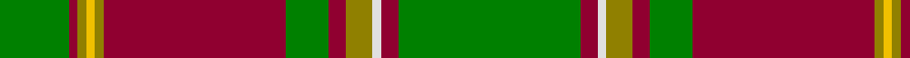

In pattern [GRGYGRGRGWRG](/patterns/grgygrgrgwrg/).

This was sourced from weddslist.  It is a [12 stripes tartan](/stripes/stripes12/).

Original link http://www.weddslist.com/cgi-bin/tartans/pg.pl?source=sts

## Thread count
G/16 DR2 LG2 Y2 LG2 DR42 G10 DR4 LG6 LN2 DR4 G/42

## Palette
Each colour and its ΔE from the base-6 reference it is a variant of.

| Colour | Shade | Base | ΔE (OKLab) |
|---|---|---|---|
| DR | <code style="background-color:#900030;">#900030</code> `#900030` | R <code style="background-color:#CC0000;">#CC0000</code> | 0.14 |
| G | <code style="background-color:#008000;">#008000</code> `#008000` | G <code style="background-color:#006100;">#006100</code> | 0.10 |
| LG | <code style="background-color:#908000;">#908000</code> `#908000` | G <code style="background-color:#006100;">#006100</code> | 0.20 |
| LN | <code style="background-color:#E0E0E0;">#E0E0E0</code> `#E0E0E0` | W <code style="background-color:#F7F7F7;">#F7F7F7</code> | 0.07 |
| Y | <code style="background-color:#F0C000;">#F0C000</code> `#F0C000` | Y <code style="background-color:#F2BF00;">#F2BF00</code> | 0.00 |

## Nearest tartans

The nearest existing variants by ΔTartan distance.

1. [Rattray](/setts/s9/g71k4r4b9r4b4r36b4w4~b304080-g008000-k000000-rc00000-we0e0e0/) — ΔT 1.02
1. [Westmeath](/setts/s14/g11r6b6ra2g3ra2b6r6g36y2ra2y2b5r5~b304080-g008000-rc00000-ra806050-yf0c000~x2/) — ΔT 1.02
1. [Rattray Family Tartan Tartan Number: 819. Earliest known date: pre 2003 A Follower, but not a Sept, of the Murrays of Atholl. The family descends from Adam de Rattrieff in the 13th century. Their ancient seat is at Craighall, Blairgowrie, in Perthshire. See products available Copyright © Blair Urquhart, Comrie, 2015](/setts/s9/g71k4r4b9r4b4r36b4w4~b2c2c80-g006818-k101010-rc80000-we0e0e0/) — ΔT 1.06
1. [Longmore (Name)](/setts/s9/g15y3g27r2g2r33b2w1b4~b1474b4-g006818-rc80000-we0e0e0-ye8c000~x2/) — ΔT 1.07
1. [Leask Family Tartan Tartan Number: 905. Earliest known date: 1981 Designed by Madam Leask and the Scottish Tartans Society Accredited in 1981. See products available Copyright © Blair Urquhart, Comrie, 2015](/setts/s14/g2r2w1r2k1r24g12y2g3y2g12r2g3y2~g006818-k101010-rc80000-we0e0e0-ye8c000~x2/) — ΔT 1.12
1. [Gray Hunting Family Tartan Tartan Number: 1079. Earliest known date: 1990 There is also a Gray tartan designed by Mrs G. Gray some years earlier. See products available Copyright © Blair Urquhart, Comrie, 2015](/setts/s11/k3w1g29r8ra2r2ra2r2ra8g7k2~g006818-k101010-r888888-raa00048-we0e0e0~x2/) — ΔT 1.14
1. [Leask](/setts/s14/g2r2w1r2k1r24g12y2g3y2g12r2g3y2~g008000-k000000-rc00000-we0e0e0-yf0c000~x2/) — ΔT 1.15
1. [MacKinnon 1](/setts/s12/r3ra4g3b3ra11g30ra3b7g3r2ra4w2~b800080-g008000-rd03030-rac00000-we0e0e0~x2/) — ΔT 1.19
1. [Connemarra Irish District Tartan Tartan Number: 3897. Earliest known date: pre 1997 The Connemara tartan has been created to represent the wild yet picturesque area situated in the north west of County Galway. Strictly speaking this should be a fashion tartan but it has been placed in the same class as the House of Edgar irish tartans. See products available Copyright © Blair Urquhart, Comrie, 2015](/setts/s16/b4y1g1r30g18g3g1k3g1g3g18r30g1y1b4g2~b2888c4-g289c18-k000000-r800000-yf0c400~x2/) — ΔT 1.19
1. [Cavalier, Green](/setts/s11/g40b10r2b2w2b3ra8g6b2g4w2~b1c1c1c-g5c6428-ra07c58-raa00000-we0e0e0~x2/) — ΔT 1.20

## Neighbour map

Every grey dot is one of 15726 variants placed by the first two principal components of the ΔTartan feature space (44% of its variance). Red is this tartan; blue dots are its nearest — click one to open its page.

<svg viewBox="0 0 640 380" role="img" style="max-width:100%;height:auto;border:1px solid #e0e0e0;border-radius:4px;display:block" xmlns="http://www.w3.org/2000/svg"><image href="/nn/cloud.v1.png" width="640" height="380"/><a href="/setts/s9/g71k4r4b9r4b4r36b4w4~b304080-g008000-k000000-rc00000-we0e0e0/"><circle cx="296.0" cy="118.2" r="4" fill="#3465a4"><title>Rattray</title></circle></a><a href="/setts/s14/g11r6b6ra2g3ra2b6r6g36y2ra2y2b5r5~b304080-g008000-rc00000-ra806050-yf0c000~x2/"><circle cx="296.8" cy="116.0" r="4" fill="#3465a4"><title>Westmeath</title></circle></a><a href="/setts/s9/g71k4r4b9r4b4r36b4w4~b2c2c80-g006818-k101010-rc80000-we0e0e0/"><circle cx="306.5" cy="121.8" r="4" fill="#3465a4"><title>Rattray Family Tartan Tartan Number: 819. Earliest known date: pre 2003 A Follower, but not a Sept, of the Murrays of Atholl. The family descends from Adam de Rattrieff in the 13th century. Their ancient seat is at Craighall, Blairgowrie, in Perthshire. See products available Copyright © Blair Urquhart, Comrie, 2015</title></circle></a><a href="/setts/s9/g15y3g27r2g2r33b2w1b4~b1474b4-g006818-rc80000-we0e0e0-ye8c000~x2/"><circle cx="332.8" cy="113.6" r="4" fill="#3465a4"><title>Longmore (Name)</title></circle></a><a href="/setts/s14/g2r2w1r2k1r24g12y2g3y2g12r2g3y2~g006818-k101010-rc80000-we0e0e0-ye8c000~x2/"><circle cx="297.1" cy="93.4" r="4" fill="#3465a4"><title>Leask Family Tartan Tartan Number: 905. Earliest known date: 1981 Designed by Madam Leask and the Scottish Tartans Society Accredited in 1981. See products available Copyright © Blair Urquhart, Comrie, 2015</title></circle></a><a href="/setts/s11/k3w1g29r8ra2r2ra2r2ra8g7k2~g006818-k101010-r888888-raa00048-we0e0e0~x2/"><circle cx="334.7" cy="112.0" r="4" fill="#3465a4"><title>Gray Hunting Family Tartan Tartan Number: 1079. Earliest known date: 1990 There is also a Gray tartan designed by Mrs G. Gray some years earlier. See products available Copyright © Blair Urquhart, Comrie, 2015</title></circle></a><a href="/setts/s14/g2r2w1r2k1r24g12y2g3y2g12r2g3y2~g008000-k000000-rc00000-we0e0e0-yf0c000~x2/"><circle cx="290.8" cy="91.5" r="4" fill="#3465a4"><title>Leask</title></circle></a><a href="/setts/s12/r3ra4g3b3ra11g30ra3b7g3r2ra4w2~b800080-g008000-rd03030-rac00000-we0e0e0~x2/"><circle cx="264.7" cy="119.6" r="4" fill="#3465a4"><title>MacKinnon 1</title></circle></a><a href="/setts/s16/b4y1g1r30g18g3g1k3g1g3g18r30g1y1b4g2~b2888c4-g289c18-k000000-r800000-yf0c400~x2/"><circle cx="307.8" cy="78.0" r="4" fill="#3465a4"><title>Connemarra Irish District Tartan Tartan Number: 3897. Earliest known date: pre 1997 The Connemara tartan has been created to represent the wild yet picturesque area situated in the north west of County Galway. Strictly speaking this should be a fashion tartan but it has been placed in the same class as the House of Edgar irish tartans. See products available Copyright © Blair Urquhart, Comrie, 2015</title></circle></a><a href="/setts/s11/g40b10r2b2w2b3ra8g6b2g4w2~b1c1c1c-g5c6428-ra07c58-raa00000-we0e0e0~x2/"><circle cx="386.5" cy="120.3" r="4" fill="#3465a4"><title>Cavalier, Green</title></circle></a><circle cx="325.3" cy="115.0" r="5" fill="#c00000"/></svg>

ID: /setts/s12/g21r2w1ga3r2g5r21ga1y1ga1r1g8~g008000-ga908000-r900030-we0e0e0-yf0c000~x2/
