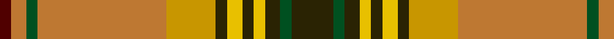

In pattern [BRGRYGYGYGGG](/patterns/brgrygygyggg/).

This was sourced from register-of-tartans.  It is a [12 stripes tartan](/stripes/stripes12/).

Original link https://www.tartanregister.gov.uk/tartanDetails.aspx?ref=1602

## Thread count
DR/6 DO8 G6 DO68 DY26 K6 Y8 K6 Y6 K8 G6 K/22

## Palette
Each colour and its ΔE from the base-6 reference it is a variant of.

| Colour | Shade | Base | ΔE (OKLab) |
|---|---|---|---|
| DO | <code style="background-color:#BE7832;">#BE7832</code> `#BE7832` | R <code style="background-color:#CC0000;">#CC0000</code> | 0.17 |
| DR | <code style="background-color:#500000;">#500000</code> `#500000` | B <code style="background-color:#2A418A;">#2A418A</code> | 0.24 |
| DY | <code style="background-color:#C89600;">#C89600</code> `#C89600` | Y <code style="background-color:#F2BF00;">#F2BF00</code> | 0.13 |
| G | <code style="background-color:#005020;">#005020</code> `#005020` | G <code style="background-color:#006100;">#006100</code> | 0.07 |
| K | <code style="background-color:#2A2303;">#2A2303</code> `#2A2303` | G <code style="background-color:#006100;">#006100</code> | 0.21 |
| Y | <code style="background-color:#E8C000;">#E8C000</code> `#E8C000` | Y <code style="background-color:#F2BF00;">#F2BF00</code> | 0.02 |

## Nearest tartans

The nearest existing variants by ΔTartan distance.

1. [Harmony 1 Trade Tartan Tartan Number: 1658. Earliest known date: pre 2003 LB may be Turquoise See products available Copyright © Blair Urquhart, Comrie, 2015](/setts/s12/b22g6b8y6b6y8b6y26ya68g6ya8r6-b441800-g006818-r880000-ye8c000-yaa08858/) — ΔT 0.43
1. [Harmony 1](/setts/s12/b22g6b8y6b6y8b6ga26r68g6r8ba6-b401000-ba506060-g008000-ga908000-r906030-yf0c000/) — ΔT 0.97
1. [North West Territories](/setts/s10/y8g4y4g4y4g48k4r32w18b6-b2c2c80-g006818-k101010-rc80000-we0e0e0-yd09800/) — ΔT 1.01
1. [Wilson's, No 128](/setts/s11/b8r6y4r18b6g48b6r18k6r6w4-b5480b0-g008000-k000000-rc00000-we0e0e0-yf0c000/) — ΔT 1.01
1. [North West Territories Canadian District Tartan Tartan Number: 662. Earliest known date: 1969 Designed at the request of an official of the Canadian Commission who decreed that the predominant colours should be "Green and White - White for the snow covering the Territories for six months of every year and the Green for the other six months." See products available Copyright © Blair Urquhart, Comrie, 2015](/setts/s10/y8g4y4g4y4g48k4r32w18b6-b2c2c80-g006818-k101010-rc80000-we0e0e0-ye8c000/) — ΔT 1.15
1. [Murray of Abercairney](/setts/s9/b6g2k2r24ra2ga18ra2g2b6-b5480b0-g808080-ga008000-k000000-rc00000-rad03030/) — ΔT 1.24
1. [North West Territories](/setts/s10/y8g4y4g4y4g48k4r32w18b6-b304080-g008000-k000000-rc00000-we0e0e0-yf0c000/) — ΔT 1.28
1. [MacKinnon 1](/setts/s12/r6ra8g6b6ra22g60ra6b14g6r4ra8w4-b800080-g008000-rd03030-rac00000-we0e0e0/) — ΔT 1.32
1. [Cats (Fashion)](/setts/s12/b16g4k4y4k4ya4k4g36r4g4r58k6-b2c2c80-g006818-k101010-rc80000-ybc8c00-yae8c000/) — ΔT 1.32
1. [Dunblane](/setts/s12/g12y10w2g4w2g10w2g4w2r30b4w2-b304080-g008000-rc00000-we0e0e0-yf0c000/) — ΔT 1.33

## Neighbour map

Every grey dot is one of 15726 variants placed by the first two principal components of the ΔTartan feature space (44% of its variance). Red is this tartan; blue dots are its nearest — click one to open its page.

<svg viewBox="0 0 640 380" role="img" style="max-width:100%;height:auto;border:1px solid #e0e0e0;border-radius:4px;display:block" xmlns="http://www.w3.org/2000/svg"><image href="/nn/cloud.v1.png" width="640" height="380"/><a href="/setts/s12/b22g6b8y6b6y8b6y26ya68g6ya8r6-b441800-g006818-r880000-ye8c000-yaa08858/"><circle cx="181.8" cy="106.5" r="4" fill="#3465a4"><title>Harmony 1 Trade Tartan Tartan Number: 1658. Earliest known date: pre 2003 LB may be Turquoise See products available Copyright © Blair Urquhart, Comrie, 2015</title></circle></a><a href="/setts/s12/b22g6b8y6b6y8b6ga26r68g6r8ba6-b401000-ba506060-g008000-ga908000-r906030-yf0c000/"><circle cx="214.4" cy="123.6" r="4" fill="#3465a4"><title>Harmony 1</title></circle></a><a href="/setts/s10/y8g4y4g4y4g48k4r32w18b6-b2c2c80-g006818-k101010-rc80000-we0e0e0-yd09800/"><circle cx="168.4" cy="115.8" r="4" fill="#3465a4"><title>North West Territories</title></circle></a><a href="/setts/s11/b8r6y4r18b6g48b6r18k6r6w4-b5480b0-g008000-k000000-rc00000-we0e0e0-yf0c000/"><circle cx="162.7" cy="118.2" r="4" fill="#3465a4"><title>Wilson's, No 128</title></circle></a><a href="/setts/s10/y8g4y4g4y4g48k4r32w18b6-b2c2c80-g006818-k101010-rc80000-we0e0e0-ye8c000/"><circle cx="161.7" cy="112.9" r="4" fill="#3465a4"><title>North West Territories Canadian District Tartan Tartan Number: 662. Earliest known date: 1969 Designed at the request of an official of the Canadian Commission who decreed that the predominant colours should be &quot;Green and White - White for the snow covering the Territories for six months of every year and the Green for the other six months.&quot; See products available Copyright © Blair Urquhart, Comrie, 2015</title></circle></a><a href="/setts/s9/b6g2k2r24ra2ga18ra2g2b6-b5480b0-g808080-ga008000-k000000-rc00000-rad03030/"><circle cx="180.2" cy="130.2" r="4" fill="#3465a4"><title>Murray of Abercairney</title></circle></a><a href="/setts/s10/y8g4y4g4y4g48k4r32w18b6-b304080-g008000-k000000-rc00000-we0e0e0-yf0c000/"><circle cx="158.3" cy="111.9" r="4" fill="#3465a4"><title>North West Territories</title></circle></a><a href="/setts/s12/r6ra8g6b6ra22g60ra6b14g6r4ra8w4-b800080-g008000-rd03030-rac00000-we0e0e0/"><circle cx="263.0" cy="119.3" r="4" fill="#3465a4"><title>MacKinnon 1</title></circle></a><a href="/setts/s12/b16g4k4y4k4ya4k4g36r4g4r58k6-b2c2c80-g006818-k101010-rc80000-ybc8c00-yae8c000/"><circle cx="210.5" cy="93.9" r="4" fill="#3465a4"><title>Cats (Fashion)</title></circle></a><a href="/setts/s12/g12y10w2g4w2g10w2g4w2r30b4w2-b304080-g008000-rc00000-we0e0e0-yf0c000/"><circle cx="176.6" cy="111.3" r="4" fill="#3465a4"><title>Dunblane</title></circle></a><circle cx="189.6" cy="109.3" r="5" fill="#c00000"/></svg>

ID: /setts/s12/g22ga6g8y6g6y8g6ya26r68ga6r8b6-b500000-g2a2303-ga005020-rbe7832-ye8c000-yac89600/
