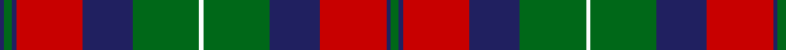

**Bands:** [GBRBGWGBRBGB](/stripes/gbrbgwgbrbgb/) · **Stripes:** [G DB R DB G W G DB R DB G DB](/stripes/stripes12/) G DB R DB G W G DB R DB G DB

This was sourced from register-of-tartans.  It is a [12 band tartan](/bands/bands12/).

Original link https://www.tartanregister.gov.uk/tartanDetails.aspx?ref=5418

## Register references

External register numbers recorded for this tartan.

- Scottish Register of Tartans: [5418](https://www.tartanregister.gov.uk/tartanDetails.aspx?ref=5418)
- Scottish Tartans Authority (ITI): 3889

## Thread count
G/4 DB2 R32 DB24 G32 W2 G32 DB24 R32 DB2 G4 DB/2

## Palette
Each colour and its ΔE from the base-6 reference it is a variant of.

| Colour | Shade | Base | ΔE (OKLab) |
|---|---|---|---|
| DB | <code style="background-color:#202060;">#202060</code> `#202060` | B <code style="background-color:#2A418A;">#2A418A</code> | 0.11 |
| G | <code style="background-color:#006818;">#006818</code> `#006818` | G <code style="background-color:#006100;">#006100</code> | 0.02 |
| R | <code style="background-color:#C80000;">#C80000</code> `#C80000` | R <code style="background-color:#CC0000;">#CC0000</code> | 0.01 |
| W | <code style="background-color:#FCFCFC;">#FCFCFC</code> `#FCFCFC` | W <code style="background-color:#F7F7F7;">#F7F7F7</code> | 0.01 |

## Nearest tartans

The nearest existing variants by ΔTartan distance.

1. [Fraser of Lovat](/setts/s12/db16r1db1r1g12r16w2r16g12db12r1db1~x2/) — ΔT 0.50
1. [MacEdward](/setts/s10/r12ly4r38g25db8g10db8g8db25r3/) — ΔT 0.79
1. [MacIsaac (Name?)](/setts/s13/y20k2y2k2y2k20y20lo4y20k20y20k1lo4~x2/) — ΔT 0.80
1. [MacEdward (Personal)](/setts/s10/r12ly4r38dg25db8dg10db8dg8db25r3/) — ΔT 0.84
1. [Fulton (1999) (Name)](/setts/s9/db3k5r2g2r3g12r6k1r3~x4/) — ΔT 0.96
1. [North Berwick (Dance)](/setts/s11/dt10r2dt10r10dg2r2dg2r2dg10r1w2~x4/) — ΔT 0.96
1. [Fraser, Stewart of Athol](/setts/s12/db16r1db1r1g12r16g2r16g12db12r1db1~x2/) — ΔT 1.00
1. [MacIntyre (of Gatehouse)](/setts/s15/t3r24db4r8g32r4db4r8g4r4db32r8g4r4t2~x2/) — ΔT 1.04
1. [Queen of Scots](/setts/s9/g22k3g1k3g2p8m1p8m16~x2/) — ΔT 1.06
1. [Inverness, Fencibles](/setts/s12/db10r1db1r1g10r13g2r13g10db10r1db1~x2/) — ΔT 1.07

## Neighbour map

Every grey dot is one of 14299 variants placed by the first two principal components of the ΔTartan feature space (44% of its variance). Red is this tartan; blue dots are its nearest — click one to open its page.

<svg viewBox="0 0 640 380" role="img" style="max-width:100%;height:auto;border:1px solid #e0e0e0;border-radius:4px;display:block" xmlns="http://www.w3.org/2000/svg"><image href="/nn/cloud.v1.png" width="640" height="380"/><a href="/setts/s12/db16r1db1r1g12r16w2r16g12db12r1db1~x2/"><circle cx="230.7" cy="159.3" r="4" fill="#3465a4"><title>Fraser of Lovat</title></circle></a><a href="/setts/s10/r12ly4r38g25db8g10db8g8db25r3/"><circle cx="211.4" cy="183.7" r="4" fill="#3465a4"><title>MacEdward</title></circle></a><a href="/setts/s13/y20k2y2k2y2k20y20lo4y20k20y20k1lo4~x2/"><circle cx="202.6" cy="156.3" r="4" fill="#3465a4"><title>MacIsaac (Name?)</title></circle></a><a href="/setts/s10/r12ly4r38dg25db8dg10db8dg8db25r3/"><circle cx="215.5" cy="184.0" r="4" fill="#3465a4"><title>MacEdward (Personal)</title></circle></a><a href="/setts/s9/db3k5r2g2r3g12r6k1r3~x4/"><circle cx="209.9" cy="190.3" r="4" fill="#3465a4"><title>Fulton (1999) (Name)</title></circle></a><a href="/setts/s11/dt10r2dt10r10dg2r2dg2r2dg10r1w2~x4/"><circle cx="200.5" cy="186.6" r="4" fill="#3465a4"><title>North Berwick (Dance)</title></circle></a><a href="/setts/s12/db16r1db1r1g12r16g2r16g12db12r1db1~x2/"><circle cx="258.3" cy="178.9" r="4" fill="#3465a4"><title>Fraser, Stewart of Athol</title></circle></a><a href="/setts/s15/t3r24db4r8g32r4db4r8g4r4db32r8g4r4t2~x2/"><circle cx="251.9" cy="137.2" r="4" fill="#3465a4"><title>MacIntyre (of Gatehouse)</title></circle></a><a href="/setts/s9/g22k3g1k3g2p8m1p8m16~x2/"><circle cx="231.4" cy="148.7" r="4" fill="#3465a4"><title>Queen of Scots</title></circle></a><a href="/setts/s12/db10r1db1r1g10r13g2r13g10db10r1db1~x2/"><circle cx="251.5" cy="189.0" r="4" fill="#3465a4"><title>Inverness, Fencibles</title></circle></a><circle cx="224.1" cy="162.6" r="5" fill="#c00000"/></svg>

ID: /setts/s12/g2db1r16db12g16w1g16db12r16db1g2db1~x2/
