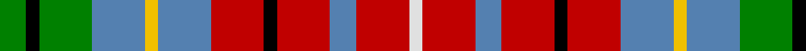

This page is one **sett** — a single exact thread-count. It belongs to the [tartan](/tartans/g2k1g4b4y1b4r4k1r4b2r4ln1/)
(the same proportion at any scale), whose colour order is pattern [GKGBYBRKRBRW](/stripes/gkgbybrkrbrw/).

Sourced from weddslist.  It is a [12 stripe tartan](/stripes/stripes12/).

Original link http://www.weddslist.com/cgi-bin/tartans/pg.pl?source=sts

2 attestations — the source records this cloth was collapsed from (oldest owns this page)

<ul>
<li>undated — British Columbia (weddslist, <a href="http://www.weddslist.com/cgi-bin/tartans/pg.pl?source=sts">record</a>)</li>
<li>undated — British Columbia District Tartan Tartan Number: 808. Earliest known date: 1966 The British Columbia Provincial tartan was produced by the Pik Mills of Quebec in connection with the Centennial Celebration of 1966 which marked the unification of the administration of the mainland and Vancouver Island a hundred years earlier. See products available Copyright © Blair Urquhart, Comrie, 2015 (house-of-tartan, <a href="http://www.house-of-tartan.scotland.net/house/TartanViewjs.asp?colr=Def&tnam=808">record</a>)</li>
</ul>

## Thread count
G/8 K4 G16 B16 Y4 B16 R16 K4 R16 B8 R16 LN/4

## Palette
Each colour and the base-6 reference it is a variant of.

| Colour | Shade | Base |
|---|---|---|
| B | <code style="background-color:#5480B0;">#5480B0</code> `oklch(58.8% 0.089 251.5)` <small>#5480B0</small> | B <code style="background-color:#2A418A;">#2A418A</code> |
| G | <code style="background-color:#008000;">#008000</code> `oklch(52.0% 0.177 142.5)` <small>#008000</small> | G <code style="background-color:#006100;">#006100</code> |
| K | <code style="background-color:#000000;">#000000</code> `oklch(0.0% 0.000 0.0)` <small>#000000</small> | K <code style="background-color:#000000;">#000000</code> |
| LN | <code style="background-color:#E0E0E0;">#E0E0E0</code> `oklch(90.7% 0.000 89.9)` <small>#E0E0E0</small> | W <code style="background-color:#F7F7F7;">#F7F7F7</code> |
| R | <code style="background-color:#C00000;">#C00000</code> `oklch(50.7% 0.208 29.2)` <small>#C00000</small> | R <code style="background-color:#CC0000;">#CC0000</code> |
| Y | <code style="background-color:#F0C000;">#F0C000</code> `oklch(82.7% 0.169 90.5)` <small>#F0C000</small> | Y <code style="background-color:#F2BF00;">#F2BF00</code> |

## Nearest tartans

The nearest existing variants by ΔTartan distance, with this tartan at the top so the swatches line up against it.

ΔTartan

Tartan

Sett

—

<a href="/ttd/edit/#slug=g2k1g4t4ly1t4r4k1r4t2r4w1~x4">British Columbia</a> <a class="nn-out" href="/setts/s12/g2k1g4t4ly1t4r4k1r4t2r4w1~x4/" title="open its dictionary page">↗</a>

0.22

<a href="/ttd/edit/#slug=g2k1g4lr4ly1lr4r4k1r4lr2r4w1~x4">British Columbia</a> <a class="nn-out" href="/setts/s12/g2k1g4lr4ly1lr4r4k1r4lr2r4w1~x4/" title="open its dictionary page">↗</a>

1.10

<a href="/ttd/edit/#slug=r4w4r5b4r12g4r12g8b13dt3b4~x2">Hueg (Formal) (Personal)</a> <a class="nn-out" href="/setts/s11/r4w4r5b4r12g4r12g8b13dt3b4~x2/" title="open its dictionary page">↗</a>

1.15

<a href="/ttd/edit/#slug=db4lb8k2lb5lb2lb5dg8r7dg2r7dg3~x2">DunBroch (Corporate)</a> <a class="nn-out" href="/setts/s11/db4lb8k2lb5lb2lb5dg8r7dg2r7dg3~x2/" title="open its dictionary page">↗</a>

1.20

<a href="/ttd/edit/#slug=w2t2dg8k2t6dg5r5lo5r4w2r4lo5r5dg5t6k2r10lo2~x2">Kutztown (Berks Co., PA) (District)</a> <a class="nn-out" href="/setts/s18/w2t2dg8k2t6dg5r5lo5r4w2r4lo5r5dg5t6k2r10lo2~x2/" title="open its dictionary page">↗</a>

1.21

<a href="/ttd/edit/#slug=b10r3b10ly5k2r6lr2r6lr2r6n2ly2b5lr2~x2">Ogilvy</a> <a class="nn-out" href="/setts/s14/b10r3b10ly5k2r6lr2r6lr2r6n2ly2b5lr2~x2/" title="open its dictionary page">↗</a>

1.21

<a href="/ttd/edit/#slug=b10r3b10ly5k2r6lr2r6lr2r6n2ly2b5lr2">Ogilvy</a> <a class="nn-out" href="/setts/s14/b10r3b10ly5k2r6lr2r6lr2r6n2ly2b5lr2/" title="open its dictionary page">↗</a>

1.21

<a href="/ttd/edit/#slug=db7lr2dp5ly2dg7ly2r5lr2r5ly2db7~x2">Unnamed C19th (Silk Sash)</a> <a class="nn-out" href="/setts/s11/db7lr2dp5ly2dg7ly2r5lr2r5ly2db7~x2/" title="open its dictionary page">↗</a>

1.23

<a href="/ttd/edit/#slug=r7t3k2t2k2t3k6ly2dg7r4db2r4w2r5~x2">Caledonia Variant</a> <a class="nn-out" href="/setts/s14/r7t3k2t2k2t3k6ly2dg7r4db2r4w2r5~x2/" title="open its dictionary page">↗</a>

1.33

<a href="/ttd/edit/#slug=g10k6t10ly4t10k3g10k3g10k3r10w4r10k6~x2">Scandinavian</a> <a class="nn-out" href="/setts/s14/g10k6t10ly4t10k3g10k3g10k3r10w4r10k6~x2/" title="open its dictionary page">↗</a>

1.33

<a href="/ttd/edit/#slug=o2lr2do2y2lr6y3do3y4lr2do3y2lr2o2~x2">Callanish, The</a> <a class="nn-out" href="/setts/s13/o2lr2do2y2lr6y3do3y4lr2do3y2lr2o2~x2/" title="open its dictionary page">↗</a>

## Neighbour map

Every grey dot is one of 14299 variants placed by the first two principal components of the ΔTartan feature space (44% of its variance). Red is this tartan; blue dots are its nearest — click one to open its page.

<svg viewBox="0 0 640 380" role="img" style="max-width:100%;height:auto;border:1px solid #e0e0e0;border-radius:4px;display:block" xmlns="http://www.w3.org/2000/svg"><image href="/nn/cloud.v1.png" width="640" height="380"/><a href="/setts/s12/g2k1g4lr4ly1lr4r4k1r4lr2r4w1~x4/"><circle cx="71.6" cy="197.1" r="4" fill="#3465a4"><title>British Columbia</title></circle></a><a href="/setts/s11/r4w4r5b4r12g4r12g8b13dt3b4~x2/"><circle cx="127.0" cy="198.3" r="4" fill="#3465a4"><title>Hueg (Formal) (Personal)</title></circle></a><a href="/setts/s11/db4lb8k2lb5lb2lb5dg8r7dg2r7dg3~x2/"><circle cx="27.3" cy="203.4" r="4" fill="#3465a4"><title>DunBroch (Corporate)</title></circle></a><a href="/setts/s18/w2t2dg8k2t6dg5r5lo5r4w2r4lo5r5dg5t6k2r10lo2~x2/"><circle cx="48.9" cy="182.6" r="4" fill="#3465a4"><title>Kutztown (Berks Co., PA) (District)</title></circle></a><a href="/setts/s14/b10r3b10ly5k2r6lr2r6lr2r6n2ly2b5lr2~x2/"><circle cx="114.4" cy="180.9" r="4" fill="#3465a4"><title>Ogilvy</title></circle></a><a href="/setts/s14/b10r3b10ly5k2r6lr2r6lr2r6n2ly2b5lr2/"><circle cx="114.4" cy="180.9" r="4" fill="#3465a4"><title>Ogilvy</title></circle></a><a href="/setts/s11/db7lr2dp5ly2dg7ly2r5lr2r5ly2db7~x2/"><circle cx="14.0" cy="201.9" r="4" fill="#3465a4"><title>Unnamed C19th (Silk Sash)</title></circle></a><a href="/setts/s14/r7t3k2t2k2t3k6ly2dg7r4db2r4w2r5~x2/"><circle cx="31.5" cy="176.6" r="4" fill="#3465a4"><title>Caledonia Variant</title></circle></a><a href="/setts/s14/g10k6t10ly4t10k3g10k3g10k3r10w4r10k6~x2/"><circle cx="14.0" cy="208.2" r="4" fill="#3465a4"><title>Scandinavian</title></circle></a><a href="/setts/s13/o2lr2do2y2lr6y3do3y4lr2do3y2lr2o2~x2/"><circle cx="39.0" cy="236.0" r="4" fill="#3465a4"><title>Callanish, The</title></circle></a><circle cx="69.2" cy="197.7" r="5" fill="#c00000"/></svg>

ID: /setts/s12/g2k1g4t4ly1t4r4k1r4t2r4w1~x4/
