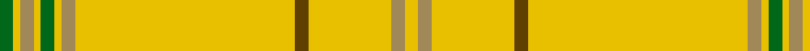

**Bands:** [YYYGYYYGYYYG](/stripes/yyygyyygyyyg/) · **Stripes:** [LY LO LY DY LY LO LY G LY LO LY G](/stripes/stripes12/) LY LO LY DY LY LO LY G LY LO LY G

This was sourced from house-of-tartan.  It is a [12 band tartan](/bands/bands12/).

Original link http://www.house-of-tartan.scotland.net/house/TartanViewjs.asp?colr=Def&tnam=2290

## Thread count
Y/4 LT4 Y24 T4 Y64 LT4 Y2 G4 Y2 LT4 Y2 G/4

## Palette
Each colour and its ΔE from the base-6 reference it is a variant of.

| Colour | Shade | Base | ΔE (OKLab) |
|---|---|---|---|
| G | <code style="background-color:#006818;">#006818</code> `#006818` | G <code style="background-color:#006100;">#006100</code> | 0.02 |
| LT | <code style="background-color:#A08858;">#A08858</code> `#A08858` | Y <code style="background-color:#F2BF00;">#F2BF00</code> | 0.21 |
| T | <code style="background-color:#604000;">#604000</code> `#604000` | G <code style="background-color:#006100;">#006100</code> | 0.14 |
| Y | <code style="background-color:#E8C000;">#E8C000</code> `#E8C000` | Y <code style="background-color:#F2BF00;">#F2BF00</code> | 0.02 |

## Nearest tartans

The nearest existing variants by ΔTartan distance.

1. [Houston #2 (Personal)](/setts/s12/lo32do2lo12dy2lo1g2lo1dy2lo1g2lo1dy2~x2/) — ΔT 1.50
1. [Catalan](/setts/s14/db3ly3g3ly62r9ly9r9ly9r9ly9r9ly62w3ly3/) — ΔT 1.91
1. [Houston (Personal)](/setts/s22/g2lo1dy2lo1g2lo1dy2lo32do2lo12dy2lo2~x2/) — ΔT 1.95
1. [Catalan (92 Olympics)](/setts/s14/ly44r6ly6r6ly6r6ly6r6ly44b3ly3g3ly3lb3/) — ΔT 2.26
1. [Manitoba District Tartan Tartan Number: 145. Earliest known date: 1962 A slight modification of the original sett. See products available Copyright © Blair Urquhart, Comrie, 2015](/setts/s8/ly622r21g2dg6g41t2g2t6/) — ΔT 2.34
1. [Virginia Quadricentennial (District)](/setts/s13/ly40lo3ly10lo6ly20k3ly2k3ly10r4ly2r8ly2~x2/) — ΔT 2.40
1. [Connacht (1993)](/setts/s10/o64dg6o2dg3o2dg6o64dy2o2dy6~x2/) — ΔT 2.42
1. [UPS No. 1 (Corporate)](/setts/s16/ly8do2ly2lo2ly2do2ly15do2ly60do4w1do2w2do2w1do4~x2/) — ΔT 2.93
1. [UPS No.1](/setts/s15/do4ly60do2ly15do2ly2lo2do2ly8do4w1do2w2do2w1~x2/) — ΔT 2.94
1. [Canadian Irish Regiment Regimental Tartan Tartan Number: 1544. Earliest known date: 1930 The Canadian Irish Regiment was formed in April 1914 and formally gazetted on October 15th, 1915, as the 110th (Irish) Regiment of Canada. In 1931 they became the only kilted Irish Regiment in the world. The Regiment served on active service during World War II and was also the first Irish Regiment to provide a Royal Guard. (P.E.MacDonald, 1982) See products available Copyright © Blair Urquhart, Comrie, 2015](/setts/s4/lo100dy26dg3dr2~x2/) — ΔT 3.02

## Neighbour map

Every grey dot is one of 14299 variants placed by the first two principal components of the ΔTartan feature space (44% of its variance). Red is this tartan; blue dots are its nearest — click one to open its page.

<svg viewBox="0 0 640 380" role="img" style="max-width:100%;height:auto;border:1px solid #e0e0e0;border-radius:4px;display:block" xmlns="http://www.w3.org/2000/svg"><image href="/nn/cloud.v1.png" width="640" height="380"/><a href="/setts/s12/lo32do2lo12dy2lo1g2lo1dy2lo1g2lo1dy2~x2/"><circle cx="604.1" cy="114.7" r="4" fill="#3465a4"><title>Houston #2 (Personal)</title></circle></a><a href="/setts/s14/db3ly3g3ly62r9ly9r9ly9r9ly9r9ly62w3ly3/"><circle cx="493.6" cy="89.6" r="4" fill="#3465a4"><title>Catalan</title></circle></a><a href="/setts/s22/g2lo1dy2lo1g2lo1dy2lo32do2lo12dy2lo2~x2/"><circle cx="603.3" cy="92.7" r="4" fill="#3465a4"><title>Houston (Personal)</title></circle></a><a href="/setts/s14/ly44r6ly6r6ly6r6ly6r6ly44b3ly3g3ly3lb3/"><circle cx="468.0" cy="106.0" r="4" fill="#3465a4"><title>Catalan (92 Olympics)</title></circle></a><a href="/setts/s8/ly622r21g2dg6g41t2g2t6/"><circle cx="626.0" cy="82.2" r="4" fill="#3465a4"><title>Manitoba District Tartan Tartan Number: 145. Earliest known date: 1962 A slight modification of the original sett. See products available Copyright © Blair Urquhart, Comrie, 2015</title></circle></a><a href="/setts/s13/ly40lo3ly10lo6ly20k3ly2k3ly10r4ly2r8ly2~x2/"><circle cx="468.0" cy="122.9" r="4" fill="#3465a4"><title>Virginia Quadricentennial (District)</title></circle></a><a href="/setts/s10/o64dg6o2dg3o2dg6o64dy2o2dy6~x2/"><circle cx="626.0" cy="137.7" r="4" fill="#3465a4"><title>Connacht (1993)</title></circle></a><a href="/setts/s16/ly8do2ly2lo2ly2do2ly15do2ly60do4w1do2w2do2w1do4~x2/"><circle cx="526.5" cy="25.7" r="4" fill="#3465a4"><title>UPS No. 1 (Corporate)</title></circle></a><a href="/setts/s15/do4ly60do2ly15do2ly2lo2do2ly8do4w1do2w2do2w1~x2/"><circle cx="523.2" cy="28.9" r="4" fill="#3465a4"><title>UPS No.1</title></circle></a><a href="/setts/s4/lo100dy26dg3dr2~x2/"><circle cx="590.2" cy="163.9" r="4" fill="#3465a4"><title>Canadian Irish Regiment Regimental Tartan Tartan Number: 1544. Earliest known date: 1930 The Canadian Irish Regiment was formed in April 1914 and formally gazetted on October 15th, 1915, as the 110th (Irish) Regiment of Canada. In 1931 they became the only kilted Irish Regiment in the world. The Regiment served on active service during World War II and was also the first Irish Regiment to provide a Royal Guard. (P.E.MacDonald, 1982) See products available Copyright © Blair Urquhart, Comrie, 2015</title></circle></a><circle cx="584.9" cy="102.4" r="5" fill="#c00000"/></svg>

ID: /setts/s12/g2ly1lo2ly1g2ly1lo2ly32dy2ly12lo2ly2~x2/
