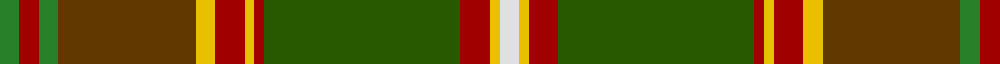

In pattern [GRGGYRYRGRYW](/patterns/grggyryrgryw/).

This was sourced from tartans-authority.  It is a [12 stripes tartan](/stripes/stripes12/).

Original link http://www.tartansauthority.com/tartan-ferret/display/10873/

## Thread count
G/4 DR4 G4 T28 Y4 DR6 Y2 DR2 Ga40 DR6 Y2 LN/4

## Palette
Each colour and its ΔE from the base-6 reference it is a variant of.

| Colour | Shade | Base | ΔE (OKLab) |
|---|---|---|---|
| DR | <code style="background-color:#A00000;">#A00000</code> `#A00000` | R <code style="background-color:#CC0000;">#CC0000</code> | 0.09 |
| G | <code style="background-color:#288028;">#288028</code> `#288028` | G <code style="background-color:#006100;">#006100</code> | 0.10 |
| Ga | <code style="background-color:#285800;">#285800</code> `#285800` | G <code style="background-color:#006100;">#006100</code> | 0.03 |
| LN | <code style="background-color:#E0E0E0;">#E0E0E0</code> `#E0E0E0` | W <code style="background-color:#F7F7F7;">#F7F7F7</code> | 0.07 |
| T | <code style="background-color:#603800;">#603800</code> `#603800` | G <code style="background-color:#006100;">#006100</code> | 0.16 |
| Y | <code style="background-color:#E8C000;">#E8C000</code> `#E8C000` | Y <code style="background-color:#F2BF00;">#F2BF00</code> | 0.02 |

## Nearest tartans

The nearest existing variants by ΔTartan distance.

1. [Harmony 1](/setts/s12/b11g3b4y3b3y4b3ga13r34g3r4ba3x2~b401000-ba506060-g008000-ga908000-r906030-yf0c000/) — ΔT 1.20
1. [Hamish Bicknell (Personal)](/setts/s11/w3k1r25k2g2ga25g2y2g10k1r2x2~g604000-ga006818-k101010-rc80000-we0e0e0-ye8c000/) — ΔT 1.25
1. [Caithness District Tartan Tartan Number: 2466. Earliest known date: (Feb, 2001) Designed by Trudi Mann of Wick and incorporating colours of Caithness, including the unique blue grey Caithness flagstone. See products available Copyright © Blair Urquhart, Comrie, 2015](/setts/s15/g28r3b2ra2b2r3ra8y2b8y5b3w2b2y3b1x2~b441800-g604000-rc80000-ra888888-we0e0e0-ya08858/) — ΔT 1.28
1. [Bicknell, The Hamish (Personal)](/setts/s11/w3k1r25k2g2ga25g2y2g10k1r2x2~g603311-ga008000-k101010-raf1e2d-wffffff-yffe600/) — ΔT 1.40
1. [Spens, Fragment](/setts/s17/r50w2b7ra2g33ga12b7ra3w2ra3b7ga12g33ra2b7w2r17x2~b304080-g008000-ga30a010-rd00000-ra906030-we0e0e0/) — ΔT 1.40
1. [Moray of Abercairny](/setts/s11/w1b3ba2r18ra2g16ra2r2ra2b3w1x2~b5c8ca8-ba1c1c50-g006818-r880000-rad05054-wf8f8f8/) — ΔT 1.41
1. [Tara (District)](/setts/s12/k8r2k6y2k2w2k2g16ga24r2ga4k3x2~g603800-ga285800-k101010-rc80000-wc0c0c0-ybc8c00/) — ΔT 1.46
1. [State Seal of Florida (Fashion)](/setts/s10/r3y21r14w3b11g36ba3b3ba4y3x2~b2c2c80-ba441800-g006818-r880000-we8ccb8-ya08858/) — ΔT 1.49
1. [Ogg of Tarragann Hunting (Personal)](/setts/s12/r2b6r1g14r1g14r1k6ga10y1ga2y2x2~b5c8ca8-g604000-ga006818-k101010-rc80000-ybc8c00/) — ΔT 1.50
1. [Isle of Skye](/setts/s11/r20b2r2b2r3b8g9ga8gb8g1y2x2~b300030-g003000-ga008000-gb607030-r806050-yb0b0b0/) — ΔT 1.55

## Neighbour map

Every grey dot is one of 15726 variants placed by the first two principal components of the ΔTartan feature space (44% of its variance). Red is this tartan; blue dots are its nearest — click one to open its page.

<svg viewBox="0 0 640 380" role="img" style="max-width:100%;height:auto;border:1px solid #e0e0e0;border-radius:4px;display:block" xmlns="http://www.w3.org/2000/svg"><image href="/nn/cloud.v1.png" width="640" height="380"/><a href="/setts/s12/b11g3b4y3b3y4b3ga13r34g3r4ba3x2~b401000-ba506060-g008000-ga908000-r906030-yf0c000/"><circle cx="217.0" cy="121.8" r="4" fill="#3465a4"><title>Harmony 1</title></circle></a><a href="/setts/s11/w3k1r25k2g2ga25g2y2g10k1r2x2~g604000-ga006818-k101010-rc80000-we0e0e0-ye8c000/"><circle cx="220.0" cy="83.5" r="4" fill="#3465a4"><title>Hamish Bicknell (Personal)</title></circle></a><a href="/setts/s15/g28r3b2ra2b2r3ra8y2b8y5b3w2b2y3b1x2~b441800-g604000-rc80000-ra888888-we0e0e0-ya08858/"><circle cx="234.6" cy="75.6" r="4" fill="#3465a4"><title>Caithness District Tartan Tartan Number: 2466. Earliest known date: (Feb, 2001) Designed by Trudi Mann of Wick and incorporating colours of Caithness, including the unique blue grey Caithness flagstone. See products available Copyright © Blair Urquhart, Comrie, 2015</title></circle></a><a href="/setts/s11/w3k1r25k2g2ga25g2y2g10k1r2x2~g603311-ga008000-k101010-raf1e2d-wffffff-yffe600/"><circle cx="206.5" cy="79.7" r="4" fill="#3465a4"><title>Bicknell, The Hamish (Personal)</title></circle></a><a href="/setts/s17/r50w2b7ra2g33ga12b7ra3w2ra3b7ga12g33ra2b7w2r17x2~b304080-g008000-ga30a010-rd00000-ra906030-we0e0e0/"><circle cx="175.9" cy="72.1" r="4" fill="#3465a4"><title>Spens, Fragment</title></circle></a><a href="/setts/s11/w1b3ba2r18ra2g16ra2r2ra2b3w1x2~b5c8ca8-ba1c1c50-g006818-r880000-rad05054-wf8f8f8/"><circle cx="207.1" cy="99.3" r="4" fill="#3465a4"><title>Moray of Abercairny</title></circle></a><a href="/setts/s12/k8r2k6y2k2w2k2g16ga24r2ga4k3x2~g603800-ga285800-k101010-rc80000-wc0c0c0-ybc8c00/"><circle cx="203.9" cy="138.5" r="4" fill="#3465a4"><title>Tara (District)</title></circle></a><a href="/setts/s10/r3y21r14w3b11g36ba3b3ba4y3x2~b2c2c80-ba441800-g006818-r880000-we8ccb8-ya08858/"><circle cx="162.4" cy="136.4" r="4" fill="#3465a4"><title>State Seal of Florida (Fashion)</title></circle></a><a href="/setts/s12/r2b6r1g14r1g14r1k6ga10y1ga2y2x2~b5c8ca8-g604000-ga006818-k101010-rc80000-ybc8c00/"><circle cx="242.2" cy="142.5" r="4" fill="#3465a4"><title>Ogg of Tarragann Hunting (Personal)</title></circle></a><a href="/setts/s11/r20b2r2b2r3b8g9ga8gb8g1y2x2~b300030-g003000-ga008000-gb607030-r806050-yb0b0b0/"><circle cx="190.2" cy="130.7" r="4" fill="#3465a4"><title>Isle of Skye</title></circle></a><circle cx="217.7" cy="98.6" r="5" fill="#c00000"/></svg>

ID: /setts/s12/g2r2g2ga14y2r3y1r1gb20r3y1w2x2~g288028-ga603800-gb285800-ra00000-we0e0e0-ye8c000/
