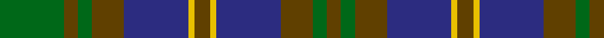

In pattern [GGGBYGYBGGGG](/patterns/gggbygybgggg/).

This was sourced from register-of-tartans.  It is a [12 stripes tartan](/stripes/stripes12/).

Original link https://www.tartanregister.gov.uk/tartanDetails.aspx?ref=3976

## Register references

External register numbers recorded for this tartan.

- Scottish Register of Tartans: [3976](https://www.tartanregister.gov.uk/tartanDetails.aspx?ref=3976)
- Scottish Tartans Authority (ITI): 2259
- Scottish Tartans World Register: 2259

## Thread count
G/64 T14 G14 T32 DBa64 Y6 T16 Y6 DBa64 T32 G14 T/14

## Palette
Each colour and its ΔE from the base-6 reference it is a variant of.

| Colour | Shade | Base | ΔE (OKLab) |
|---|---|---|---|
| B | <code style="background-color:#1474B4;">#1474B4</code> `#1474B4` | B <code style="background-color:#2A418A;">#2A418A</code> | 0.15 |
| DB | <code style="background-color:#202060;">#202060</code> `#202060` | B <code style="background-color:#2A418A;">#2A418A</code> | 0.11 |
| DBa | <code style="background-color:#2C2C80;">#2C2C80</code> `#2C2C80` | B <code style="background-color:#2A418A;">#2A418A</code> | 0.06 |
| DG | <code style="background-color:#003820;">#003820</code> `#003820` | G <code style="background-color:#006100;">#006100</code> | 0.15 |
| G | <code style="background-color:#006818;">#006818</code> `#006818` | G <code style="background-color:#006100;">#006100</code> | 0.02 |
| Ga | <code style="background-color:#289C18;">#289C18</code> `#289C18` | G <code style="background-color:#006100;">#006100</code> | 0.19 |
| T | <code style="background-color:#604000;">#604000</code> `#604000` | G <code style="background-color:#006100;">#006100</code> | 0.14 |
| Y | <code style="background-color:#E8C000;">#E8C000</code> `#E8C000` | Y <code style="background-color:#F2BF00;">#F2BF00</code> | 0.02 |

## Nearest tartans

The nearest existing variants by ΔTartan distance.

1. [Tupper. Sir Charles.. Family Tartan Tartan Number: 614. Earliest known date: 1983 From Canada. See products available Copyright © Blair Urquhart, Comrie, 2015](/setts/s10/b4g7y3g12ga15g5b20g5ga4g2~b2c2c80-g604000-ga006818-ye8c000~x2/) — ΔT 0.57
1. [Antrim, County](/setts/s10/g5b2g18y2b5y2r5b17g2y4~b14283c-g406054-rc04c08-ybc8c00~x2/) — ΔT 0.86
1. [Tupper., Sir Charles..](/setts/s10/b4r7y3r12g15r5b20r5g4r2~b304080-g008000-r806050-yf0c000~x2/) — ΔT 0.91
1. [Murray of Atholl #2](/setts/s12/b25k2b2k2b2k21g23r5g23k20b19r5~b2c4084-g005020-k101010-rdc0000~x2/) — ΔT 0.91
1. [Stephenson Hunting](/setts/s13/b9k9g9k1w1k2w1k1g9k9b9k1g2~b2c4084-g005020-k101010-we0e0e0~x4/) — ΔT 1.01
1. [Dewar's Highlander](/setts/s13/g56k6g7k6g7k35b45y6b45k35g45k6g6~b202060-g006818-k101010-ybc8c00/) — ΔT 1.03
1. [Tyneside, Scottish](/setts/s13/b11r1b1r1b1r8g8r1g8r8b8r1b1~b304080-g008000-r703000~x2/) — ΔT 1.04
1. [Pinney's of Scotland](/setts/s10/b4g2ba10y1ba2g13b11g13ba13y2~b202060-ba2c2c80-g006818-ye8c000~x2/) — ΔT 1.09
1. [Urquhart (Logan)](/setts/s13/g8k1g1k1g1k8b8r1b8k8g8k1g1~b2c2c80-g006818-k101010-r880000~x2/) — ΔT 1.12
1. [Berkshire #2](/setts/s10/b6ba3k1r10b12g6k1g6b1ba2~b606060-ba00008c-g144800-k000000-r888888~x4/) — ΔT 1.13

## Neighbour map

Every grey dot is one of 15726 variants placed by the first two principal components of the ΔTartan feature space (44% of its variance). Red is this tartan; blue dots are its nearest — click one to open its page.

<svg viewBox="0 0 640 380" role="img" style="max-width:100%;height:auto;border:1px solid #e0e0e0;border-radius:4px;display:block" xmlns="http://www.w3.org/2000/svg"><image href="/nn/cloud.v1.png" width="640" height="380"/><a href="/setts/s10/b4g7y3g12ga15g5b20g5ga4g2~b2c2c80-g604000-ga006818-ye8c000~x2/"><circle cx="239.3" cy="218.6" r="4" fill="#3465a4"><title>Tupper. Sir Charles.. Family Tartan Tartan Number: 614. Earliest known date: 1983 From Canada. See products available Copyright © Blair Urquhart, Comrie, 2015</title></circle></a><a href="/setts/s10/g5b2g18y2b5y2r5b17g2y4~b14283c-g406054-rc04c08-ybc8c00~x2/"><circle cx="246.9" cy="200.4" r="4" fill="#3465a4"><title>Antrim, County</title></circle></a><a href="/setts/s10/b4r7y3r12g15r5b20r5g4r2~b304080-g008000-r806050-yf0c000~x2/"><circle cx="240.0" cy="216.2" r="4" fill="#3465a4"><title>Tupper., Sir Charles..</title></circle></a><a href="/setts/s12/b25k2b2k2b2k21g23r5g23k20b19r5~b2c4084-g005020-k101010-rdc0000~x2/"><circle cx="205.9" cy="199.9" r="4" fill="#3465a4"><title>Murray of Atholl #2</title></circle></a><a href="/setts/s13/b9k9g9k1w1k2w1k1g9k9b9k1g2~b2c4084-g005020-k101010-we0e0e0~x4/"><circle cx="205.3" cy="205.5" r="4" fill="#3465a4"><title>Stephenson Hunting</title></circle></a><a href="/setts/s13/g56k6g7k6g7k35b45y6b45k35g45k6g6~b202060-g006818-k101010-ybc8c00/"><circle cx="223.7" cy="204.0" r="4" fill="#3465a4"><title>Dewar's Highlander</title></circle></a><a href="/setts/s13/b11r1b1r1b1r8g8r1g8r8b8r1b1~b304080-g008000-r703000~x2/"><circle cx="269.2" cy="210.7" r="4" fill="#3465a4"><title>Tyneside, Scottish</title></circle></a><a href="/setts/s10/b4g2ba10y1ba2g13b11g13ba13y2~b202060-ba2c2c80-g006818-ye8c000~x2/"><circle cx="224.8" cy="209.8" r="4" fill="#3465a4"><title>Pinney's of Scotland</title></circle></a><a href="/setts/s13/g8k1g1k1g1k8b8r1b8k8g8k1g1~b2c2c80-g006818-k101010-r880000~x2/"><circle cx="201.3" cy="207.6" r="4" fill="#3465a4"><title>Urquhart (Logan)</title></circle></a><a href="/setts/s10/b6ba3k1r10b12g6k1g6b1ba2~b606060-ba00008c-g144800-k000000-r888888~x4/"><circle cx="195.5" cy="184.4" r="4" fill="#3465a4"><title>Berkshire #2</title></circle></a><circle cx="227.5" cy="203.8" r="5" fill="#c00000"/></svg>

ID: /setts/s12/g32ga7g7ga16b32y3ga8y3b32ga16g7ga7~b2c2c80-g006818-ga604000-ye8c000~x2/
