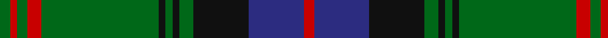

In pattern [GRGRGKGKGKBR](/patterns/grgrgkgkgkbr/).

This was sourced from register-of-tartans.  It is a [12 stripes tartan](/stripes/stripes12/).

Original link https://www.tartanregister.gov.uk/tartanDetails.aspx?ref=3290

## Attestations

This cloth appears in 2 source records; the oldest owns this page.

- 01/09/1996 — Park (register-of-tartans, [record](https://www.tartanregister.gov.uk/tartanDetails.aspx?ref=3290))
- September 1996 — Park (Name) (tartans-authority, [record](http://www.tartansauthority.com/tartan-ferret/display/2387/))

## Thread count
G/6 R4 G6 R8 G68 K4 G4 K4 G8 K32 DB32 R/6

## Palette
Each colour and its ΔE from the base-6 reference it is a variant of.

| Colour | Shade | Base | ΔE (OKLab) |
|---|---|---|---|
| DB | <code style="background-color:#2C2C80;">#2C2C80</code> `#2C2C80` | B <code style="background-color:#2A418A;">#2A418A</code> | 0.06 |
| G | <code style="background-color:#006818;">#006818</code> `#006818` | G <code style="background-color:#006100;">#006100</code> | 0.02 |
| K | <code style="background-color:#101010;">#101010</code> `#101010` | K <code style="background-color:#000000;">#000000</code> | 0.17 |
| R | <code style="background-color:#C80000;">#C80000</code> `#C80000` | R <code style="background-color:#CC0000;">#CC0000</code> | 0.01 |

## Nearest tartans

The nearest existing variants by ΔTartan distance.

1. [Fort William](/setts/s11/g17b2y2b2k21b2k3g30k2b2k4~b5c8ca8-g5c6428-k101010-y9c9c00~x2/) — ΔT 0.90
1. [Durie Clan Tartan Tartan Number: 2228. Earliest known date: 1988 When the matriculation of the Durie 'Arms' was updated in June 1988, this tartan was designed for family use by Harry G Lindlay of Kinloch & Anderson of Edinburgh. The design is said to be based on the Argyle & Southern Highlanders regimental tartan - the yellow is from the mess dress (military uniform evening wear) facings (lapels) and the burgundy represents the Durie family's French connections. Andrew, son of Lt. Col. Raymond Varley Dewar Durie succeded his father as clan chieftain in 1999. See products available Copyright © Blair Urquhart, Comrie, 2015](/setts/s16/g2y1g12r4b1r1b1r1b12r1b1r1b1r4g12y1~b202060-g006818-r880000-ye8c000~x4/) — ΔT 0.96
1. [Glen Tilt #1](/setts/s10/w1b1g1b11ba6b1g14b1g1w1~b4c0000-ba1c0070-g006818-wc0c0c0~x4/) — ΔT 1.04
1. [Danareth (Corporate)](/setts/s10/k7g6y3k12r19k12g62k62g12r7~g006818-k101010-r880000-yfccc00/) — ΔT 1.06
1. [Armstrong](/setts/s10/r3b12k1b1k1b2k12g30k1g2~b2c2c80-g006818-k101010-rc80000~x2/) — ΔT 1.06
1. [Fort William (District?)](/setts/s11/g17b2ga2b2k21b2k3g30k2b2k4~b5c8ca8-g006818-ga5c6428-k101010~x2/) — ΔT 1.07
1. [Zorra Caledonian Society](/setts/s10/g3w2g39k3ga3k3g3k20ga10r2~g284942-ga548b54-k101010-rc82536-wffffff~x2/) — ΔT 1.09
1. [Fort William District Tartan Tartan Number: 699. Earliest known date: 1819 The pattern books of the old firm of weavers, Wilson's of Bannockburn, provide a reliable early source for this tartan. Wilson's were in business with a monopoly to supply tartan to the regiments in the second half of the 18th century before this pattern was recorded. See products available Copyright © Blair Urquhart, Comrie, 2015](/setts/s11/g17b2ga2b2k21b2k3g30k2b2k4~b5c8ca8-g006818-ga289c18-k101010~x2/) — ΔT 1.11
1. [Cochrane](/setts/s15/g34r4g3r2g4r2g3r4g17k17r2b17r4b4y3~b202060-g006818-k101010-rc80000-yd8b000~x2/) — ΔT 1.11
1. [Cochrane (1984) Clan Tartan Tartan Number: 978. Earliest known date: 1984 Lord Dundonald originally registered a version missing a red and a green stripe in 1974. There is a story that a fragment of this design was discovered in the foundations of a Perthshire house in 1934. Around that time, a count was recorded from the sample books of Messrs William Anderson. The red and green have been restored in this version, which is now the 'approved' tartan, and appears in the 'Appendix' of the Lyon Court Books dated 12th November 1984. See products available Copyright © Blair Urquhart, Comrie, 2015](/setts/s15/g34r4g4r2g4r2g3r4g17k17r2b17r4b4y3~b2c2c80-g006818-k101010-rc80000-ye8c000~x2/) — ΔT 1.13

## Neighbour map

Every grey dot is one of 15726 variants placed by the first two principal components of the ΔTartan feature space (44% of its variance). Red is this tartan; blue dots are its nearest — click one to open its page.

<svg viewBox="0 0 640 380" role="img" style="max-width:100%;height:auto;border:1px solid #e0e0e0;border-radius:4px;display:block" xmlns="http://www.w3.org/2000/svg"><image href="/nn/cloud.v1.png" width="640" height="380"/><a href="/setts/s11/g17b2y2b2k21b2k3g30k2b2k4~b5c8ca8-g5c6428-k101010-y9c9c00~x2/"><circle cx="337.8" cy="159.4" r="4" fill="#3465a4"><title>Fort William</title></circle></a><a href="/setts/s16/g2y1g12r4b1r1b1r1b12r1b1r1b1r4g12y1~b202060-g006818-r880000-ye8c000~x4/"><circle cx="273.2" cy="148.4" r="4" fill="#3465a4"><title>Durie Clan Tartan Tartan Number: 2228. Earliest known date: 1988 When the matriculation of the Durie 'Arms' was updated in June 1988, this tartan was designed for family use by Harry G Lindlay of Kinloch &amp; Anderson of Edinburgh. The design is said to be based on the Argyle &amp; Southern Highlanders regimental tartan - the yellow is from the mess dress (military uniform evening wear) facings (lapels) and the burgundy represents the Durie family's French connections. Andrew, son of Lt. Col. Raymond Varley Dewar Durie succeded his father as clan chieftain in 1999. See products available Copyright © Blair Urquhart, Comrie, 2015</title></circle></a><a href="/setts/s10/w1b1g1b11ba6b1g14b1g1w1~b4c0000-ba1c0070-g006818-wc0c0c0~x4/"><circle cx="265.0" cy="157.8" r="4" fill="#3465a4"><title>Glen Tilt #1</title></circle></a><a href="/setts/s10/k7g6y3k12r19k12g62k62g12r7~g006818-k101010-r880000-yfccc00/"><circle cx="306.1" cy="163.5" r="4" fill="#3465a4"><title>Danareth (Corporate)</title></circle></a><a href="/setts/s10/r3b12k1b1k1b2k12g30k1g2~b2c2c80-g006818-k101010-rc80000~x2/"><circle cx="337.2" cy="134.4" r="4" fill="#3465a4"><title>Armstrong</title></circle></a><a href="/setts/s11/g17b2ga2b2k21b2k3g30k2b2k4~b5c8ca8-g006818-ga5c6428-k101010~x2/"><circle cx="337.2" cy="166.9" r="4" fill="#3465a4"><title>Fort William (District?)</title></circle></a><a href="/setts/s10/g3w2g39k3ga3k3g3k20ga10r2~g284942-ga548b54-k101010-rc82536-wffffff~x2/"><circle cx="313.9" cy="136.1" r="4" fill="#3465a4"><title>Zorra Caledonian Society</title></circle></a><a href="/setts/s11/g17b2ga2b2k21b2k3g30k2b2k4~b5c8ca8-g006818-ga289c18-k101010~x2/"><circle cx="333.4" cy="165.6" r="4" fill="#3465a4"><title>Fort William District Tartan Tartan Number: 699. Earliest known date: 1819 The pattern books of the old firm of weavers, Wilson's of Bannockburn, provide a reliable early source for this tartan. Wilson's were in business with a monopoly to supply tartan to the regiments in the second half of the 18th century before this pattern was recorded. See products available Copyright © Blair Urquhart, Comrie, 2015</title></circle></a><a href="/setts/s15/g34r4g3r2g4r2g3r4g17k17r2b17r4b4y3~b202060-g006818-k101010-rc80000-yd8b000~x2/"><circle cx="263.4" cy="124.7" r="4" fill="#3465a4"><title>Cochrane</title></circle></a><a href="/setts/s15/g34r4g4r2g4r2g3r4g17k17r2b17r4b4y3~b2c2c80-g006818-k101010-rc80000-ye8c000~x2/"><circle cx="263.1" cy="124.7" r="4" fill="#3465a4"><title>Cochrane (1984) Clan Tartan Tartan Number: 978. Earliest known date: 1984 Lord Dundonald originally registered a version missing a red and a green stripe in 1974. There is a story that a fragment of this design was discovered in the foundations of a Perthshire house in 1934. Around that time, a count was recorded from the sample books of Messrs William Anderson. The red and green have been restored in this version, which is now the 'approved' tartan, and appears in the 'Appendix' of the Lyon Court Books dated 12th November 1984. See products available Copyright © Blair Urquhart, Comrie, 2015</title></circle></a><circle cx="302.5" cy="148.7" r="5" fill="#c00000"/></svg>

ID: /setts/s12/g3r2g3r4g34k2g2k2g4k16b16r3~b2c2c80-g006818-k101010-rc80000~x2/
