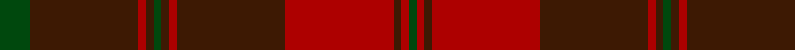

In pattern [GBRBGBRBRBRG](/patterns/gbrbgbrbrbrg/).

This was sourced from register-of-tartans.  It is a [12 stripes tartan](/stripes/stripes12/).

Original link https://www.tartanregister.gov.uk/tartanDetails.aspx?ref=10614

## Thread count
G/16 DR56 DRa4 DR4 G4 DR4 DRa4 DR56 DRa56 DR4 DRa4 G/4

## Palette
Each colour and its ΔE from the base-6 reference it is a variant of.

| Colour | Shade | Base | ΔE (OKLab) |
|---|---|---|---|
| DR | <code style="background-color:#3D1903;">#3D1903</code> `#3D1903` | B <code style="background-color:#2A418A;">#2A418A</code> | 0.23 |
| DRa | <code style="background-color:#AD0000;">#AD0000</code> `#AD0000` | R <code style="background-color:#CC0000;">#CC0000</code> | 0.07 |
| G | <code style="background-color:#00480D;">#00480D</code> `#00480D` | G <code style="background-color:#006100;">#006100</code> | 0.09 |

## Nearest tartans

The nearest existing variants by ΔTartan distance.

1. [Frame - Ferniegair (Personal)](/setts/s12/g4ga14r1ga1g1ga1r1ga14r14ga1r1g1x4~g003820-ga604000-rc8002c/) — ΔT 0.87
1. [Livingstone (Australia) NSW](/setts/s12/g12r4k1y1r2k1y1r4g16r20g2r8x2~g003820-k101010-r780808-ye1ad29/) — ΔT 1.34
1. [Beanpole Brown Trial](/setts/s12/r4b31r2ra2r2ra2r2b2ba2b4ba11r4~b441800-ba4c3428-ra07c58-ra880000/) — ΔT 1.37
1. [MacDonell of Keppoch #3](/setts/s15/r12g2r1g1r1g1r6g12r1k1r12k1r1k1r3x4~g006818-k101010-r880000/) — ΔT 1.47
1. [MacDonald of Aird & Valley (Clan?)](/setts/s14/r12b1r1g8r2b1r1b3r1b1r12g1r1g8x4~b1c0070-g006818-r880000/) — ΔT 1.50
1. [Chisholm D](/setts/s10/r6y1r24b6g2b1g2b1g12r1x2~b6e5058-g11450d-raa0000-yaaaaaa/) — ΔT 1.55
1. [MacDougall #5](/setts/s12/r7ra2b2r2g32r6b12r41g2r5ra2g5x2~b2c4084-g005020-r960028-rac82828/) — ΔT 1.55
1. [MacIver of Strathendry Htg (Personal](/setts/s9/r3ra28b5ra5b33ra5b5ra28y3x2~b441800-r880000-ra98481c-ybc8c00/) — ΔT 1.56
1. [Donachie of Brockloch (Clan)](/setts/s10/r24g2r2g20r25g2r2g2r2g20x2~g005834-r940000/) — ΔT 1.56
1. [Griffiths Welsh Name Tartan Tartan Number: 5733. Earliest known date: 2002 The tartan for this Welsh surname and its variation, Griffith, is actually woven in Wales at the Cambrian Woollen Mill, weaving on the same site since 1830. This tartan differs from many traditional patterns in that the warp and weft differ, giving the finished worsted wool cloth more of a predominant stripe, vertically noticeable in the finished Kilt, or Cilt in Wales. Available from Wales Tartan Centres in Swansea See products available Copyright © Blair Urquhart, Comrie, 2015](/setts/s11/y4b37ba17b4ba8b6r2b5ba2b3y4~b441800-ba202060-rc80000-ya08858/) — ΔT 1.68

## Neighbour map

Every grey dot is one of 15726 variants placed by the first two principal components of the ΔTartan feature space (44% of its variance). Red is this tartan; blue dots are its nearest — click one to open its page.

<svg viewBox="0 0 640 380" role="img" style="max-width:100%;height:auto;border:1px solid #e0e0e0;border-radius:4px;display:block" xmlns="http://www.w3.org/2000/svg"><image href="/nn/cloud.v1.png" width="640" height="380"/><a href="/setts/s12/g4ga14r1ga1g1ga1r1ga14r14ga1r1g1x4~g003820-ga604000-rc8002c/"><circle cx="446.8" cy="187.0" r="4" fill="#3465a4"><title>Frame - Ferniegair (Personal)</title></circle></a><a href="/setts/s12/g12r4k1y1r2k1y1r4g16r20g2r8x2~g003820-k101010-r780808-ye1ad29/"><circle cx="408.6" cy="173.5" r="4" fill="#3465a4"><title>Livingstone (Australia) NSW</title></circle></a><a href="/setts/s12/r4b31r2ra2r2ra2r2b2ba2b4ba11r4~b441800-ba4c3428-ra07c58-ra880000/"><circle cx="395.3" cy="156.6" r="4" fill="#3465a4"><title>Beanpole Brown Trial</title></circle></a><a href="/setts/s15/r12g2r1g1r1g1r6g12r1k1r12k1r1k1r3x4~g006818-k101010-r880000/"><circle cx="466.4" cy="182.2" r="4" fill="#3465a4"><title>MacDonell of Keppoch #3</title></circle></a><a href="/setts/s14/r12b1r1g8r2b1r1b3r1b1r12g1r1g8x4~b1c0070-g006818-r880000/"><circle cx="380.1" cy="180.9" r="4" fill="#3465a4"><title>MacDonald of Aird &amp; Valley (Clan?)</title></circle></a><a href="/setts/s10/r6y1r24b6g2b1g2b1g12r1x2~b6e5058-g11450d-raa0000-yaaaaaa/"><circle cx="419.3" cy="149.1" r="4" fill="#3465a4"><title>Chisholm D</title></circle></a><a href="/setts/s12/r7ra2b2r2g32r6b12r41g2r5ra2g5x2~b2c4084-g005020-r960028-rac82828/"><circle cx="385.6" cy="147.4" r="4" fill="#3465a4"><title>MacDougall #5</title></circle></a><a href="/setts/s9/r3ra28b5ra5b33ra5b5ra28y3x2~b441800-r880000-ra98481c-ybc8c00/"><circle cx="421.3" cy="211.9" r="4" fill="#3465a4"><title>MacIver of Strathendry Htg (Personal</title></circle></a><a href="/setts/s10/r24g2r2g20r25g2r2g2r2g20x2~g005834-r940000/"><circle cx="449.9" cy="231.2" r="4" fill="#3465a4"><title>Donachie of Brockloch (Clan)</title></circle></a><a href="/setts/s11/y4b37ba17b4ba8b6r2b5ba2b3y4~b441800-ba202060-rc80000-ya08858/"><circle cx="428.6" cy="171.0" r="4" fill="#3465a4"><title>Griffiths Welsh Name Tartan Tartan Number: 5733. Earliest known date: 2002 The tartan for this Welsh surname and its variation, Griffith, is actually woven in Wales at the Cambrian Woollen Mill, weaving on the same site since 1830. This tartan differs from many traditional patterns in that the warp and weft differ, giving the finished worsted wool cloth more of a predominant stripe, vertically noticeable in the finished Kilt, or Cilt in Wales. Available from Wales Tartan Centres in Swansea See products available Copyright © Blair Urquhart, Comrie, 2015</title></circle></a><circle cx="441.0" cy="188.2" r="5" fill="#c00000"/></svg>

ID: /setts/s12/g4b14r1b1g1b1r1b14r14b1r1g1x4~b3d1903-g00480d-rad0000/
