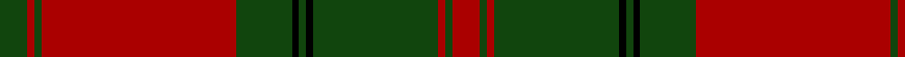

In pattern [GRGRGKGKGRGR](/patterns/grgrgkgkgrgr/).

This was sourced from weddslist.  It is a [12 stripes tartan](/stripes/stripes12/).

Original link http://www.weddslist.com/cgi-bin/tartans/pg.pl?source=tinsel

## Thread count
DG/8 DR2 DG2 DR56 DG16 K2 DG2 K2 DG36 DR2 DG2 DR/8

## Palette
Each colour and its ΔE from the base-6 reference it is a variant of.

| Colour | Shade | Base | ΔE (OKLab) |
|---|---|---|---|
| DG | <code style="background-color:#11450D;">#11450D</code> `#11450D` | G <code style="background-color:#006100;">#006100</code> | 0.09 |
| DR | <code style="background-color:#AA0000;">#AA0000</code> `#AA0000` | R <code style="background-color:#CC0000;">#CC0000</code> | 0.07 |
| K | <code style="background-color:#000000;">#000000</code> `#000000` | K <code style="background-color:#000000;">#000000</code> | 0.00 |

## Nearest tartans

The nearest existing variants by ΔTartan distance.

1. [Drummond VS](/setts/s12/g4r1g1r28g8k1g1k1g18r1g1r4~g11450d-k000000-raa0000/) — ΔT 0.00
1. [Drummond VS](/setts/s12/g4r1g1r28g8k1g1k1g18r1g1r4~g004c00-k000000-rc80000/) — ΔT 0.91
1. [Unidentified #62](/setts/s10/r32y1g8y1g8y1g8y1g8y1~g006818-r880000-yd09800~x2/) — ΔT 1.05
1. [Drummond #3](/setts/s12/g4r1g1r28g8k1g1k1g18r1g1r4~g005020-k101010-rdc0000~x2/) — ΔT 1.07
1. [Thomas of Wales](/setts/s8/g2r27b2g19b1g2b1r2~b202060-g006818-rc80000~x2/) — ΔT 1.25
1. [MacAlister of Glenbarr](/setts/s14/g20r3g6r6g6r8b2r2g20r2b2r46b3r8~b440044-g006818-rc80000~x2/) — ΔT 1.27
1. [MacFie](/setts/s9/y2r12g2r1g32r1g2r12ya2~g11450d-raa0000-yaaaa00-yaaaaaaa~x2/) — ΔT 1.28
1. [MacDonell of Glengarry #4](/setts/s11/g18r3g2r2b6r2g2r24g1r2g6~b2c4084-g005020-rdc0000~x2/) — ΔT 1.29
1. [Bruce - 1819 (Old)](/setts/s14/r60b2r2g63r2b2r2b20r2b2r54g2r2g40~b1c1c50-g5c6428-rc80000/) — ΔT 1.34
1. [MacDonell of Glengarry](/setts/s11/g18r3g2r2b6r2g2r24g1r2g6~b304080-g008000-rc00000~x2/) — ΔT 1.35

## Neighbour map

Every grey dot is one of 15726 variants placed by the first two principal components of the ΔTartan feature space (44% of its variance). Red is this tartan; blue dots are its nearest — click one to open its page.

<svg viewBox="0 0 640 380" role="img" style="max-width:100%;height:auto;border:1px solid #e0e0e0;border-radius:4px;display:block" xmlns="http://www.w3.org/2000/svg"><image href="/nn/cloud.v1.png" width="640" height="380"/><a href="/setts/s12/g4r1g1r28g8k1g1k1g18r1g1r4~g11450d-k000000-raa0000/"><circle cx="420.9" cy="138.2" r="4" fill="#3465a4"><title>Drummond VS</title></circle></a><a href="/setts/s12/g4r1g1r28g8k1g1k1g18r1g1r4~g004c00-k000000-rc80000/"><circle cx="396.7" cy="126.0" r="4" fill="#3465a4"><title>Drummond VS</title></circle></a><a href="/setts/s10/r32y1g8y1g8y1g8y1g8y1~g006818-r880000-yd09800~x2/"><circle cx="398.4" cy="147.9" r="4" fill="#3465a4"><title>Unidentified #62</title></circle></a><a href="/setts/s12/g4r1g1r28g8k1g1k1g18r1g1r4~g005020-k101010-rdc0000~x2/"><circle cx="395.6" cy="122.7" r="4" fill="#3465a4"><title>Drummond #3</title></circle></a><a href="/setts/s8/g2r27b2g19b1g2b1r2~b202060-g006818-rc80000~x2/"><circle cx="404.5" cy="148.3" r="4" fill="#3465a4"><title>Thomas of Wales</title></circle></a><a href="/setts/s14/g20r3g6r6g6r8b2r2g20r2b2r46b3r8~b440044-g006818-rc80000~x2/"><circle cx="409.0" cy="137.8" r="4" fill="#3465a4"><title>MacAlister of Glenbarr</title></circle></a><a href="/setts/s9/y2r12g2r1g32r1g2r12ya2~g11450d-raa0000-yaaaa00-yaaaaaaa~x2/"><circle cx="412.3" cy="135.0" r="4" fill="#3465a4"><title>MacFie</title></circle></a><a href="/setts/s11/g18r3g2r2b6r2g2r24g1r2g6~b2c4084-g005020-rdc0000~x2/"><circle cx="360.3" cy="144.2" r="4" fill="#3465a4"><title>MacDonell of Glengarry #4</title></circle></a><a href="/setts/s14/r60b2r2g63r2b2r2b20r2b2r54g2r2g40~b1c1c50-g5c6428-rc80000/"><circle cx="405.7" cy="128.1" r="4" fill="#3465a4"><title>Bruce - 1819 (Old)</title></circle></a><a href="/setts/s11/g18r3g2r2b6r2g2r24g1r2g6~b304080-g008000-rc00000~x2/"><circle cx="362.6" cy="147.7" r="4" fill="#3465a4"><title>MacDonell of Glengarry</title></circle></a><circle cx="420.9" cy="138.2" r="5" fill="#c00000"/></svg>

ID: /setts/s12/g4r1g1r28g8k1g1k1g18r1g1r4~g11450d-k000000-raa0000~x2/
