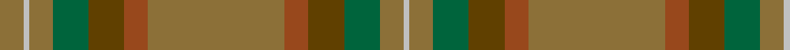

In pattern [GWGGGRGRGGGW](/patterns/gwgggrgrgggw/).

This was sourced from register-of-tartans.  It is a [12 stripes tartan](/stripes/stripes12/).

Original link https://www.tartanregister.gov.uk/tartanDetails.aspx?ref=4151

## Thread count
LT/16 N4 LT16 G24 T24 Ta16 LT92 Ta16 T24 G24 LT16 N/4

## Palette
Each colour and its ΔE from the base-6 reference it is a variant of.

| Colour | Shade | Base | ΔE (OKLab) |
|---|---|---|---|
| G | <code style="background-color:#00643C;">#00643C</code> `#00643C` | G <code style="background-color:#006100;">#006100</code> | 0.05 |
| LT | <code style="background-color:#8C7038;">#8C7038</code> `#8C7038` | G <code style="background-color:#006100;">#006100</code> | 0.18 |
| N | <code style="background-color:#C0C0C0;">#C0C0C0</code> `#C0C0C0` | W <code style="background-color:#F7F7F7;">#F7F7F7</code> | 0.17 |
| T | <code style="background-color:#604000;">#604000</code> `#604000` | G <code style="background-color:#006100;">#006100</code> | 0.14 |
| Ta | <code style="background-color:#98481C;">#98481C</code> `#98481C` | R <code style="background-color:#CC0000;">#CC0000</code> | 0.11 |

## Nearest tartans

The nearest existing variants by ΔTartan distance.

1. [Ensign of Ontario (Fashion)](/setts/s15/g21k1r4k1ga21g3ga3g3ga21g3y4g21ga3g3ga3~g006038-ga604000-k101010-rc80000-ybc8c00~x2/) — ΔT 1.46
1. [Historic Scotland Corporate Tartan Tartan Number: 2122. Earliest known date: 1988 Custodians at Historic Scotland properties throughout Scotland, including Edinburgh Castle, wear this distinctive tartan. See products available Copyright © Blair Urquhart, Comrie, 2015](/setts/s9/g2r1g1r2g21ga9k1ga7k2~g604000-ga5c6428-k101010-r888888~x2/) — ΔT 1.59
1. [MacNaughton Htg](/setts/s9/g1r1ga22gb21g12r11ga22r1g1~g003820-ga145024-gb604000-ra40800~x2/) — ΔT 1.72
1. [Johansson (Personal)](/setts/s13/r8g1r1g1r1g25b1g1b1g1b25ra7y6~b5c5c5c-g5c6428-r880000-ra888888-ybc8c00~x2/) — ΔT 1.72
1. [The Broons (Corporate)](/setts/s9/r3k1g8y1ga7y1g19gb25k1~g5c6428-ga604000-gb603800-k101010-rc80000-ybc8c00~x2/) — ΔT 1.75
1. [Johansson (Aneby, Sweden), Christian (Personal)](/setts/s13/r8g1r1g1r1g25b1g1b1g1b25ga7y6~b3f4441-g70714d-ga75786c-r97342f-yc5831b~x2/) — ΔT 1.82
1. [Prince David](/setts/s15/g3ga1y2g3ga1y2gb21g18gb2g3gb2g18gb21ga1y2~g006818-ga5c6428-gb604000-yd87c00~x2/) — ΔT 1.84
1. [Broons, The (DC Thomson)](/setts/s9/r3k1g8y1ga7y1g19gb25k1~g556b2f-ga603311-gb8b6508-k101010-rff0000-yffd700~x2/) — ΔT 1.88
1. [Willsher Wedding (Personal)](/setts/s9/b8r4w2r4b1r12g9b24ra4~b5c5c5c-g006818-r888888-ra880000-we8ccb8~x2/) — ΔT 1.89
1. [Annan (Fashion)](/setts/s10/g16r2g2ra2g2r2g2b6ba10g3~b441800-ba5c5c5c-g8c7038-r888888-rab84c00~x2/) — ΔT 1.89

## Neighbour map

Every grey dot is one of 15726 variants placed by the first two principal components of the ΔTartan feature space (44% of its variance). Red is this tartan; blue dots are its nearest — click one to open its page.

<svg viewBox="0 0 640 380" role="img" style="max-width:100%;height:auto;border:1px solid #e0e0e0;border-radius:4px;display:block" xmlns="http://www.w3.org/2000/svg"><image href="/nn/cloud.v1.png" width="640" height="380"/><a href="/setts/s15/g21k1r4k1ga21g3ga3g3ga21g3y4g21ga3g3ga3~g006038-ga604000-k101010-rc80000-ybc8c00~x2/"><circle cx="405.7" cy="172.9" r="4" fill="#3465a4"><title>Ensign of Ontario (Fashion)</title></circle></a><a href="/setts/s9/g2r1g1r2g21ga9k1ga7k2~g604000-ga5c6428-k101010-r888888~x2/"><circle cx="457.3" cy="197.6" r="4" fill="#3465a4"><title>Historic Scotland Corporate Tartan Tartan Number: 2122. Earliest known date: 1988 Custodians at Historic Scotland properties throughout Scotland, including Edinburgh Castle, wear this distinctive tartan. See products available Copyright © Blair Urquhart, Comrie, 2015</title></circle></a><a href="/setts/s9/g1r1ga22gb21g12r11ga22r1g1~g003820-ga145024-gb604000-ra40800~x2/"><circle cx="401.4" cy="224.0" r="4" fill="#3465a4"><title>MacNaughton Htg</title></circle></a><a href="/setts/s13/r8g1r1g1r1g25b1g1b1g1b25ra7y6~b5c5c5c-g5c6428-r880000-ra888888-ybc8c00~x2/"><circle cx="348.1" cy="139.6" r="4" fill="#3465a4"><title>Johansson (Personal)</title></circle></a><a href="/setts/s9/r3k1g8y1ga7y1g19gb25k1~g5c6428-ga604000-gb603800-k101010-rc80000-ybc8c00~x2/"><circle cx="375.7" cy="165.7" r="4" fill="#3465a4"><title>The Broons (Corporate)</title></circle></a><a href="/setts/s13/r8g1r1g1r1g25b1g1b1g1b25ga7y6~b3f4441-g70714d-ga75786c-r97342f-yc5831b~x2/"><circle cx="339.7" cy="135.9" r="4" fill="#3465a4"><title>Johansson (Aneby, Sweden), Christian (Personal)</title></circle></a><a href="/setts/s15/g3ga1y2g3ga1y2gb21g18gb2g3gb2g18gb21ga1y2~g006818-ga5c6428-gb604000-yd87c00~x2/"><circle cx="423.0" cy="179.9" r="4" fill="#3465a4"><title>Prince David</title></circle></a><a href="/setts/s9/r3k1g8y1ga7y1g19gb25k1~g556b2f-ga603311-gb8b6508-k101010-rff0000-yffd700~x2/"><circle cx="321.0" cy="140.5" r="4" fill="#3465a4"><title>Broons, The (DC Thomson)</title></circle></a><a href="/setts/s9/b8r4w2r4b1r12g9b24ra4~b5c5c5c-g006818-r888888-ra880000-we8ccb8~x2/"><circle cx="348.6" cy="177.3" r="4" fill="#3465a4"><title>Willsher Wedding (Personal)</title></circle></a><a href="/setts/s10/g16r2g2ra2g2r2g2b6ba10g3~b441800-ba5c5c5c-g8c7038-r888888-rab84c00~x2/"><circle cx="348.3" cy="209.6" r="4" fill="#3465a4"><title>Annan (Fashion)</title></circle></a><circle cx="385.2" cy="174.2" r="5" fill="#c00000"/></svg>

ID: /setts/s12/g4w1g4ga6gb6r4g23r4gb6ga6g4w1~g8c7038-ga00643c-gb604000-r98481c-wc0c0c0~x4/
