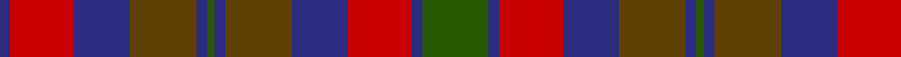

In pattern [BRBGBGBGBRBG](/patterns/brbgbgbgbrbg/).

This was sourced from register-of-tartans.  It is a [12 stripes tartan](/stripes/stripes12/).

Original link https://www.tartanregister.gov.uk/tartanDetails.aspx?ref=3259

## Attestations

This cloth appears in 2 source records; the oldest owns this page.

- 01/01/2002 — Orban-Prentice (Personal) (register-of-tartans, [record](https://www.tartanregister.gov.uk/tartanDetails.aspx?ref=3259))
- undated — Orban-Prentice Personal Tartan Tartan Number: 5769. Earliest known date: 2002 Nothing See products available Copyright © Blair Urquhart, Comrie, 2015 (house-of-tartan, [record](http://www.house-of-tartan.scotland.net/house/TartanViewjs.asp?colr=Def&tnam=5769))

## Thread count
DB/8 R48 DB42 T50 DB8 G6 DB8 T50 DB42 R48 DB8 G/50

## Palette
Each colour and its ΔE from the base-6 reference it is a variant of.

| Colour | Shade | Base | ΔE (OKLab) |
|---|---|---|---|
| DB | <code style="background-color:#2C2C80;">#2C2C80</code> `#2C2C80` | B <code style="background-color:#2C4084;">#2C4084</code> | 0.05 |
| G | <code style="background-color:#285800;">#285800</code> `#285800` | G <code style="background-color:#006400;">#006400</code> | 0.04 |
| R | <code style="background-color:#C80000;">#C80000</code> `#C80000` | R <code style="background-color:#C80000;">#C80000</code> | 0.00 |
| T | <code style="background-color:#604000;">#604000</code> `#604000` | G <code style="background-color:#006400;">#006400</code> | 0.14 |

## Nearest tartans

The nearest existing variants by ΔTartan distance.

1. [Murray of Atholl](/setts/s13/b36g8b6g6b6g36ga36r20ga36g36b36g6r20-b2c2c80-g603800-ga408060-rc80000/) — ΔT 0.81
1. [Hueg (Munich) Hunting (Personal)](/setts/s11/r20b20r8g4r4b4r8g24ba24g6ba8-b311f11-ba433a5a-g23321b-rca2625/) — ΔT 0.84
1. [Clare Irish County Tartan Tartan Number: 2248. Earliest known date: 1995 One of a series of Irish District tartans designed by Polly Wittering of the House of Edgar, with colours reminiscent of the Country with soft warm colours dominating. See products available Copyright © Blair Urquhart, Comrie, 2015](/setts/s11/r6b28g28b4r28b4r28b4g28b4y6-b101448-g3c6838-r8c0020-yd09000/) — ΔT 1.04
1. [Ruben Delanghe (Personal)](/setts/s10/g14k5b2r21g18k4b18r9k2r12-b38388c-g0c442c-k101010-r940c0c/) — ΔT 1.11
1. [Crook](/setts/s9/g8b24r6k6r6g32b4r28k8-b1870a4-g406054-k101010-ra00048/) — ΔT 1.11
1. [Monaghan Irish County Tartan Tartan Number: 2267. Earliest known date: 1996 One of a series of Irish District tartans designed by Polly Wittering of the House of Edgar, with colours reminiscent of the Country with soft warm colours dominating. See products available Copyright © Blair Urquhart, Comrie, 2015](/setts/s9/y6b4r28g34b28y16r28b4y6-b28200c-g004830-r782030-ycc9410/) — ΔT 1.13
1. [Glenmorangie #2](/setts/s11/g12r4g4r8g26b24ra26r8ra4r4ra12-b2a2303-g503c14-r781c38-rabe7832/) — ΔT 1.13
1. [Clare, County](/setts/s10/r6b28g28b4r28b4r28g28b4y6-b440044-g003820-r880000-yd8b000/) — ΔT 1.15
1. [Kinloch Anderson](/setts/s12/r8g28y4g8y4k12g6k12b28r4b8r8-b2c2c80-g604000-k101010-rc80000-yd87c00/) — ΔT 1.23
1. [Orban-Prentice (Personal)](/setts/s7/g50b8r48b42ga50b8g6-b2c2c80-g285800-ga604000-rc80000/) — ΔT 1.23

## Neighbour map

Every grey dot is one of 15726 variants placed by the first two principal components of the ΔTartan feature space (44% of its variance). Red is this tartan; blue dots are its nearest — click one to open its page.

<svg viewBox="0 0 640 380" role="img" style="max-width:100%;height:auto;border:1px solid #e0e0e0;border-radius:4px;display:block" xmlns="http://www.w3.org/2000/svg"><image href="/nn/cloud.v1.png" width="640" height="380"/><a href="/setts/s13/b36g8b6g6b6g36ga36r20ga36g36b36g6r20-b2c2c80-g603800-ga408060-rc80000/"><circle cx="156.8" cy="230.3" r="4" fill="#3465a4"><title>Murray of Atholl</title></circle></a><a href="/setts/s11/r20b20r8g4r4b4r8g24ba24g6ba8-b311f11-ba433a5a-g23321b-rca2625/"><circle cx="172.5" cy="233.7" r="4" fill="#3465a4"><title>Hueg (Munich) Hunting (Personal)</title></circle></a><a href="/setts/s11/r6b28g28b4r28b4r28b4g28b4y6-b101448-g3c6838-r8c0020-yd09000/"><circle cx="204.3" cy="212.8" r="4" fill="#3465a4"><title>Clare Irish County Tartan Tartan Number: 2248. Earliest known date: 1995 One of a series of Irish District tartans designed by Polly Wittering of the House of Edgar, with colours reminiscent of the Country with soft warm colours dominating. See products available Copyright © Blair Urquhart, Comrie, 2015</title></circle></a><a href="/setts/s10/g14k5b2r21g18k4b18r9k2r12-b38388c-g0c442c-k101010-r940c0c/"><circle cx="240.3" cy="226.1" r="4" fill="#3465a4"><title>Ruben Delanghe (Personal)</title></circle></a><a href="/setts/s9/g8b24r6k6r6g32b4r28k8-b1870a4-g406054-k101010-ra00048/"><circle cx="198.2" cy="220.0" r="4" fill="#3465a4"><title>Crook</title></circle></a><a href="/setts/s9/y6b4r28g34b28y16r28b4y6-b28200c-g004830-r782030-ycc9410/"><circle cx="184.7" cy="218.1" r="4" fill="#3465a4"><title>Monaghan Irish County Tartan Tartan Number: 2267. Earliest known date: 1996 One of a series of Irish District tartans designed by Polly Wittering of the House of Edgar, with colours reminiscent of the Country with soft warm colours dominating. See products available Copyright © Blair Urquhart, Comrie, 2015</title></circle></a><a href="/setts/s11/g12r4g4r8g26b24ra26r8ra4r4ra12-b2a2303-g503c14-r781c38-rabe7832/"><circle cx="179.7" cy="220.9" r="4" fill="#3465a4"><title>Glenmorangie #2</title></circle></a><a href="/setts/s10/r6b28g28b4r28b4r28g28b4y6-b440044-g003820-r880000-yd8b000/"><circle cx="230.0" cy="231.4" r="4" fill="#3465a4"><title>Clare, County</title></circle></a><a href="/setts/s12/r8g28y4g8y4k12g6k12b28r4b8r8-b2c2c80-g604000-k101010-rc80000-yd87c00/"><circle cx="134.8" cy="189.4" r="4" fill="#3465a4"><title>Kinloch Anderson</title></circle></a><a href="/setts/s7/g50b8r48b42ga50b8g6-b2c2c80-g285800-ga604000-rc80000/"><circle cx="167.7" cy="239.2" r="4" fill="#3465a4"><title>Orban-Prentice (Personal)</title></circle></a><circle cx="171.5" cy="215.8" r="5" fill="#c00000"/></svg>

ID: /setts/s12/g50b8r48b42ga50b8g6b8ga50b42r48b8-b2c2c80-g285800-ga604000-rc80000/
