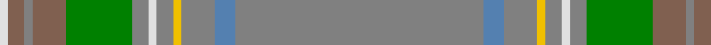

In pattern [GBGYGWGGRGRW](/patterns/gbgygwggrgrw/).

This was sourced from weddslist.  It is a [12 stripes tartan](/stripes/stripes12/).

Original link http://www.weddslist.com/cgi-bin/tartans/pg.pl?source=sts

## Thread count
LN/4 LT8 N4 LT16 G32 N8 LN4 N8 Y4 N16 B10 N/120

## Palette
Each colour and its ΔE from the base-6 reference it is a variant of.

| Colour | Shade | Base | ΔE (OKLab) |
|---|---|---|---|
| B | <code style="background-color:#5480B0;">#5480B0</code> `#5480B0` | B <code style="background-color:#2A418A;">#2A418A</code> | 0.19 |
| G | <code style="background-color:#008000;">#008000</code> `#008000` | G <code style="background-color:#006100;">#006100</code> | 0.10 |
| LN | <code style="background-color:#E0E0E0;">#E0E0E0</code> `#E0E0E0` | W <code style="background-color:#F7F7F7;">#F7F7F7</code> | 0.07 |
| LT | <code style="background-color:#806050;">#806050</code> `#806050` | R <code style="background-color:#CC0000;">#CC0000</code> | 0.17 |
| N | <code style="background-color:#808080;">#808080</code> `#808080` | G <code style="background-color:#006100;">#006100</code> | 0.23 |
| Y | <code style="background-color:#F0C000;">#F0C000</code> `#F0C000` | Y <code style="background-color:#F2BF00;">#F2BF00</code> | 0.00 |

## Nearest tartans

The nearest existing variants by ΔTartan distance.

1. [Gabrielle (Fashion)](/setts/s12/b48r4b6y2b2ya2b2r10ba6b2ba3ya2~b5c5c5c-ba1474b4-r880000-ybc8c00-yaa0a0a0~x2/) — ΔT 1.63
1. [Stuart Silver Commemorative Tartan Tartan Number: 1281. Earliest known date: 1977 1977 Jubilee tartan NOT accepted. No official jubilee tartan was adopted for the occasion. See products available Copyright © Blair Urquhart, Comrie, 2015](/setts/s12/r60b5r8y2r4w2r4g16ga8r2ga4w2~b5c8ca8-g006818-ga604000-r888888-we0e0e0-ye8c000~x2/) — ΔT 1.65
1. [Craven County](/setts/s11/g46y1ga5y1gb5y1b5y1g16r1y4~b8b5da3-g427e89-ga766123-gb256527-rdd1212-ye1b609~x2/) — ΔT 1.67
1. [Bartlett, Chris (Personal)](/setts/s13/r4g40b12ga2b12g30k2g4k2g4ga2g3k3~b3f4441-g6c7058-ga75786c-k120a01-r89051b~x2/) — ΔT 1.72
1. [Haddrell (2013)](/setts/s7/r2b4g18ba2g2ba41w2~b1870a4-ba505050-g808080-rc80000-we0e0e0~x2/) — ΔT 2.04
1. [Stuart/Stewart Silver](/setts/s12/g60b5g8y2g4w2g4ga16gb8g2gb4w2~b3c82af-g808080-ga005020-gb503c14-we0e0e0-ye8c000~x2/) — ΔT 2.06
1. [Miller Hargreaves (Personal)](/setts/s8/y40b4y4r5g5y3ya6ra3~b5c8ca8-g767e52-r9c68a4-raa00000-yb0b0b0-yad8b000~x2/) — ΔT 2.11
1. [Down](/setts/s9/r65b9ra11r5ba2y2g5r2y13~b401000-ba5480b0-g808080-r806050-rac00000-yd09060~x2/) — ΔT 2.11
1. [Canuck Place](/setts/s9/w1b2y15b3y26r24y3ra2ya1~b1c1c50-r9c8098-ra901c38-we0e0e0-y889c5c-yabc8c00~x2/) — ΔT 2.14
1. [Stuart of Bute 2013 (Fashion)](/setts/s9/r16w8b1w2b1w1b8r34wa2~b5c5c5c-r888888-w98c8e8-wae0e0e0~x2/) — ΔT 2.16

## Neighbour map

Every grey dot is one of 15726 variants placed by the first two principal components of the ΔTartan feature space (44% of its variance). Red is this tartan; blue dots are its nearest — click one to open its page.

<svg viewBox="0 0 640 380" role="img" style="max-width:100%;height:auto;border:1px solid #e0e0e0;border-radius:4px;display:block" xmlns="http://www.w3.org/2000/svg"><image href="/nn/cloud.v1.png" width="640" height="380"/><a href="/setts/s12/b48r4b6y2b2ya2b2r10ba6b2ba3ya2~b5c5c5c-ba1474b4-r880000-ybc8c00-yaa0a0a0~x2/"><circle cx="518.3" cy="132.2" r="4" fill="#3465a4"><title>Gabrielle (Fashion)</title></circle></a><a href="/setts/s12/r60b5r8y2r4w2r4g16ga8r2ga4w2~b5c8ca8-g006818-ga604000-r888888-we0e0e0-ye8c000~x2/"><circle cx="456.7" cy="93.6" r="4" fill="#3465a4"><title>Stuart Silver Commemorative Tartan Tartan Number: 1281. Earliest known date: 1977 1977 Jubilee tartan NOT accepted. No official jubilee tartan was adopted for the occasion. See products available Copyright © Blair Urquhart, Comrie, 2015</title></circle></a><a href="/setts/s11/g46y1ga5y1gb5y1b5y1g16r1y4~b8b5da3-g427e89-ga766123-gb256527-rdd1212-ye1b609~x2/"><circle cx="529.8" cy="95.3" r="4" fill="#3465a4"><title>Craven County</title></circle></a><a href="/setts/s13/r4g40b12ga2b12g30k2g4k2g4ga2g3k3~b3f4441-g6c7058-ga75786c-k120a01-r89051b~x2/"><circle cx="486.8" cy="155.6" r="4" fill="#3465a4"><title>Bartlett, Chris (Personal)</title></circle></a><a href="/setts/s7/r2b4g18ba2g2ba41w2~b1870a4-ba505050-g808080-rc80000-we0e0e0~x2/"><circle cx="459.3" cy="170.9" r="4" fill="#3465a4"><title>Haddrell (2013)</title></circle></a><a href="/setts/s12/g60b5g8y2g4w2g4ga16gb8g2gb4w2~b3c82af-g808080-ga005020-gb503c14-we0e0e0-ye8c000~x2/"><circle cx="447.5" cy="91.1" r="4" fill="#3465a4"><title>Stuart/Stewart Silver</title></circle></a><a href="/setts/s8/y40b4y4r5g5y3ya6ra3~b5c8ca8-g767e52-r9c68a4-raa00000-yb0b0b0-yad8b000~x2/"><circle cx="443.0" cy="150.0" r="4" fill="#3465a4"><title>Miller Hargreaves (Personal)</title></circle></a><a href="/setts/s9/r65b9ra11r5ba2y2g5r2y13~b401000-ba5480b0-g808080-r806050-rac00000-yd09060~x2/"><circle cx="460.5" cy="108.8" r="4" fill="#3465a4"><title>Down</title></circle></a><a href="/setts/s9/w1b2y15b3y26r24y3ra2ya1~b1c1c50-r9c8098-ra901c38-we0e0e0-y889c5c-yabc8c00~x2/"><circle cx="383.5" cy="129.7" r="4" fill="#3465a4"><title>Canuck Place</title></circle></a><a href="/setts/s9/r16w8b1w2b1w1b8r34wa2~b5c5c5c-r888888-w98c8e8-wae0e0e0~x2/"><circle cx="533.6" cy="160.1" r="4" fill="#3465a4"><title>Stuart of Bute 2013 (Fashion)</title></circle></a><circle cx="497.6" cy="111.8" r="5" fill="#c00000"/></svg>

ID: /setts/s12/g60b5g8y2g4w2g4ga16r8g2r4w2~b5480b0-g808080-ga008000-r806050-we0e0e0-yf0c000~x2/
