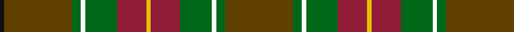

In pattern [GGWGRYRGWGGK](/patterns/ggwgryrgwggk/).

This was sourced from register-of-tartans.  It is a [12 stripes tartan](/stripes/stripes12/).

Original link https://www.tartanregister.gov.uk/tartanDetails.aspx?ref=3479

## Thread count
K/4 T60 G8 W4 G28 DR26 Y4 DR26 G28 W4 G8 T/60

## Palette
Each colour and its ΔE from the base-6 reference it is a variant of.

| Colour | Shade | Base | ΔE (OKLab) |
|---|---|---|---|
| DR | <code style="background-color:#901C38;">#901C38</code> `#901C38` | R <code style="background-color:#CC0000;">#CC0000</code> | 0.13 |
| G | <code style="background-color:#006818;">#006818</code> `#006818` | G <code style="background-color:#006100;">#006100</code> | 0.02 |
| K | <code style="background-color:#101010;">#101010</code> `#101010` | K <code style="background-color:#000000;">#000000</code> | 0.17 |
| T | <code style="background-color:#604000;">#604000</code> `#604000` | G <code style="background-color:#006100;">#006100</code> | 0.14 |
| W | <code style="background-color:#FCFCFC;">#FCFCFC</code> `#FCFCFC` | W <code style="background-color:#F7F7F7;">#F7F7F7</code> | 0.01 |
| Y | <code style="background-color:#E8C000;">#E8C000</code> `#E8C000` | Y <code style="background-color:#F2BF00;">#F2BF00</code> | 0.02 |

## Nearest tartans

The nearest existing variants by ΔTartan distance.

1. [Ogg of Tarragann Hunting (Personal)](/setts/s12/r4b12r2g28r2g28r2k12ga20y2ga4y4-b5c8ca8-g604000-ga006818-k101010-rc80000-ybc8c00/) — ΔT 0.65
1. [Stewart Camel (Lochcarron)](/setts/s14/g6ga6gb4ga12gc14gb4g6gb4y6gb10g6b6g40ga4-b3850c8-g8c7038-ga603800-gb003820-gc5c6428-ybc8c00/) — ΔT 1.28
1. [Prince Edward Island District Tartan Tartan Number: 918. Earliest known date: 1964 The warmth and glow of the fertile soil, The green field and tree, The yellow and the brown of Autumn, The white of surf or a summer snow, Rust, green, yellow and white, Yes! That's our Island Tartan. See products available Copyright © Blair Urquhart, Comrie, 2015](/setts/s15/g32ga2g4ga2g4ga24r24ga2y4ga2r24ga24g24ga2w4-g006818-ga604000-ra00048-we0e0e0-ye8c000/) — ΔT 1.35
1. [Glasgow Cathedral 2000](/setts/s10/g44r6b20ba4b20r42g44r6y4b4-b003c64-ba1870a4-g005814-r940000-yb89800/) — ΔT 1.42
1. [Glen Nevis #2 (Personal)](/setts/s12/g56y4g4y4g8k12g12k12b12ba4b36y4-b4c3428-ba441800-g8c7038-k101010-ydc943c/) — ΔT 1.44
1. [Scottish Crofting Foundation](/setts/s9/b12y6b36g4b4g20ga56r4ga8-b441800-g604000-ga5c6428-r880000-ya0b8a4/) — ΔT 1.48
1. [Isle of Skye District Tartan Tartan Number: 2155. Earliest known date: 1993 The tartan was instigated and registered by Mrs Rosemary Nicolson Samios in 1992, an Australian of Skye descent, now living in Skye. It was selected through a worldwide competition won by Angus MacLeod from Lewis. Angus, a weaver by trade, produced the first commercial quantities in the traditional kilt weight in 1993 at Lochcarron Weavers in North Strome. The colours of the tartan depict those of the island, often called the 'Misty Isle'. Worn by the Torphican and Bathgate pipe band. (A patented design No. 0600930) See products available Copyright © Blair Urquhart, Comrie, 2015](/setts/s11/g40b4g4b4g6b16ga18gb16gc16ga2y4-b780078-g604000-ga003820-gb408060-gc5c6428-yb8b8b8/) — ΔT 1.49
1. [Harmony 1](/setts/s12/b22g6b8y6b6y8b6ga26r68g6r8ba6-b401000-ba506060-g008000-ga908000-r906030-yf0c000/) — ΔT 1.49
1. [Indiana 'Cardinal'](/setts/s14/b32y4g48r40ga8r24ga8r16ga8r24ga8r40g48y4-b1c1c50-g006818-ga8c7038-r880000-yd09800/) — ΔT 1.49
1. [Moncton, City of](/setts/s9/g16r4b8r4g40ga20r12ga40y4-b2c2c80-g006818-ga885c00-rc80000-ye8c000/) — ΔT 1.50

## Neighbour map

Every grey dot is one of 15726 variants placed by the first two principal components of the ΔTartan feature space (44% of its variance). Red is this tartan; blue dots are its nearest — click one to open its page.

<svg viewBox="0 0 640 380" role="img" style="max-width:100%;height:auto;border:1px solid #e0e0e0;border-radius:4px;display:block" xmlns="http://www.w3.org/2000/svg"><image href="/nn/cloud.v1.png" width="640" height="380"/><a href="/setts/s12/r4b12r2g28r2g28r2k12ga20y2ga4y4-b5c8ca8-g604000-ga006818-k101010-rc80000-ybc8c00/"><circle cx="239.4" cy="144.7" r="4" fill="#3465a4"><title>Ogg of Tarragann Hunting (Personal)</title></circle></a><a href="/setts/s14/g6ga6gb4ga12gc14gb4g6gb4y6gb10g6b6g40ga4-b3850c8-g8c7038-ga603800-gb003820-gc5c6428-ybc8c00/"><circle cx="246.3" cy="160.2" r="4" fill="#3465a4"><title>Stewart Camel (Lochcarron)</title></circle></a><a href="/setts/s15/g32ga2g4ga2g4ga24r24ga2y4ga2r24ga24g24ga2w4-g006818-ga604000-ra00048-we0e0e0-ye8c000/"><circle cx="229.1" cy="145.4" r="4" fill="#3465a4"><title>Prince Edward Island District Tartan Tartan Number: 918. Earliest known date: 1964 The warmth and glow of the fertile soil, The green field and tree, The yellow and the brown of Autumn, The white of surf or a summer snow, Rust, green, yellow and white, Yes! That's our Island Tartan. See products available Copyright © Blair Urquhart, Comrie, 2015</title></circle></a><a href="/setts/s10/g44r6b20ba4b20r42g44r6y4b4-b003c64-ba1870a4-g005814-r940000-yb89800/"><circle cx="268.2" cy="194.6" r="4" fill="#3465a4"><title>Glasgow Cathedral 2000</title></circle></a><a href="/setts/s12/g56y4g4y4g8k12g12k12b12ba4b36y4-b4c3428-ba441800-g8c7038-k101010-ydc943c/"><circle cx="272.0" cy="142.8" r="4" fill="#3465a4"><title>Glen Nevis #2 (Personal)</title></circle></a><a href="/setts/s9/b12y6b36g4b4g20ga56r4ga8-b441800-g604000-ga5c6428-r880000-ya0b8a4/"><circle cx="306.2" cy="186.1" r="4" fill="#3465a4"><title>Scottish Crofting Foundation</title></circle></a><a href="/setts/s11/g40b4g4b4g6b16ga18gb16gc16ga2y4-b780078-g604000-ga003820-gb408060-gc5c6428-yb8b8b8/"><circle cx="222.6" cy="147.1" r="4" fill="#3465a4"><title>Isle of Skye District Tartan Tartan Number: 2155. Earliest known date: 1993 The tartan was instigated and registered by Mrs Rosemary Nicolson Samios in 1992, an Australian of Skye descent, now living in Skye. It was selected through a worldwide competition won by Angus MacLeod from Lewis. Angus, a weaver by trade, produced the first commercial quantities in the traditional kilt weight in 1993 at Lochcarron Weavers in North Strome. The colours of the tartan depict those of the island, often called the 'Misty Isle'. Worn by the Torphican and Bathgate pipe band. (A patented design No. 0600930) See products available Copyright © Blair Urquhart, Comrie, 2015</title></circle></a><a href="/setts/s12/b22g6b8y6b6y8b6ga26r68g6r8ba6-b401000-ba506060-g008000-ga908000-r906030-yf0c000/"><circle cx="214.4" cy="123.6" r="4" fill="#3465a4"><title>Harmony 1</title></circle></a><a href="/setts/s14/b32y4g48r40ga8r24ga8r16ga8r24ga8r40g48y4-b1c1c50-g006818-ga8c7038-r880000-yd09800/"><circle cx="244.3" cy="176.1" r="4" fill="#3465a4"><title>Indiana 'Cardinal'</title></circle></a><a href="/setts/s9/g16r4b8r4g40ga20r12ga40y4-b2c2c80-g006818-ga885c00-rc80000-ye8c000/"><circle cx="254.3" cy="202.4" r="4" fill="#3465a4"><title>Moncton, City of</title></circle></a><circle cx="260.4" cy="150.7" r="5" fill="#c00000"/></svg>

ID: /setts/s12/g60ga8w4ga28r26y4r26ga28w4ga8g60k4-g604000-ga006818-k101010-r901c38-wfcfcfc-ye8c000/
