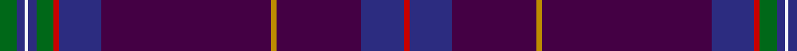

In pattern [GBWBGRBBYBBR](/patterns/gbwbgrbbybbr/).

This was sourced from register-of-tartans.  It is a [12 stripes tartan](/stripes/stripes12/).

Original link https://www.tartanregister.gov.uk/tartanDetails.aspx?ref=5349

## Thread count
G/12 DB6 W2 DB6 G12 R4 DB30 DP120 DY4 DP60 DB30 R/4

## Palette
Each colour and its ΔE from the base-6 reference it is a variant of.

| Colour | Shade | Base | ΔE (OKLab) |
|---|---|---|---|
| DB | <code style="background-color:#2C2C80;">#2C2C80</code> `#2C2C80` | B <code style="background-color:#2A418A;">#2A418A</code> | 0.06 |
| DP | <code style="background-color:#440044;">#440044</code> `#440044` | B <code style="background-color:#2A418A;">#2A418A</code> | 0.18 |
| DY | <code style="background-color:#BC8C00;">#BC8C00</code> `#BC8C00` | Y <code style="background-color:#F2BF00;">#F2BF00</code> | 0.16 |
| G | <code style="background-color:#006818;">#006818</code> `#006818` | G <code style="background-color:#006100;">#006100</code> | 0.02 |
| R | <code style="background-color:#C80000;">#C80000</code> `#C80000` | R <code style="background-color:#CC0000;">#CC0000</code> | 0.01 |
| W | <code style="background-color:#F8F8F8;">#F8F8F8</code> `#F8F8F8` | W <code style="background-color:#F7F7F7;">#F7F7F7</code> | 0.00 |

## Nearest tartans

The nearest existing variants by ΔTartan distance.

1. [Roseline](/setts/s12/b5g9r3b18ba80y3ba40b18r3g9b5w2~b2c4084-ba5a1c38-g005020-rdc0000-we0e0e0-ye8c000~x2/) — ΔT 1.09
1. [Roslin Roseline Da Vinci (Corporate)](/setts/s12/g6b3w1b3g6r2b15ba60y2ba30b15r2~b2c2c80-ba683ca0-g006818-rc80000-wf8f8f8-ybc8c00~x2/) — ΔT 1.56
1. [Royal British Legion Scotland (Corp)](/setts/s8/y4b2ba30k3b8ba5b1r2~b440044-ba202060-k101010-rc80000-ybc8c00~x2/) — ΔT 1.56
1. [Scottish American](/setts/s11/b50ba3k3b11ba8b2r6b2bb8b2w4~b202060-ba440044-bb2c2c80-k101010-rc80000-wf8f8f8~x2/) — ΔT 1.72
1. [Heart of Scotland (Fashion)](/setts/s10/b5w1b44ba1g12k12ba5k2r2k3~b202060-ba6c0070-g006818-k101010-r9c68a4-wf8f8f8~x2/) — ΔT 1.73
1. [Buckie](/setts/s9/r4k2g2y1g8k20b50ra2b2~b2c2c80-g003820-k101010-r888888-rae87878-ye8c000~x2/) — ΔT 1.75
1. [Silverton Family (Basingstoke)](/setts/s13/b4ba1w1ba1k29b3y1k4b20k2bb1k3b3~b373875-ba5f749c-bb2c2c80-k1c1714-wf9f5ef-yf8e38c~x2/) — ΔT 1.85
1. [Ulster Scots (Fashion)](/setts/s10/b84ba1b1k2b2k30ba7b2g3y2~b2c2c80-ba780078-g006818-k101010-yd87c00~x2/) — ΔT 1.86
1. [Gretna Gold Fashion Tartan Tartan Number: 6032. Earliest known date: 01/01/2003 Presumably a fashion tartan. Lochcarron swatch. See products available Copyright © Blair Urquhart, Comrie, 2015](/setts/s14/b2r2b28ba38k2ba2w3ba2k2ba38b28r2b2ra2~b202060-ba6c0070-k000000-rb468ac-rac80000-we0e0e0~x2/) — ΔT 1.88
1. [Gretna Gold](/setts/s14/b2r2b28ba38y2ba2w3ba2y2ba38b28r2b2ra2~b202060-ba6c0070-rb468ac-rac80000-we0e0e0-ybc8c00~x2/) — ΔT 1.89

## Neighbour map

Every grey dot is one of 15726 variants placed by the first two principal components of the ΔTartan feature space (44% of its variance). Red is this tartan; blue dots are its nearest — click one to open its page.

<svg viewBox="0 0 640 380" role="img" style="max-width:100%;height:auto;border:1px solid #e0e0e0;border-radius:4px;display:block" xmlns="http://www.w3.org/2000/svg"><image href="/nn/cloud.v1.png" width="640" height="380"/><a href="/setts/s12/b5g9r3b18ba80y3ba40b18r3g9b5w2~b2c4084-ba5a1c38-g005020-rdc0000-we0e0e0-ye8c000~x2/"><circle cx="442.8" cy="100.6" r="4" fill="#3465a4"><title>Roseline</title></circle></a><a href="/setts/s12/g6b3w1b3g6r2b15ba60y2ba30b15r2~b2c2c80-ba683ca0-g006818-rc80000-wf8f8f8-ybc8c00~x2/"><circle cx="462.9" cy="95.6" r="4" fill="#3465a4"><title>Roslin Roseline Da Vinci (Corporate)</title></circle></a><a href="/setts/s8/y4b2ba30k3b8ba5b1r2~b440044-ba202060-k101010-rc80000-ybc8c00~x2/"><circle cx="449.4" cy="147.4" r="4" fill="#3465a4"><title>Royal British Legion Scotland (Corp)</title></circle></a><a href="/setts/s11/b50ba3k3b11ba8b2r6b2bb8b2w4~b202060-ba440044-bb2c2c80-k101010-rc80000-wf8f8f8~x2/"><circle cx="428.8" cy="109.5" r="4" fill="#3465a4"><title>Scottish American</title></circle></a><a href="/setts/s10/b5w1b44ba1g12k12ba5k2r2k3~b202060-ba6c0070-g006818-k101010-r9c68a4-wf8f8f8~x2/"><circle cx="381.1" cy="97.5" r="4" fill="#3465a4"><title>Heart of Scotland (Fashion)</title></circle></a><a href="/setts/s9/r4k2g2y1g8k20b50ra2b2~b2c2c80-g003820-k101010-r888888-rae87878-ye8c000~x2/"><circle cx="397.7" cy="92.6" r="4" fill="#3465a4"><title>Buckie</title></circle></a><a href="/setts/s13/b4ba1w1ba1k29b3y1k4b20k2bb1k3b3~b373875-ba5f749c-bb2c2c80-k1c1714-wf9f5ef-yf8e38c~x2/"><circle cx="373.2" cy="99.4" r="4" fill="#3465a4"><title>Silverton Family (Basingstoke)</title></circle></a><a href="/setts/s10/b84ba1b1k2b2k30ba7b2g3y2~b2c2c80-ba780078-g006818-k101010-yd87c00~x2/"><circle cx="525.6" cy="105.6" r="4" fill="#3465a4"><title>Ulster Scots (Fashion)</title></circle></a><a href="/setts/s14/b2r2b28ba38k2ba2w3ba2k2ba38b28r2b2ra2~b202060-ba6c0070-k000000-rb468ac-rac80000-we0e0e0~x2/"><circle cx="368.3" cy="117.6" r="4" fill="#3465a4"><title>Gretna Gold Fashion Tartan Tartan Number: 6032. Earliest known date: 01/01/2003 Presumably a fashion tartan. Lochcarron swatch. See products available Copyright © Blair Urquhart, Comrie, 2015</title></circle></a><a href="/setts/s14/b2r2b28ba38y2ba2w3ba2y2ba38b28r2b2ra2~b202060-ba6c0070-rb468ac-rac80000-we0e0e0-ybc8c00~x2/"><circle cx="366.6" cy="115.9" r="4" fill="#3465a4"><title>Gretna Gold</title></circle></a><circle cx="451.7" cy="91.4" r="5" fill="#c00000"/></svg>

ID: /setts/s12/g6b3w1b3g6r2b15ba60y2ba30b15r2~b2c2c80-ba440044-g006818-rc80000-wf8f8f8-ybc8c00~x2/
