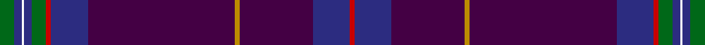

**Bands:** [RBBYBBRGBWBG](/stripes/rbbybbrgbwbg/) · **Stripes:** [R DB DP LO DP DB R G DB W DB G](/stripes/stripes12/) R DB DP LO DP DB R G DB W DB G

This was sourced from register-of-tartans.  It is a [12 band tartan](/bands/bands12/).

Original link https://www.tartanregister.gov.uk/tartanDetails.aspx?ref=5349

## Register references

External register numbers recorded for this tartan.

- Scottish Register of Tartans: [5349](https://www.tartanregister.gov.uk/tartanDetails.aspx?ref=5349)
- Scottish Tartans Authority (ITI): 6838

## Thread count
G/12 DB6 W2 DB6 G12 R4 DB30 DP120 DY4 DP60 DB30 R/4

## Palette
Each colour and its ΔE from the base-6 reference it is a variant of.

| Colour | Shade | Base | ΔE (OKLab) |
|---|---|---|---|
| DB | <code style="background-color:#2C2C80;">#2C2C80</code> `#2C2C80` | B <code style="background-color:#2A418A;">#2A418A</code> | 0.06 |
| DP | <code style="background-color:#440044;">#440044</code> `#440044` | B <code style="background-color:#2A418A;">#2A418A</code> | 0.18 |
| DY | <code style="background-color:#BC8C00;">#BC8C00</code> `#BC8C00` | Y <code style="background-color:#F2BF00;">#F2BF00</code> | 0.16 |
| G | <code style="background-color:#006818;">#006818</code> `#006818` | G <code style="background-color:#006100;">#006100</code> | 0.02 |
| R | <code style="background-color:#C80000;">#C80000</code> `#C80000` | R <code style="background-color:#CC0000;">#CC0000</code> | 0.01 |
| W | <code style="background-color:#F8F8F8;">#F8F8F8</code> `#F8F8F8` | W <code style="background-color:#F7F7F7;">#F7F7F7</code> | 0.00 |

## Nearest tartans

The nearest existing variants by ΔTartan distance.

1. [Roseline](/setts/s12/db5dg9r3db18dr80ly3dr40db18r3dg9db5w2~x2/) — ΔT 1.09
1. [Roslin Roseline Da Vinci (Corporate)](/setts/s12/g6db3w1db3g6r2db15b60lo2b30db15r2~x2/) — ΔT 1.56
1. [Royal British Legion Scotland (Corp)](/setts/s8/lo4dp2db30k3dp8db5dp1r2~x2/) — ΔT 1.57
1. [Scottish American](/setts/s11/db50dp3k3db11dp8db2r6db2db8db2w4~x2/) — ΔT 1.72
1. [Heart of Scotland (Fashion)](/setts/s10/db5w1db44dp1g12k12dp5k2m2k3~x2/) — ΔT 1.74
1. [Buckie](/setts/s9/o4k2dg2ly1dg8k20db50r2db2~x2/) — ΔT 1.76
1. [Silverton Family (Basingstoke)](/setts/s13/db4t1w1t1k29db3ly1k4db20k2db1k3db3~x2/) — ΔT 1.86
1. [Ulster Scots (Fashion)](/setts/s10/db84dp1db1k2db2k30dp7db2g3lo2~x2/) — ΔT 1.87
1. [Gretna Gold Fashion Tartan Tartan Number: 6032. Earliest known date: 01/01/2003 Presumably a fashion tartan. Lochcarron swatch. See products available Copyright © Blair Urquhart, Comrie, 2015](/setts/s14/w3dp2k2dp38db28m2db2r2~x2/) — ΔT 1.88
1. [Gretna Gold](/setts/s14/w3dp2lo2dp38db28m2db2r2~x2/) — ΔT 1.89

## Neighbour map

Every grey dot is one of 14299 variants placed by the first two principal components of the ΔTartan feature space (44% of its variance). Red is this tartan; blue dots are its nearest — click one to open its page.

<svg viewBox="0 0 640 380" role="img" style="max-width:100%;height:auto;border:1px solid #e0e0e0;border-radius:4px;display:block" xmlns="http://www.w3.org/2000/svg"><image href="/nn/cloud.v1.png" width="640" height="380"/><a href="/setts/s12/db5dg9r3db18dr80ly3dr40db18r3dg9db5w2~x2/"><circle cx="443.4" cy="108.9" r="4" fill="#3465a4"><title>Roseline</title></circle></a><a href="/setts/s12/g6db3w1db3g6r2db15b60lo2b30db15r2~x2/"><circle cx="464.1" cy="105.8" r="4" fill="#3465a4"><title>Roslin Roseline Da Vinci (Corporate)</title></circle></a><a href="/setts/s8/lo4dp2db30k3dp8db5dp1r2~x2/"><circle cx="451.0" cy="153.9" r="4" fill="#3465a4"><title>Royal British Legion Scotland (Corp)</title></circle></a><a href="/setts/s11/db50dp3k3db11dp8db2r6db2db8db2w4~x2/"><circle cx="430.8" cy="114.5" r="4" fill="#3465a4"><title>Scottish American</title></circle></a><a href="/setts/s10/db5w1db44dp1g12k12dp5k2m2k3~x2/"><circle cx="383.6" cy="105.5" r="4" fill="#3465a4"><title>Heart of Scotland (Fashion)</title></circle></a><a href="/setts/s9/o4k2dg2ly1dg8k20db50r2db2~x2/"><circle cx="400.3" cy="99.8" r="4" fill="#3465a4"><title>Buckie</title></circle></a><a href="/setts/s13/db4t1w1t1k29db3ly1k4db20k2db1k3db3~x2/"><circle cx="375.6" cy="106.8" r="4" fill="#3465a4"><title>Silverton Family (Basingstoke)</title></circle></a><a href="/setts/s10/db84dp1db1k2db2k30dp7db2g3lo2~x2/"><circle cx="527.6" cy="113.6" r="4" fill="#3465a4"><title>Ulster Scots (Fashion)</title></circle></a><a href="/setts/s14/w3dp2k2dp38db28m2db2r2~x2/"><circle cx="369.6" cy="126.0" r="4" fill="#3465a4"><title>Gretna Gold Fashion Tartan Tartan Number: 6032. Earliest known date: 01/01/2003 Presumably a fashion tartan. Lochcarron swatch. See products available Copyright © Blair Urquhart, Comrie, 2015</title></circle></a><a href="/setts/s14/w3dp2lo2dp38db28m2db2r2~x2/"><circle cx="367.9" cy="124.0" r="4" fill="#3465a4"><title>Gretna Gold</title></circle></a><circle cx="452.8" cy="99.0" r="5" fill="#c00000"/></svg>

ID: /setts/s12/g6db3w1db3g6r2db15dp60lo2dp30db15r2~x2/
