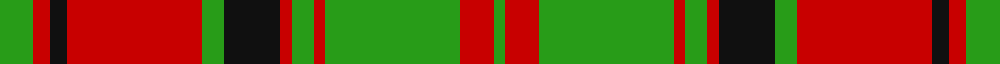

In pattern [GRGRGRKGRKRG](/stripes/grgrgrkgrkrg/).

This was sourced from tartans-authority.  It is a [12 stripe tartan](/stripes/stripes12/).

Original link http://www.tartansauthority.com/tartan-ferret/display/3509/

## Attestations

This cloth appears in 2 source records; the oldest owns this page.

- pre 2002 — MacNeish (tartans-authority, [record](http://www.tartansauthority.com/tartan-ferret/display/3509/))
- undated — MacNeish (register-of-tartans, [record](https://www.tartanregister.gov.uk/tartanDetails.aspx?ref=5200))

## Register references

External register numbers recorded for this tartan.

- Scottish Register of Tartans: [5200](https://www.tartanregister.gov.uk/tartanDetails.aspx?ref=5200)
- Scottish Tartans Authority (ITI): 3509

## Thread count
G/12 R6 K6 R48 G8 K20 R4 G8 R4 G48 R12 G/4

## Palette
Each colour and the base-6 reference it is a variant of.

| Colour | Shade | Base |
|---|---|---|
| G | <code style="background-color:#289C18;">#289C18</code> `oklch(60.6% 0.191 141.6)` <small>#289C18</small> | G <code style="background-color:#006100;">#006100</code> |
| K | <code style="background-color:#101010;">#101010</code> `oklch(17.3% 0.000 89.9)` <small>#101010</small> | K <code style="background-color:#000000;">#000000</code> |
| R | <code style="background-color:#C80000;">#C80000</code> `oklch(52.3% 0.215 29.2)` <small>#C80000</small> | R <code style="background-color:#CC0000;">#CC0000</code> |

## Nearest tartans

The nearest existing variants by ΔTartan distance, with this tartan at the top so the swatches line up against it.

ΔTartan

Tartan

Sett

—

<a href="/ttd/edit/#slug=g6r3k3r24g4k10r2g4r2g24r6g2~x2">MacNeish</a> <a class="nn-out" href="/setts/s12/g6r3k3r24g4k10r2g4r2g24r6g2~x2/" title="open its dictionary page">↗</a>

1.22

<a href="/ttd/edit/#slug=r2w1g1r16g7r1w1g1w1r1g7w2r1g2~x2">Mordente (Personal)</a> <a class="nn-out" href="/setts/s14/r2w1g1r16g7r1w1g1w1r1g7w2r1g2~x2/" title="open its dictionary page">↗</a>

1.22

<a href="/ttd/edit/#slug=r2w1g1r16g7r1w1g1w1r1g7w2r1g2~x4">Mordente (Personal)</a> <a class="nn-out" href="/setts/s14/r2w1g1r16g7r1w1g1w1r1g7w2r1g2~x4/" title="open its dictionary page">↗</a>

1.24

<a href="/ttd/edit/#slug=r1w1g1r16g7r1w1g1w1r1g7w2r1g1~x2">Mordente</a> <a class="nn-out" href="/setts/s14/r1w1g1r16g7r1w1g1w1r1g7w2r1g1~x2/" title="open its dictionary page">↗</a>

1.26

<a href="/ttd/edit/#slug=lb2r19lb2r5lb2g13lb2g12lb2r5lb2g14lb2g12lb2~x2">Fraser of Castle Leathers, Major James</a> <a class="nn-out" href="/setts/s15/lb2r19lb2r5lb2g13lb2g12lb2r5lb2g14lb2g12lb2~x2/" title="open its dictionary page">↗</a>

1.26

<a href="/ttd/edit/#slug=g6r2g2r18db9r3g3r3db9r3g24r2g2r4~x2">Stewart of Urrard</a> <a class="nn-out" href="/setts/s14/g6r2g2r18db9r3g3r3db9r3g24r2g2r4~x2/" title="open its dictionary page">↗</a>

1.27

<a href="/ttd/edit/#slug=k6r3k3r24t4k10r2g4r2g24r6t2~x2">Bates</a> <a class="nn-out" href="/setts/s12/k6r3k3r24t4k10r2g4r2g24r6t2~x2/" title="open its dictionary page">↗</a>

1.29

<a href="/ttd/edit/#slug=r45db4r4g48r4db4r4db15r4db4r40g4r4g30">Bruce, Old</a> <a class="nn-out" href="/setts/s14/r45db4r4g48r4db4r4db15r4db4r40g4r4g30/" title="open its dictionary page">↗</a>

1.29

<a href="/ttd/edit/#slug=g20k2r3k2r6g20r29g3r10~x2">Livingston</a> <a class="nn-out" href="/setts/s9/g20k2r3k2r6g20r29g3r10~x2/" title="open its dictionary page">↗</a>

1.32

<a href="/ttd/edit/#slug=w16dy14y2dy2y2dy2y22dy2y2dy2y2dy14w16dy3~x2">Snaefell</a> <a class="nn-out" href="/setts/s14/w16dy14y2dy2y2dy2y22dy2y2dy2y2dy14w16dy3~x2/" title="open its dictionary page">↗</a>

1.32

<a href="/ttd/edit/#slug=k6r3k3r24t4g10r2g4r2g24r6t2~x2">Leach (1999)</a> <a class="nn-out" href="/setts/s12/k6r3k3r24t4g10r2g4r2g24r6t2~x2/" title="open its dictionary page">↗</a>

## Neighbour map

Every grey dot is one of 14299 variants placed by the first two principal components of the ΔTartan feature space (44% of its variance). Red is this tartan; blue dots are its nearest — click one to open its page.

<svg viewBox="0 0 640 380" role="img" style="max-width:100%;height:auto;border:1px solid #e0e0e0;border-radius:4px;display:block" xmlns="http://www.w3.org/2000/svg"><image href="/nn/cloud.v1.png" width="640" height="380"/><a href="/setts/s14/r2w1g1r16g7r1w1g1w1r1g7w2r1g2~x2/"><circle cx="311.2" cy="123.9" r="4" fill="#3465a4"><title>Mordente (Personal)</title></circle></a><a href="/setts/s14/r2w1g1r16g7r1w1g1w1r1g7w2r1g2~x4/"><circle cx="311.2" cy="123.9" r="4" fill="#3465a4"><title>Mordente (Personal)</title></circle></a><a href="/setts/s14/r1w1g1r16g7r1w1g1w1r1g7w2r1g1~x2/"><circle cx="320.6" cy="124.4" r="4" fill="#3465a4"><title>Mordente</title></circle></a><a href="/setts/s15/lb2r19lb2r5lb2g13lb2g12lb2r5lb2g14lb2g12lb2~x2/"><circle cx="289.3" cy="181.5" r="4" fill="#3465a4"><title>Fraser of Castle Leathers, Major James</title></circle></a><a href="/setts/s14/g6r2g2r18db9r3g3r3db9r3g24r2g2r4~x2/"><circle cx="269.3" cy="172.5" r="4" fill="#3465a4"><title>Stewart of Urrard</title></circle></a><a href="/setts/s12/k6r3k3r24t4k10r2g4r2g24r6t2~x2/"><circle cx="212.8" cy="144.0" r="4" fill="#3465a4"><title>Bates</title></circle></a><a href="/setts/s14/r45db4r4g48r4db4r4db15r4db4r40g4r4g30/"><circle cx="321.5" cy="165.0" r="4" fill="#3465a4"><title>Bruce, Old</title></circle></a><a href="/setts/s9/g20k2r3k2r6g20r29g3r10~x2/"><circle cx="335.7" cy="186.2" r="4" fill="#3465a4"><title>Livingston</title></circle></a><a href="/setts/s14/w16dy14y2dy2y2dy2y22dy2y2dy2y2dy14w16dy3~x2/"><circle cx="214.4" cy="157.9" r="4" fill="#3465a4"><title>Snaefell</title></circle></a><a href="/setts/s12/k6r3k3r24t4g10r2g4r2g24r6t2~x2/"><circle cx="256.2" cy="158.7" r="4" fill="#3465a4"><title>Leach (1999)</title></circle></a><circle cx="268.1" cy="162.8" r="5" fill="#c00000"/></svg>

ID: /setts/s12/g6r3k3r24g4k10r2g4r2g24r6g2~x2/
