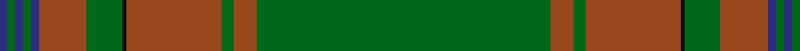

In pattern [BGBGBRGKRGRG](/patterns/bgbgbrgkrgrg/).

This was sourced from tartans-authority.  It is a [12 stripes tartan](/stripes/stripes12/).

Original link http://www.tartansauthority.com/tartan-ferret/display/7807/

## Attestations

This cloth appears in 2 source records; the oldest owns this page.

- 2008 — Ridgeback (Corporate) (tartans-authority, [record](http://www.tartansauthority.com/tartan-ferret/display/7807/))
- undated — Ridgeback (register-of-tartans, [record](https://www.tartanregister.gov.uk/tartanDetails.aspx?ref=5767))

## Thread count
DB/4 G4 DB4 G4 DB4 T24 G18 K2 T48 G6 T12 G/148

## Palette
Each colour and its ΔE from the base-6 reference it is a variant of.

| Colour | Shade | Base | ΔE (OKLab) |
|---|---|---|---|
| DB | <code style="background-color:#2C2C80;">#2C2C80</code> `#2C2C80` | B <code style="background-color:#2A418A;">#2A418A</code> | 0.06 |
| G | <code style="background-color:#006818;">#006818</code> `#006818` | G <code style="background-color:#006100;">#006100</code> | 0.02 |
| K | <code style="background-color:#101010;">#101010</code> `#101010` | K <code style="background-color:#000000;">#000000</code> | 0.17 |
| T | <code style="background-color:#98481C;">#98481C</code> `#98481C` | R <code style="background-color:#CC0000;">#CC0000</code> | 0.11 |

## Nearest tartans

The nearest existing variants by ΔTartan distance.

1. [Montreal](/setts/s10/y78g10r2g1r2g6y2g3y2g43x2~g006818-rc80000-ya08858/) — ΔT 1.53
1. [Unnamed Green (Teddy Bear)](/setts/s11/r1ra3g2ra3r1g24r1ra3g2ra3r1x2~g008000-rc00000-ra806050/) — ΔT 1.59
1. [Orvis Sports Company](/setts/s18/g4r4g60k4g4k1ga2k1g4ga36g4k1ga2k1g4k4g60r4~g003820-ga8c7038-k101010-r880000/) — ΔT 1.77
1. [Orvis Sports Company (Corporate)](/setts/s10/g36ga4k1g2k1ga4k4ga60r4ga4~g8c7038-ga003820-k101010-r880000/) — ΔT 1.83
1. [Wexford Irish County Tartan Tartan Number: 2251. Earliest known date: 1995 One of a series of Irish District tartans designed by Polly Wittering of the House of Edgar, with colours reminiscent of the Country with soft warm colours dominating. See products available Copyright © Blair Urquhart, Comrie, 2015](/setts/s14/g11ga6g6w1ga2w1g6ga6g36k1y3k1g5ga5x2~g3c6838-ga043828-k000000-we8e8e8-yd09000/) — ΔT 1.85
1. [Seton Hunting Family Tartan Tartan Number: 938. Earliest known date: pre 1930 Based on Vestiarium Scoticum - D.C.S. James Cant was a noted authority on tartans around 1930. See products available Copyright © Blair Urquhart, Comrie, 2015](/setts/s10/g6w1g12ga4r4ga2r4ga32g1ga2x2~g006818-ga604000-rc80000-we0e0e0/) — ΔT 1.86
1. [Berry Tribute](/setts/s12/g43b3r3b2r4ra3ga2g13ga2r9g1y2x2~b780078-g006818-ga289c18-r98481c-rac80000-ya08858/) — ΔT 1.86
1. [Seton, hunting](/setts/s10/g6w1g12r4ra4r2ra4r32g1r2x2~g008000-r806050-rac00000-we0e0e0/) — ΔT 1.87
1. [Murphy and his Gang (Phoenix Arizona) (Personal)](/setts/s20/g29b1g2b2g2b3g2b5r1k1r1b5g2b3g2b2g2b1g14y3x2~b576982-g124b24-k120a01-r861031-yef8f06/) — ΔT 1.94
1. [Semper](/setts/s8/g16ga1gb4ga41gb1ga6gc2ga2x2~g408060-ga003820-gb789484-gc289c18/) — ΔT 1.96

## Neighbour map

Every grey dot is one of 15726 variants placed by the first two principal components of the ΔTartan feature space (44% of its variance). Red is this tartan; blue dots are its nearest — click one to open its page.

<svg viewBox="0 0 640 380" role="img" style="max-width:100%;height:auto;border:1px solid #e0e0e0;border-radius:4px;display:block" xmlns="http://www.w3.org/2000/svg"><image href="/nn/cloud.v1.png" width="640" height="380"/><a href="/setts/s10/y78g10r2g1r2g6y2g3y2g43x2~g006818-rc80000-ya08858/"><circle cx="502.2" cy="135.0" r="4" fill="#3465a4"><title>Montreal</title></circle></a><a href="/setts/s11/r1ra3g2ra3r1g24r1ra3g2ra3r1x2~g008000-rc00000-ra806050/"><circle cx="507.6" cy="166.5" r="4" fill="#3465a4"><title>Unnamed Green (Teddy Bear)</title></circle></a><a href="/setts/s18/g4r4g60k4g4k1ga2k1g4ga36g4k1ga2k1g4k4g60r4~g003820-ga8c7038-k101010-r880000/"><circle cx="537.4" cy="101.2" r="4" fill="#3465a4"><title>Orvis Sports Company</title></circle></a><a href="/setts/s10/g36ga4k1g2k1ga4k4ga60r4ga4~g8c7038-ga003820-k101010-r880000/"><circle cx="469.5" cy="119.4" r="4" fill="#3465a4"><title>Orvis Sports Company (Corporate)</title></circle></a><a href="/setts/s14/g11ga6g6w1ga2w1g6ga6g36k1y3k1g5ga5x2~g3c6838-ga043828-k000000-we8e8e8-yd09000/"><circle cx="493.8" cy="118.4" r="4" fill="#3465a4"><title>Wexford Irish County Tartan Tartan Number: 2251. Earliest known date: 1995 One of a series of Irish District tartans designed by Polly Wittering of the House of Edgar, with colours reminiscent of the Country with soft warm colours dominating. See products available Copyright © Blair Urquhart, Comrie, 2015</title></circle></a><a href="/setts/s10/g6w1g12ga4r4ga2r4ga32g1ga2x2~g006818-ga604000-rc80000-we0e0e0/"><circle cx="473.0" cy="156.6" r="4" fill="#3465a4"><title>Seton Hunting Family Tartan Tartan Number: 938. Earliest known date: pre 1930 Based on Vestiarium Scoticum - D.C.S. James Cant was a noted authority on tartans around 1930. See products available Copyright © Blair Urquhart, Comrie, 2015</title></circle></a><a href="/setts/s12/g43b3r3b2r4ra3ga2g13ga2r9g1y2x2~b780078-g006818-ga289c18-r98481c-rac80000-ya08858/"><circle cx="462.1" cy="91.4" r="4" fill="#3465a4"><title>Berry Tribute</title></circle></a><a href="/setts/s10/g6w1g12r4ra4r2ra4r32g1r2x2~g008000-r806050-rac00000-we0e0e0/"><circle cx="464.2" cy="149.4" r="4" fill="#3465a4"><title>Seton, hunting</title></circle></a><a href="/setts/s20/g29b1g2b2g2b3g2b5r1k1r1b5g2b3g2b2g2b1g14y3x2~b576982-g124b24-k120a01-r861031-yef8f06/"><circle cx="483.7" cy="110.9" r="4" fill="#3465a4"><title>Murphy and his Gang (Phoenix Arizona) (Personal)</title></circle></a><a href="/setts/s8/g16ga1gb4ga41gb1ga6gc2ga2x2~g408060-ga003820-gb789484-gc289c18/"><circle cx="510.8" cy="152.7" r="4" fill="#3465a4"><title>Semper</title></circle></a><circle cx="539.8" cy="120.6" r="5" fill="#c00000"/></svg>

ID: /setts/s12/g74r6g3r24k1g9r12b2g2b2g2b2x2~b2c2c80-g006818-k101010-r98481c/
