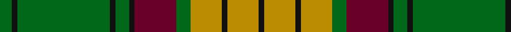

In pattern [GKGKGKBGYKYK](/patterns/gkgkgkbgykyk/).

This was sourced from tartans-authority.  It is a [12 stripes tartan](/stripes/stripes12/).

Original link http://www.tartansauthority.com/tartan-ferret/display/2025/

## Thread count
G/14 K6 G106 K6 G16 K6 DR48 G16 DY36 K6 DY36 K/6

## Palette
Each colour and its ΔE from the base-6 reference it is a variant of.

| Colour | Shade | Base | ΔE (OKLab) |
|---|---|---|---|
| DR | <code style="background-color:#680028;">#680028</code> `#680028` | B <code style="background-color:#2A418A;">#2A418A</code> | 0.21 |
| DY | <code style="background-color:#BC8C00;">#BC8C00</code> `#BC8C00` | Y <code style="background-color:#F2BF00;">#F2BF00</code> | 0.16 |
| G | <code style="background-color:#006818;">#006818</code> `#006818` | G <code style="background-color:#006100;">#006100</code> | 0.02 |
| K | <code style="background-color:#101010;">#101010</code> `#101010` | K <code style="background-color:#000000;">#000000</code> | 0.17 |

## Nearest tartans

The nearest existing variants by ΔTartan distance.

1. [Valdres, Kvam & Vang #2](/setts/s11/k4w1r4k2g2r3k2g20r2k2r2x2~g006818-k101010-rc80000-we0e0e0/) — ΔT 0.98
1. [MacMillan Ancient (a)](/setts/s12/g2k1g18k1g2k1b12g4y6k1y6k1x2~b59110d-g11450d-k000000-yaaaa00/) — ΔT 1.00
1. [MacMillan Ancient](/setts/s12/g2k1g18k1g2k1b12g4y6k1y6k1~b59110d-g11450d-k000000-yaaaa00/) — ΔT 1.00
1. [Hickey (Name)](/setts/s15/g3k1g1r12g1r1g1k4g1b2g15k1g1k1g3x4~b5c8ca8-g006818-k101010-rc80000/) — ΔT 1.00
1. [Cape Breton University](/setts/s10/b4r17b4g4b2g4b4g27b4y4x2~b202060-g006818-re86000-yfccc00/) — ΔT 1.12
1. [Georgia District Tartan Tartan Number: 794. Earliest known date: 1982 The tartan commemorates the founding of the State of Georgia and combines elements in the design associated with its historic past. General Oglethorpe commanded the Highland Independant Company of Foot which, in 1746, wore the Black Watch tartan. Captain John 'Mohr' MacIntosh is remembered in the MacIntosh red. Georgia tartan is much in evidence at the annual Stone Mountain Highland Games held in Atlanta, Georgias capital. See products available Copyright © Blair Urquhart, Comrie, 2015](/setts/s8/g36k2g2k2g3k12b10r20x2~b5c8ca8-g006818-k101010-rc80000/) — ΔT 1.12
1. [Westmeath](/setts/s14/g11r6b6ra2g3ra2b6r6g36y2ra2y2b5r5x2~b304080-g008000-rc00000-ra806050-yf0c000/) — ΔT 1.14
1. [MacMillan Old Clan Tartan Tartan Number: 2025. Earliest known date: 1847 The term 'ancient' normally describes a change in colour that can be applied to any tartan. In the case of MacMillan the 'ancient' form involves a more radical change, justifying the traditional use of the adjective in the name of the tartan. James Logan, co-author of 'The Clans of the Scottish Highlands' (1847), states that this version is identical with Buchanan. The thread count was deduced by J. Cant from the illustration by R.R. MacIan in the same work. In 1951 Lieut. General Sir Gordon MacMillan, then G.O.C. Scottish Command, was recognised as chief of the clan by the Lord Lyon. See products available Copyright © Blair Urquhart, Comrie, 2015](/setts/s12/g2k1g18k1g2k1r12g4y6k1y6k1x2~g006818-k101010-ra00048-ye8c000/) — ΔT 1.15
1. [MacMillan Ancient](/setts/s12/g2k1g18k1g2k1r12g4y6k1y6k1x2~g005020-k101010-r960028-ye8c000/) — ΔT 1.15
1. [Cork](/setts/s9/g28r12g4b20y2b3y2b3g7x2~b304080-g008000-rc00000-yf0c000/) — ΔT 1.16

## Neighbour map

Every grey dot is one of 15726 variants placed by the first two principal components of the ΔTartan feature space (44% of its variance). Red is this tartan; blue dots are its nearest — click one to open its page.

<svg viewBox="0 0 640 380" role="img" style="max-width:100%;height:auto;border:1px solid #e0e0e0;border-radius:4px;display:block" xmlns="http://www.w3.org/2000/svg"><image href="/nn/cloud.v1.png" width="640" height="380"/><a href="/setts/s11/k4w1r4k2g2r3k2g20r2k2r2x2~g006818-k101010-rc80000-we0e0e0/"><circle cx="304.5" cy="131.8" r="4" fill="#3465a4"><title>Valdres, Kvam &amp; Vang #2</title></circle></a><a href="/setts/s12/g2k1g18k1g2k1b12g4y6k1y6k1x2~b59110d-g11450d-k000000-yaaaa00/"><circle cx="258.9" cy="140.6" r="4" fill="#3465a4"><title>MacMillan Ancient (a)</title></circle></a><a href="/setts/s12/g2k1g18k1g2k1b12g4y6k1y6k1~b59110d-g11450d-k000000-yaaaa00/"><circle cx="258.9" cy="140.6" r="4" fill="#3465a4"><title>MacMillan Ancient</title></circle></a><a href="/setts/s15/g3k1g1r12g1r1g1k4g1b2g15k1g1k1g3x4~b5c8ca8-g006818-k101010-rc80000/"><circle cx="322.7" cy="132.3" r="4" fill="#3465a4"><title>Hickey (Name)</title></circle></a><a href="/setts/s10/b4r17b4g4b2g4b4g27b4y4x2~b202060-g006818-re86000-yfccc00/"><circle cx="249.2" cy="159.2" r="4" fill="#3465a4"><title>Cape Breton University</title></circle></a><a href="/setts/s8/g36k2g2k2g3k12b10r20x2~b5c8ca8-g006818-k101010-rc80000/"><circle cx="272.5" cy="164.8" r="4" fill="#3465a4"><title>Georgia District Tartan Tartan Number: 794. Earliest known date: 1982 The tartan commemorates the founding of the State of Georgia and combines elements in the design associated with its historic past. General Oglethorpe commanded the Highland Independant Company of Foot which, in 1746, wore the Black Watch tartan. Captain John 'Mohr' MacIntosh is remembered in the MacIntosh red. Georgia tartan is much in evidence at the annual Stone Mountain Highland Games held in Atlanta, Georgias capital. See products available Copyright © Blair Urquhart, Comrie, 2015</title></circle></a><a href="/setts/s14/g11r6b6ra2g3ra2b6r6g36y2ra2y2b5r5x2~b304080-g008000-rc00000-ra806050-yf0c000/"><circle cx="296.8" cy="116.0" r="4" fill="#3465a4"><title>Westmeath</title></circle></a><a href="/setts/s12/g2k1g18k1g2k1r12g4y6k1y6k1x2~g006818-k101010-ra00048-ye8c000/"><circle cx="249.7" cy="129.3" r="4" fill="#3465a4"><title>MacMillan Old Clan Tartan Tartan Number: 2025. Earliest known date: 1847 The term 'ancient' normally describes a change in colour that can be applied to any tartan. In the case of MacMillan the 'ancient' form involves a more radical change, justifying the traditional use of the adjective in the name of the tartan. James Logan, co-author of 'The Clans of the Scottish Highlands' (1847), states that this version is identical with Buchanan. The thread count was deduced by J. Cant from the illustration by R.R. MacIan in the same work. In 1951 Lieut. General Sir Gordon MacMillan, then G.O.C. Scottish Command, was recognised as chief of the clan by the Lord Lyon. See products available Copyright © Blair Urquhart, Comrie, 2015</title></circle></a><a href="/setts/s12/g2k1g18k1g2k1r12g4y6k1y6k1x2~g005020-k101010-r960028-ye8c000/"><circle cx="251.6" cy="130.9" r="4" fill="#3465a4"><title>MacMillan Ancient</title></circle></a><a href="/setts/s9/g28r12g4b20y2b3y2b3g7x2~b304080-g008000-rc00000-yf0c000/"><circle cx="272.0" cy="175.9" r="4" fill="#3465a4"><title>Cork</title></circle></a><circle cx="292.5" cy="147.4" r="5" fill="#c00000"/></svg>

ID: /setts/s12/g7k3g53k3g8k3b24g8y18k3y18k3x2~b680028-g006818-k101010-ybc8c00/
