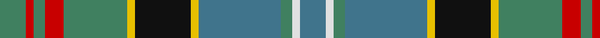

In pattern [BWGBYKYGRGRG](/stripes/bwgbykygrgrg/).

This was sourced from register-of-tartans.  It is a [12 stripe tartan](/stripes/stripes12/).

Original link https://www.tartanregister.gov.uk/tartanDetails.aspx?ref=3284

## Attestations

This cloth appears in 2 source records; the oldest owns this page.

- 01/01/1952 — Paisley (register-of-tartans, [record](https://www.tartanregister.gov.uk/tartanDetails.aspx?ref=3284))
- 1952 — Paisley (District & Clan) (tartans-authority, [record](http://www.tartansauthority.com/tartan-ferret/display/640/))

## Register references

External register numbers recorded for this tartan.

- Scottish Register of Tartans: [3284](https://www.tartanregister.gov.uk/tartanDetails.aspx?ref=3284)
- Scottish Tartans Authority (ITI): 640
- Scottish Tartans World Register: 640

## Thread count
G/14 R4 G6 R10 G34 Y4 K30 Y4 B44 G6 LN4 B/14

## Palette
Each colour and its ΔE from the base-6 reference it is a variant of.

| Colour | Shade | Base | ΔE (OKLab) |
|---|---|---|---|
| B | <code style="background-color:#40748C;">#40748C</code> `#40748C` | B <code style="background-color:#2A418A;">#2A418A</code> | 0.16 |
| G | <code style="background-color:#408060;">#408060</code> `#408060` | G <code style="background-color:#006100;">#006100</code> | 0.14 |
| K | <code style="background-color:#101010;">#101010</code> `#101010` | K <code style="background-color:#000000;">#000000</code> | 0.17 |
| LN | <code style="background-color:#E0E0E0;">#E0E0E0</code> `#E0E0E0` | W <code style="background-color:#F7F7F7;">#F7F7F7</code> | 0.07 |
| R | <code style="background-color:#C80000;">#C80000</code> `#C80000` | R <code style="background-color:#CC0000;">#CC0000</code> | 0.01 |
| Y | <code style="background-color:#E8C000;">#E8C000</code> `#E8C000` | Y <code style="background-color:#F2BF00;">#F2BF00</code> | 0.02 |

## Nearest tartans

The nearest existing variants by ΔTartan distance.

1. [Royal Pharmaceutical Society Commemorative Tartan Tartan Number: 2091. Earliest known date: 1991 Created by Kinloch Anderson of Edinburgh for the 150th Anniversary of the Royal Pharmaceutical Society of Great Britain which was held at Scone Palace, Perthshire in 1991. See products available Copyright © Blair Urquhart, Comrie, 2015](/setts/s10/do3db2g19db6g2db6lo14w2dp4w2~x2/) — ΔT 0.63
1. [Sullivan (Estimated threadcount)](/setts/s10/r3k1t10k1g2k1db8g12k1ly3~x2/) — ΔT 0.77
1. [Wojtek Memorial Trust](/setts/s11/w3db15r6db3r3db4dg11g3dg3g28lb3~x2/) — ΔT 0.82
1. [Haines Family (Personal)](/setts/s10/r2y6t1y1t1y1t3dt8ly1b1~x4/) — ΔT 0.82
1. [Penman](/setts/s14/y11db6g6ly1db2ly1g6db6y11k1r3k1g5db5~x2/) — ΔT 0.83
1. [Royal Pharmaceutical Society (Corp)](/setts/s9/dy2o2dg19o6dg2o6lo14r4w2~x2/) — ΔT 0.89
1. [Royal Pharmaceutical Society](/setts/s9/dy3o2dg19o6dg2o6lo14r4w2~x2/) — ΔT 0.91
1. [Penman Family Tartan Tartan Number: 167. Earliest known date: pre 1992 The late William Penman supplied members of the Penman family with this tartan for many years. See products available Copyright © Blair Urquhart, Comrie, 2015](/setts/s14/o11db6g6ly1db2ly1g6db6o11k1r3k1g5db5~x2/) — ΔT 0.93
1. [State Seal of Kentucky (Fashion)](/setts/s11/lb6g13k12b3k3lo3b30k3o11lo3o5~x2/) — ΔT 0.96
1. [Patterson, William John Magee (Personal)](/setts/s12/db9n3db2lb2db9n6db3lb3db3g18dg8r2~x2/) — ΔT 0.97

## Neighbour map

Every grey dot is one of 14299 variants placed by the first two principal components of the ΔTartan feature space (44% of its variance). Red is this tartan; blue dots are its nearest — click one to open its page.

<svg viewBox="0 0 640 380" role="img" style="max-width:100%;height:auto;border:1px solid #e0e0e0;border-radius:4px;display:block" xmlns="http://www.w3.org/2000/svg"><image href="/nn/cloud.v1.png" width="640" height="380"/><a href="/setts/s10/do3db2g19db6g2db6lo14w2dp4w2~x2/"><circle cx="129.1" cy="151.6" r="4" fill="#3465a4"><title>Royal Pharmaceutical Society Commemorative Tartan Tartan Number: 2091. Earliest known date: 1991 Created by Kinloch Anderson of Edinburgh for the 150th Anniversary of the Royal Pharmaceutical Society of Great Britain which was held at Scone Palace, Perthshire in 1991. See products available Copyright © Blair Urquhart, Comrie, 2015</title></circle></a><a href="/setts/s10/r3k1t10k1g2k1db8g12k1ly3~x2/"><circle cx="123.0" cy="142.3" r="4" fill="#3465a4"><title>Sullivan (Estimated threadcount)</title></circle></a><a href="/setts/s11/w3db15r6db3r3db4dg11g3dg3g28lb3~x2/"><circle cx="145.9" cy="145.7" r="4" fill="#3465a4"><title>Wojtek Memorial Trust</title></circle></a><a href="/setts/s10/r2y6t1y1t1y1t3dt8ly1b1~x4/"><circle cx="131.7" cy="163.1" r="4" fill="#3465a4"><title>Haines Family (Personal)</title></circle></a><a href="/setts/s14/y11db6g6ly1db2ly1g6db6y11k1r3k1g5db5~x2/"><circle cx="130.5" cy="160.7" r="4" fill="#3465a4"><title>Penman</title></circle></a><a href="/setts/s9/dy2o2dg19o6dg2o6lo14r4w2~x2/"><circle cx="157.6" cy="162.1" r="4" fill="#3465a4"><title>Royal Pharmaceutical Society (Corp)</title></circle></a><a href="/setts/s9/dy3o2dg19o6dg2o6lo14r4w2~x2/"><circle cx="151.8" cy="164.6" r="4" fill="#3465a4"><title>Royal Pharmaceutical Society</title></circle></a><a href="/setts/s14/o11db6g6ly1db2ly1g6db6o11k1r3k1g5db5~x2/"><circle cx="128.6" cy="158.6" r="4" fill="#3465a4"><title>Penman Family Tartan Tartan Number: 167. Earliest known date: pre 1992 The late William Penman supplied members of the Penman family with this tartan for many years. See products available Copyright © Blair Urquhart, Comrie, 2015</title></circle></a><a href="/setts/s11/lb6g13k12b3k3lo3b30k3o11lo3o5~x2/"><circle cx="120.9" cy="147.0" r="4" fill="#3465a4"><title>State Seal of Kentucky (Fashion)</title></circle></a><a href="/setts/s12/db9n3db2lb2db9n6db3lb3db3g18dg8r2~x2/"><circle cx="137.6" cy="166.5" r="4" fill="#3465a4"><title>Patterson, William John Magee (Personal)</title></circle></a><circle cx="145.1" cy="146.4" r="5" fill="#c00000"/></svg>

ID: /setts/s12/g7r2g3r5g17ly2k15ly2t22g3w2t7~x2/
