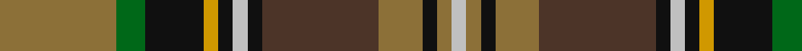

In pattern [GGKYKWKBGKGW](/patterns/ggkykwkbgkgw/).

This was sourced from register-of-tartans.  It is a [12 stripes tartan](/stripes/stripes12/).

Original link https://www.tartanregister.gov.uk/tartanDetails.aspx?ref=4557

## Thread count
LT/32 G8 K16 DY4 K4 N4 K4 T32 LT12 K4 LT4 N/4

## Palette
Each colour and its ΔE from the base-6 reference it is a variant of.

| Colour | Shade | Base | ΔE (OKLab) |
|---|---|---|---|
| DY | <code style="background-color:#D09800;">#D09800</code> `#D09800` | Y <code style="background-color:#F2BF00;">#F2BF00</code> | 0.12 |
| G | <code style="background-color:#006818;">#006818</code> `#006818` | G <code style="background-color:#006100;">#006100</code> | 0.02 |
| K | <code style="background-color:#101010;">#101010</code> `#101010` | K <code style="background-color:#000000;">#000000</code> | 0.17 |
| LT | <code style="background-color:#8C7038;">#8C7038</code> `#8C7038` | G <code style="background-color:#006100;">#006100</code> | 0.18 |
| N | <code style="background-color:#C0C0C0;">#C0C0C0</code> `#C0C0C0` | W <code style="background-color:#F7F7F7;">#F7F7F7</code> | 0.17 |
| T | <code style="background-color:#4C3428;">#4C3428</code> `#4C3428` | B <code style="background-color:#2A418A;">#2A418A</code> | 0.17 |

## Nearest tartans

The nearest existing variants by ΔTartan distance.

1. [State Seal of Florida (Fashion)](/setts/s10/r3y21r14w3b11g36ba3b3ba4y3x2~b2c2c80-ba441800-g006818-r880000-we8ccb8-ya08858/) — ΔT 0.96
1. [Royal Pharmaceutical Society (Corp)](/setts/s9/g2r2ga19r6ga2r6y14ra4w2x2~g604000-ga003820-r888888-ra901c38-we0e0e0-ya08858/) — ΔT 0.98
1. [Royal Pharmaceutical Society](/setts/s9/g3r2ga19r6ga2r6y14ra4w2x2~g604000-ga003820-r888888-ra901c38-we0e0e0-ya08858/) — ΔT 0.99
1. [Gordonstoun](/setts/s12/y3g15r2b8ba2r8g8r2ga15r2ga2ba2x2~b304080-ba5480b0-g008000-ga003000-r900030-yf0c000/) — ΔT 0.99
1. [Cuthill (Personal)](/setts/s13/b3g4r2g3r3g16ba16ra16b3ra3b2ra4y3x2~b2c2c80-ba003c64-g006818-rc80000-ra880000-ye8c000/) — ΔT 1.02
1. [Kelsey, William (Personal)](/setts/s12/g12r2g2r5g16b3ra2k2ra3b6k20y3x2~b2c2c80-g006818-k101010-rc80000-ra888888-yfccc00/) — ΔT 1.04
1. [Murphy (District)](/setts/s12/k4r1k3y1k1w1k1g8ga12r1ga2k1x4~g84642c-ga347430-k101010-rc80000-wfcfcfc-yd8b000/) — ΔT 1.05
1. [Allen - 2001 (Personal)](/setts/s14/b16r2b3r4b2g12ga18w2ga18g12b12y2r2y2x2~b14283c-g604000-ga006818-rc80000-wfcfcfc-ye8c000/) — ΔT 1.06
1. [Wojtek Memorial Trust](/setts/s11/w3b15r6b3r3b4g11ga3g3ga28y3x2~b202060-g003820-ga005020-rdc0000-wffffff-ya08858/) — ΔT 1.07
1. [Gordonstoun (Corporate)](/setts/s12/y5g19r2b11w2r11g11r2k20r2k2w2x2~b5c8ca8-g408060-k101010-r800028-wa8ace8-ye8c000/) — ΔT 1.08

## Neighbour map

Every grey dot is one of 15726 variants placed by the first two principal components of the ΔTartan feature space (44% of its variance). Red is this tartan; blue dots are its nearest — click one to open its page.

<svg viewBox="0 0 640 380" role="img" style="max-width:100%;height:auto;border:1px solid #e0e0e0;border-radius:4px;display:block" xmlns="http://www.w3.org/2000/svg"><image href="/nn/cloud.v1.png" width="640" height="380"/><a href="/setts/s10/r3y21r14w3b11g36ba3b3ba4y3x2~b2c2c80-ba441800-g006818-r880000-we8ccb8-ya08858/"><circle cx="162.4" cy="136.4" r="4" fill="#3465a4"><title>State Seal of Florida (Fashion)</title></circle></a><a href="/setts/s9/g2r2ga19r6ga2r6y14ra4w2x2~g604000-ga003820-r888888-ra901c38-we0e0e0-ya08858/"><circle cx="155.2" cy="157.0" r="4" fill="#3465a4"><title>Royal Pharmaceutical Society (Corp)</title></circle></a><a href="/setts/s9/g3r2ga19r6ga2r6y14ra4w2x2~g604000-ga003820-r888888-ra901c38-we0e0e0-ya08858/"><circle cx="149.5" cy="159.3" r="4" fill="#3465a4"><title>Royal Pharmaceutical Society</title></circle></a><a href="/setts/s12/y3g15r2b8ba2r8g8r2ga15r2ga2ba2x2~b304080-ba5480b0-g008000-ga003000-r900030-yf0c000/"><circle cx="105.1" cy="159.7" r="4" fill="#3465a4"><title>Gordonstoun</title></circle></a><a href="/setts/s13/b3g4r2g3r3g16ba16ra16b3ra3b2ra4y3x2~b2c2c80-ba003c64-g006818-rc80000-ra880000-ye8c000/"><circle cx="123.3" cy="151.3" r="4" fill="#3465a4"><title>Cuthill (Personal)</title></circle></a><a href="/setts/s12/g12r2g2r5g16b3ra2k2ra3b6k20y3x2~b2c2c80-g006818-k101010-rc80000-ra888888-yfccc00/"><circle cx="145.9" cy="140.8" r="4" fill="#3465a4"><title>Kelsey, William (Personal)</title></circle></a><a href="/setts/s12/k4r1k3y1k1w1k1g8ga12r1ga2k1x4~g84642c-ga347430-k101010-rc80000-wfcfcfc-yd8b000/"><circle cx="172.9" cy="121.0" r="4" fill="#3465a4"><title>Murphy (District)</title></circle></a><a href="/setts/s14/b16r2b3r4b2g12ga18w2ga18g12b12y2r2y2x2~b14283c-g604000-ga006818-rc80000-wfcfcfc-ye8c000/"><circle cx="138.3" cy="155.9" r="4" fill="#3465a4"><title>Allen - 2001 (Personal)</title></circle></a><a href="/setts/s11/w3b15r6b3r3b4g11ga3g3ga28y3x2~b202060-g003820-ga005020-rdc0000-wffffff-ya08858/"><circle cx="157.0" cy="148.0" r="4" fill="#3465a4"><title>Wojtek Memorial Trust</title></circle></a><a href="/setts/s12/y5g19r2b11w2r11g11r2k20r2k2w2x2~b5c8ca8-g408060-k101010-r800028-wa8ace8-ye8c000/"><circle cx="105.8" cy="135.9" r="4" fill="#3465a4"><title>Gordonstoun (Corporate)</title></circle></a><circle cx="146.3" cy="146.0" r="5" fill="#c00000"/></svg>

ID: /setts/s12/g8ga2k4y1k1w1k1b8g3k1g1w1x4~b4c3428-g8c7038-ga006818-k101010-wc0c0c0-yd09800/
