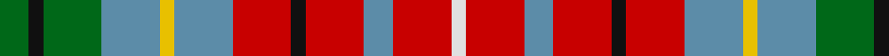

In pattern [GKGBYBRKRBRW](/patterns/gkgbybrkrbrw/).

This was sourced from house-of-tartan.  It is a [12 stripes tartan](/stripes/stripes12/).

Original link http://www.house-of-tartan.scotland.net/house/TartanViewjs.asp?colr=Def&tnam=808

## Thread count
G/8 K4 G16 B16 Y4 B16 R16 K4 R16 B8 R16 LN/4

## Palette
Each colour and its ΔE from the base-6 reference it is a variant of.

| Colour | Shade | Base | ΔE (OKLab) |
|---|---|---|---|
| B | <code style="background-color:#5C8CA8;">#5C8CA8</code> `#5C8CA8` | B <code style="background-color:#2C4084;">#2C4084</code> | 0.23 |
| G | <code style="background-color:#006818;">#006818</code> `#006818` | G <code style="background-color:#006400;">#006400</code> | 0.02 |
| K | <code style="background-color:#101010;">#101010</code> `#101010` | K <code style="background-color:#000000;">#000000</code> | 0.17 |
| LN | <code style="background-color:#E0E0E0;">#E0E0E0</code> `#E0E0E0` | W <code style="background-color:#F4F4F0;">#F4F4F0</code> | 0.06 |
| R | <code style="background-color:#C80000;">#C80000</code> `#C80000` | R <code style="background-color:#C80000;">#C80000</code> | 0.00 |
| Y | <code style="background-color:#E8C000;">#E8C000</code> `#E8C000` | Y <code style="background-color:#E8C000;">#E8C000</code> | 0.00 |

## Nearest tartans

The nearest existing variants by ΔTartan distance.

1. [British Columbia](/setts/s12/g8k4g16y16ya4y16r16k4r16y8r16w4-g006818-k101010-ra00024-we0e0e0-y9cacb8-yae8c000/) — ΔT 0.37
1. [British Columbia](/setts/s12/g8k4g16b16y4b16r16k4r16b8r16w4-b5480b0-g008000-k000000-rc00000-we0e0e0-yf0c000/) — ΔT 0.47
1. [Hueg (Formal) (Personal)](/setts/s11/b8ba6b26g16r24ga8r24b8r10w8r8-b1474b4-ba003c64-g006818-ga00643c-rc8002c-wfcfcfc/) — ΔT 1.06
1. [Ogilvy](/setts/s14/b20r6b20y10k4r12ya4r12ya4r12ba4y4b10ya4-b4367ae-ba6e5058-k000000-raa0000-yaaaa00-yaaaaaaa/) — ΔT 1.14
1. [Ogilvy](/setts/s14/b10r3b10y5k2r6ya2r6ya2r6ba2y2b5ya2-b4367ae-ba6e5058-k000000-raa0000-yaaaa00-yaaaaaaa/) — ΔT 1.14
1. [Hueg (Munich) Formal (Personal)](/setts/s11/b8ba6b26g16r24ga8r24b8r10w8r8-b5f749c-ba433a5a-g23321b-ga124b24-rca2625-wf9f5ef/) — ΔT 1.15
1. [Kutztown (Berks Co., PA) (District)](/setts/s18/w4b4g16k4b12g10r10y10r8w4r8y10r10g10b12k4r20y4-b2888c4-g003820-k101010-r901c38-we0e0e0-ybc8c00/) — ΔT 1.26
1. [Callanish, The](/setts/s13/r4w4b4g4w12ga6b6g8w4b6ga4w4r4-b383131-g6b560f-ga647052-r7c1000-wcbc1b9/) — ΔT 1.31
1. [Caledonia Variant](/setts/s14/r14b6k4b4k4b6k12y4g14r8ba4r8w4r10-b3c82af-ba2c4084-g005020-k101010-rdc0000-we0e0e0-ye8c000/) — ΔT 1.39
1. [Wilson's No.109](/setts/s14/r10g30b16y4k6r22g16r22k6y4b16g30r10w4-b440044-g006818-k101010-rc80000-wfcfcfc-yd8b000/) — ΔT 1.43

## Neighbour map

Every grey dot is one of 15726 variants placed by the first two principal components of the ΔTartan feature space (44% of its variance). Red is this tartan; blue dots are its nearest — click one to open its page.

<svg viewBox="0 0 640 380" role="img" style="max-width:100%;height:auto;border:1px solid #e0e0e0;border-radius:4px;display:block" xmlns="http://www.w3.org/2000/svg"><image href="/nn/cloud.v1.png" width="640" height="380"/><a href="/setts/s12/g8k4g16y16ya4y16r16k4r16y8r16w4-g006818-k101010-ra00024-we0e0e0-y9cacb8-yae8c000/"><circle cx="69.9" cy="197.6" r="4" fill="#3465a4"><title>British Columbia</title></circle></a><a href="/setts/s12/g8k4g16b16y4b16r16k4r16b8r16w4-b5480b0-g008000-k000000-rc00000-we0e0e0-yf0c000/"><circle cx="67.3" cy="198.2" r="4" fill="#3465a4"><title>British Columbia</title></circle></a><a href="/setts/s11/b8ba6b26g16r24ga8r24b8r10w8r8-b1474b4-ba003c64-g006818-ga00643c-rc8002c-wfcfcfc/"><circle cx="125.6" cy="198.1" r="4" fill="#3465a4"><title>Hueg (Formal) (Personal)</title></circle></a><a href="/setts/s14/b20r6b20y10k4r12ya4r12ya4r12ba4y4b10ya4-b4367ae-ba6e5058-k000000-raa0000-yaaaa00-yaaaaaaa/"><circle cx="111.7" cy="179.7" r="4" fill="#3465a4"><title>Ogilvy</title></circle></a><a href="/setts/s14/b10r3b10y5k2r6ya2r6ya2r6ba2y2b5ya2-b4367ae-ba6e5058-k000000-raa0000-yaaaa00-yaaaaaaa/"><circle cx="111.7" cy="179.7" r="4" fill="#3465a4"><title>Ogilvy</title></circle></a><a href="/setts/s11/b8ba6b26g16r24ga8r24b8r10w8r8-b5f749c-ba433a5a-g23321b-ga124b24-rca2625-wf9f5ef/"><circle cx="139.9" cy="201.2" r="4" fill="#3465a4"><title>Hueg (Munich) Formal (Personal)</title></circle></a><a href="/setts/s18/w4b4g16k4b12g10r10y10r8w4r8y10r10g10b12k4r20y4-b2888c4-g003820-k101010-r901c38-we0e0e0-ybc8c00/"><circle cx="45.7" cy="181.3" r="4" fill="#3465a4"><title>Kutztown (Berks Co., PA) (District)</title></circle></a><a href="/setts/s13/r4w4b4g4w12ga6b6g8w4b6ga4w4r4-b383131-g6b560f-ga647052-r7c1000-wcbc1b9/"><circle cx="37.3" cy="235.6" r="4" fill="#3465a4"><title>Callanish, The</title></circle></a><a href="/setts/s14/r14b6k4b4k4b6k12y4g14r8ba4r8w4r10-b3c82af-ba2c4084-g005020-k101010-rdc0000-we0e0e0-ye8c000/"><circle cx="29.4" cy="177.5" r="4" fill="#3465a4"><title>Caledonia Variant</title></circle></a><a href="/setts/s14/r10g30b16y4k6r22g16r22k6y4b16g30r10w4-b440044-g006818-k101010-rc80000-wfcfcfc-yd8b000/"><circle cx="117.7" cy="162.2" r="4" fill="#3465a4"><title>Wilson's No.109</title></circle></a><circle cx="80.4" cy="202.6" r="5" fill="#c00000"/></svg>

ID: /setts/s12/g8k4g16b16y4b16r16k4r16b8r16w4-b5c8ca8-g006818-k101010-rc80000-we0e0e0-ye8c000/
