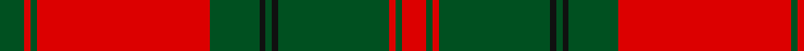

In pattern [GRGRGKGKGRGR](/patterns/grgrgkgkgrgr/).

This was sourced from register-of-tartans.  It is a [12 stripes tartan](/stripes/stripes12/).

Original link https://www.tartanregister.gov.uk/tartanDetails.aspx?ref=982

## Thread count
G/8 R2 G2 R56 G16 K2 G2 K2 G36 R2 G2 R/8

## Palette
Each colour and its ΔE from the base-6 reference it is a variant of.

| Colour | Shade | Base | ΔE (OKLab) |
|---|---|---|---|
| G | <code style="background-color:#005020;">#005020</code> `#005020` | G <code style="background-color:#006400;">#006400</code> | 0.08 |
| K | <code style="background-color:#101010;">#101010</code> `#101010` | K <code style="background-color:#000000;">#000000</code> | 0.17 |
| R | <code style="background-color:#DC0000;">#DC0000</code> `#DC0000` | R <code style="background-color:#C80000;">#C80000</code> | 0.04 |

## Nearest tartans

The nearest existing variants by ΔTartan distance.

1. [Drummond VS](/setts/s12/g4r1g1r28g8k1g1k1g18r1g1r4-g004c00-k000000-rc80000/) — ΔT 0.37
1. [MacDonell of Glengarry #4](/setts/s11/g36r6g4r4b12r4g4r48g2r4g12-b2c4084-g005020-rdc0000/) — ΔT 0.84
1. [Drummond](/setts/s12/g8r2g2r56g16k2g2k2g36r2g2r8-g008000-k000000-rc00000/) — ΔT 0.89
1. [MacAlister of Glenbarr](/setts/s14/g40r6g12r12g12r16b4r4g40r4b4r92b6r16-b440044-g006818-rc80000/) — ΔT 1.00
1. [Thomas of Wales](/setts/s8/g4r54b4g38b2g4b2r4-b202060-g006818-rc80000/) — ΔT 1.00
1. [Robertson #2](/setts/s14/g30r2g2r2g2r36g48r2g2r36g2r2g2r6-g005020-rdc0000/) — ΔT 1.01
1. [Drummond VS](/setts/s12/g8r2g2r56g16k2g2k2g36r2g2r8-g11450d-k000000-raa0000/) — ΔT 1.06
1. [Drummond VS](/setts/s12/g4r1g1r28g8k1g1k1g18r1g1r4-g11450d-k000000-raa0000/) — ΔT 1.06
1. [MacDonell of Glengarry](/setts/s11/g36r6g4r4b12r4g4r48g2r4g12-b304080-g008000-rc00000/) — ΔT 1.10
1. [Unidentified Cant #12](/setts/s12/r60b2g24r8b2ba3b2ba3b2r8g24b2-b2c2c80-ba2888c4-g006818-rc80000/) — ΔT 1.18

## Neighbour map

Every grey dot is one of 15726 variants placed by the first two principal components of the ΔTartan feature space (44% of its variance). Red is this tartan; blue dots are its nearest — click one to open its page.

<svg viewBox="0 0 640 380" role="img" style="max-width:100%;height:auto;border:1px solid #e0e0e0;border-radius:4px;display:block" xmlns="http://www.w3.org/2000/svg"><image href="/nn/cloud.v1.png" width="640" height="380"/><a href="/setts/s12/g4r1g1r28g8k1g1k1g18r1g1r4-g004c00-k000000-rc80000/"><circle cx="395.6" cy="123.2" r="4" fill="#3465a4"><title>Drummond VS</title></circle></a><a href="/setts/s11/g36r6g4r4b12r4g4r48g2r4g12-b2c4084-g005020-rdc0000/"><circle cx="359.5" cy="141.9" r="4" fill="#3465a4"><title>MacDonell of Glengarry #4</title></circle></a><a href="/setts/s12/g8r2g2r56g16k2g2k2g36r2g2r8-g008000-k000000-rc00000/"><circle cx="388.5" cy="120.7" r="4" fill="#3465a4"><title>Drummond</title></circle></a><a href="/setts/s14/g40r6g12r12g12r16b4r4g40r4b4r92b6r16-b440044-g006818-rc80000/"><circle cx="408.1" cy="135.4" r="4" fill="#3465a4"><title>MacAlister of Glenbarr</title></circle></a><a href="/setts/s8/g4r54b4g38b2g4b2r4-b202060-g006818-rc80000/"><circle cx="403.8" cy="145.7" r="4" fill="#3465a4"><title>Thomas of Wales</title></circle></a><a href="/setts/s14/g30r2g2r2g2r36g48r2g2r36g2r2g2r6-g005020-rdc0000/"><circle cx="414.3" cy="142.4" r="4" fill="#3465a4"><title>Robertson #2</title></circle></a><a href="/setts/s12/g8r2g2r56g16k2g2k2g36r2g2r8-g11450d-k000000-raa0000/"><circle cx="419.3" cy="136.1" r="4" fill="#3465a4"><title>Drummond VS</title></circle></a><a href="/setts/s12/g4r1g1r28g8k1g1k1g18r1g1r4-g11450d-k000000-raa0000/"><circle cx="419.3" cy="136.1" r="4" fill="#3465a4"><title>Drummond VS</title></circle></a><a href="/setts/s11/g36r6g4r4b12r4g4r48g2r4g12-b304080-g008000-rc00000/"><circle cx="361.7" cy="145.9" r="4" fill="#3465a4"><title>MacDonell of Glengarry</title></circle></a><a href="/setts/s12/r60b2g24r8b2ba3b2ba3b2r8g24b2-b2c2c80-ba2888c4-g006818-rc80000/"><circle cx="384.4" cy="103.8" r="4" fill="#3465a4"><title>Unidentified Cant #12</title></circle></a><circle cx="394.5" cy="119.9" r="5" fill="#c00000"/></svg>

ID: /setts/s12/g8r2g2r56g16k2g2k2g36r2g2r8-g005020-k101010-rdc0000/
