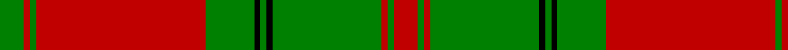

In pattern [GRGRGKGKGRGR](/patterns/grgrgkgkgrgr/).

This was sourced from weddslist.  It is a [12 stripes tartan](/stripes/stripes12/).

Original link http://www.weddslist.com/cgi-bin/tartans/pg.pl?source=sts

## Thread count
G/8 R2 G2 R56 G16 K2 G2 K2 G36 R2 G2 R/8

## Palette
Each colour and its ΔE from the base-6 reference it is a variant of.

| Colour | Shade | Base | ΔE (OKLab) |
|---|---|---|---|
| G | <code style="background-color:#008000;">#008000</code> `#008000` | G <code style="background-color:#006400;">#006400</code> | 0.09 |
| K | <code style="background-color:#000000;">#000000</code> `#000000` | K <code style="background-color:#000000;">#000000</code> | 0.00 |
| R | <code style="background-color:#C00000;">#C00000</code> `#C00000` | R <code style="background-color:#C80000;">#C80000</code> | 0.02 |

## Nearest tartans

The nearest existing variants by ΔTartan distance.

1. [Drummond VS](/setts/s12/g4r1g1r28g8k1g1k1g18r1g1r4-g004c00-k000000-rc80000/) — ΔT 0.82
1. [Drummond #3](/setts/s12/g8r2g2r56g16k2g2k2g36r2g2r8-g005020-k101010-rdc0000/) — ΔT 0.89
1. [MacDonell of Glengarry](/setts/s11/g36r6g4r4b12r4g4r48g2r4g12-b304080-g008000-rc00000/) — ΔT 0.92
1. [Robertson 2](/setts/s14/g30r2g2r2g2r36g48r2g2r36g2r2g2r6-g008000-rc00000/) — ΔT 1.12
1. [Hebrides Outer](/setts/s17/g18r4g6r40g4r2g4r4g40r4g6r4g4r44g6y2r6-g008000-rc00000-yf0c000/) — ΔT 1.17
1. [Strang (Personal)](/setts/s14/r72g36r8g12k2w4k2g4k2w4k2g12r8g36-g146400-k000000-rb00000-wc8c8c8/) — ΔT 1.19
1. [Robertson - 1746 (Artefact)](/setts/s14/g30r2g2r2g2r36g48r2g2r36g2r2g2r6-g006818-rc80000/) — ΔT 1.22
1. [Thomas of Wales](/setts/s8/g4r54b4g38b2g4b2r4-b202060-g006818-rc80000/) — ΔT 1.26
1. [Mordente](/setts/s14/g2r2w4g14r2w2g2w2r2g14r32g2w2r2-g008000-rc00000-we0e0e0/) — ΔT 1.30
1. [Robertson #2](/setts/s14/g30r2g2r2g2r36g48r2g2r36g2r2g2r6-g005020-rdc0000/) — ΔT 1.30

## Neighbour map

Every grey dot is one of 15726 variants placed by the first two principal components of the ΔTartan feature space (44% of its variance). Red is this tartan; blue dots are its nearest — click one to open its page.

<svg viewBox="0 0 640 380" role="img" style="max-width:100%;height:auto;border:1px solid #e0e0e0;border-radius:4px;display:block" xmlns="http://www.w3.org/2000/svg"><image href="/nn/cloud.v1.png" width="640" height="380"/><a href="/setts/s12/g4r1g1r28g8k1g1k1g18r1g1r4-g004c00-k000000-rc80000/"><circle cx="395.6" cy="123.2" r="4" fill="#3465a4"><title>Drummond VS</title></circle></a><a href="/setts/s12/g8r2g2r56g16k2g2k2g36r2g2r8-g005020-k101010-rdc0000/"><circle cx="394.5" cy="119.9" r="4" fill="#3465a4"><title>Drummond #3</title></circle></a><a href="/setts/s11/g36r6g4r4b12r4g4r48g2r4g12-b304080-g008000-rc00000/"><circle cx="361.7" cy="145.9" r="4" fill="#3465a4"><title>MacDonell of Glengarry</title></circle></a><a href="/setts/s14/g30r2g2r2g2r36g48r2g2r36g2r2g2r6-g008000-rc00000/"><circle cx="419.3" cy="147.8" r="4" fill="#3465a4"><title>Robertson 2</title></circle></a><a href="/setts/s17/g18r4g6r40g4r2g4r4g40r4g6r4g4r44g6y2r6-g008000-rc00000-yf0c000/"><circle cx="402.1" cy="129.7" r="4" fill="#3465a4"><title>Hebrides Outer</title></circle></a><a href="/setts/s14/r72g36r8g12k2w4k2g4k2w4k2g12r8g36-g146400-k000000-rb00000-wc8c8c8/"><circle cx="357.1" cy="97.7" r="4" fill="#3465a4"><title>Strang (Personal)</title></circle></a><a href="/setts/s14/g30r2g2r2g2r36g48r2g2r36g2r2g2r6-g006818-rc80000/"><circle cx="426.5" cy="150.0" r="4" fill="#3465a4"><title>Robertson - 1746 (Artefact)</title></circle></a><a href="/setts/s8/g4r54b4g38b2g4b2r4-b202060-g006818-rc80000/"><circle cx="403.8" cy="145.7" r="4" fill="#3465a4"><title>Thomas of Wales</title></circle></a><a href="/setts/s14/g2r2w4g14r2w2g2w2r2g14r32g2w2r2-g008000-rc00000-we0e0e0/"><circle cx="319.0" cy="124.9" r="4" fill="#3465a4"><title>Mordente</title></circle></a><a href="/setts/s14/g30r2g2r2g2r36g48r2g2r36g2r2g2r6-g005020-rdc0000/"><circle cx="414.3" cy="142.4" r="4" fill="#3465a4"><title>Robertson #2</title></circle></a><circle cx="388.5" cy="120.7" r="5" fill="#c00000"/></svg>

ID: /setts/s12/g8r2g2r56g16k2g2k2g36r2g2r8-g008000-k000000-rc00000/
