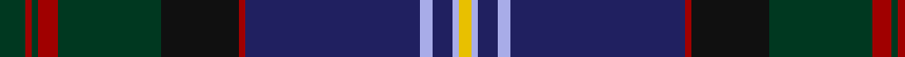

In pattern [GRGRGKRBWBWY](/patterns/grgrgkrbwbwy/).

This was sourced from tartans-authority.  It is a [12 stripes tartan](/stripes/stripes12/).

Original link http://www.tartansauthority.com/tartan-ferret/display/10904/

## Thread count
DG/8 DR2 DG2 DR6 DG32 K24 DR2 DB54 LP4 DB6 LP2 Y/4

## Palette
Each colour and its ΔE from the base-6 reference it is a variant of.

| Colour | Shade | Base | ΔE (OKLab) |
|---|---|---|---|
| DB | <code style="background-color:#202060;">#202060</code> `#202060` | B <code style="background-color:#2C4084;">#2C4084</code> | 0.11 |
| DG | <code style="background-color:#003820;">#003820</code> `#003820` | G <code style="background-color:#006400;">#006400</code> | 0.16 |
| DR | <code style="background-color:#A00000;">#A00000</code> `#A00000` | R <code style="background-color:#C80000;">#C80000</code> | 0.09 |
| K | <code style="background-color:#101010;">#101010</code> `#101010` | K <code style="background-color:#000000;">#000000</code> | 0.17 |
| LP | <code style="background-color:#A8ACE8;">#A8ACE8</code> `#A8ACE8` | W <code style="background-color:#F4F4F0;">#F4F4F0</code> | 0.22 |
| Y | <code style="background-color:#E8C000;">#E8C000</code> `#E8C000` | Y <code style="background-color:#E8C000;">#E8C000</code> | 0.00 |

## Nearest tartans

The nearest existing variants by ΔTartan distance.

1. [Unidentified #7](/setts/s11/b4r4b4r4b40k48g24y2k4g4ba4-b2c4084-ba3c82af-g005020-k101010-rdc0000-ye8c000/) — ΔT 0.67
1. [Highland Pride of Scotland (Fashion)](/setts/s11/b18g4ba4bb4g36ba4k4g2k38b66w4-b202060-ba780078-bb440044-g285800-k101010-we0e0e0/) — ΔT 0.70
1. [Sidey Family Tartan (Name)](/setts/s10/b8w2k4b50k24ba2k4g32k4r2-b202060-ba1474b4-g006818-k101010-rc80000-we0e0e0/) — ΔT 0.81
1. [McGuirk (2013)](/setts/s12/g8r2g2r6g32k24r2b54ba4b6ba2y4-b2c4084-ba5f749c-g285800-k101010-rc8002c-yffe600/) — ΔT 0.94
1. [Smithsonian (Corporate)](/setts/s11/b4w4g48k48y2r4g4r4y2b48g4-b202060-g406054-k101010-rc80000-we0e0e0-ye8c000/) — ΔT 1.01
1. [Glen Orchy (Fashion)](/setts/s15/g10r8ra2b72r8g30r16ga2b30r8g72r8rb2b10ga2-b202060-g003820-ga789484-rc80000-ra981c70-rbe87878/) — ΔT 1.08
1. [Scragg Moran (Personal)](/setts/s10/g2b56k22r10w2r10k22y2k4g2-b14465c-g509721-k120a01-r89051b-wddd5af-yc1ae8c/) — ΔT 1.09
1. [Pride of Scotland General Tartan Tartan Number: 2469. Earliest known date: 1997 The Pride of Scotland tartan was designed by Kenneth Dalgleish of D C Dalgleish, Selkirk and promoted by McCalls of Aberdeen who own copyright and patent. See products available Copyright © Blair Urquhart, Comrie, 2015](/setts/s11/g16b4ba4g6ba32g4k4g2k32bb60w4-b780078-ba583058-bb140058-g005030-k101010-wd8d8d8/) — ΔT 1.10
1. [Capercaillie Corporate Tartan Tartan Number: 6857. Earliest known date: 2005 RSPB Scotland will receive a 7% royalty on all products made from the new tartan, created in the colours of the world's largest woodland grouse, in a deal struck with the leading tartan weavers Lochcarron. See products available Copyright © Blair Urquhart, Comrie, 2015](/setts/s14/b4r3b4r2b4ba8b30k4ba4k36b4ra2k4w2-b505050-ba3c4464-k101010-r98481c-rac80000-wf8f8f8/) — ΔT 1.13
1. [Rikaco Heirloom (Fashion)](/setts/s10/b6ba6b2g52b20bb2b6bc10ba8y4-b1c1c50-ba2c2c80-bb586c8c-bc780078-g006818-ya08858/) — ΔT 1.15

## Neighbour map

Every grey dot is one of 15726 variants placed by the first two principal components of the ΔTartan feature space (44% of its variance). Red is this tartan; blue dots are its nearest — click one to open its page.

<svg viewBox="0 0 640 380" role="img" style="max-width:100%;height:auto;border:1px solid #e0e0e0;border-radius:4px;display:block" xmlns="http://www.w3.org/2000/svg"><image href="/nn/cloud.v1.png" width="640" height="380"/><a href="/setts/s11/b4r4b4r4b40k48g24y2k4g4ba4-b2c4084-ba3c82af-g005020-k101010-rdc0000-ye8c000/"><circle cx="225.7" cy="112.3" r="4" fill="#3465a4"><title>Unidentified #7</title></circle></a><a href="/setts/s11/b18g4ba4bb4g36ba4k4g2k38b66w4-b202060-ba780078-bb440044-g285800-k101010-we0e0e0/"><circle cx="290.2" cy="112.1" r="4" fill="#3465a4"><title>Highland Pride of Scotland (Fashion)</title></circle></a><a href="/setts/s10/b8w2k4b50k24ba2k4g32k4r2-b202060-ba1474b4-g006818-k101010-rc80000-we0e0e0/"><circle cx="268.6" cy="123.1" r="4" fill="#3465a4"><title>Sidey Family Tartan (Name)</title></circle></a><a href="/setts/s12/g8r2g2r6g32k24r2b54ba4b6ba2y4-b2c4084-ba5f749c-g285800-k101010-rc8002c-yffe600/"><circle cx="234.3" cy="95.3" r="4" fill="#3465a4"><title>McGuirk (2013)</title></circle></a><a href="/setts/s11/b4w4g48k48y2r4g4r4y2b48g4-b202060-g406054-k101010-rc80000-we0e0e0-ye8c000/"><circle cx="200.7" cy="103.5" r="4" fill="#3465a4"><title>Smithsonian (Corporate)</title></circle></a><a href="/setts/s15/g10r8ra2b72r8g30r16ga2b30r8g72r8rb2b10ga2-b202060-g003820-ga789484-rc80000-ra981c70-rbe87878/"><circle cx="281.1" cy="90.3" r="4" fill="#3465a4"><title>Glen Orchy (Fashion)</title></circle></a><a href="/setts/s10/g2b56k22r10w2r10k22y2k4g2-b14465c-g509721-k120a01-r89051b-wddd5af-yc1ae8c/"><circle cx="270.7" cy="110.9" r="4" fill="#3465a4"><title>Scragg Moran (Personal)</title></circle></a><a href="/setts/s11/g16b4ba4g6ba32g4k4g2k32bb60w4-b780078-ba583058-bb140058-g005030-k101010-wd8d8d8/"><circle cx="236.6" cy="119.2" r="4" fill="#3465a4"><title>Pride of Scotland General Tartan Tartan Number: 2469. Earliest known date: 1997 The Pride of Scotland tartan was designed by Kenneth Dalgleish of D C Dalgleish, Selkirk and promoted by McCalls of Aberdeen who own copyright and patent. See products available Copyright © Blair Urquhart, Comrie, 2015</title></circle></a><a href="/setts/s14/b4r3b4r2b4ba8b30k4ba4k36b4ra2k4w2-b505050-ba3c4464-k101010-r98481c-rac80000-wf8f8f8/"><circle cx="263.9" cy="112.3" r="4" fill="#3465a4"><title>Capercaillie Corporate Tartan Tartan Number: 6857. Earliest known date: 2005 RSPB Scotland will receive a 7% royalty on all products made from the new tartan, created in the colours of the world's largest woodland grouse, in a deal struck with the leading tartan weavers Lochcarron. See products available Copyright © Blair Urquhart, Comrie, 2015</title></circle></a><a href="/setts/s10/b6ba6b2g52b20bb2b6bc10ba8y4-b1c1c50-ba2c2c80-bb586c8c-bc780078-g006818-ya08858/"><circle cx="269.7" cy="117.3" r="4" fill="#3465a4"><title>Rikaco Heirloom (Fashion)</title></circle></a><circle cx="250.3" cy="105.1" r="5" fill="#c00000"/></svg>

ID: /setts/s12/g8r2g2r6g32k24r2b54w4b6w2y4-b202060-g003820-k101010-ra00000-wa8ace8-ye8c000/
