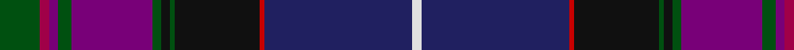

In pattern [GRBGBGKGKRBW](/patterns/grbgbgkgkrbw/).

This was sourced from tartans-authority.  It is a [12 stripes tartan](/stripes/stripes12/).

Original link http://www.tartansauthority.com/tartan-ferret/display/7463/

## Attestations

This cloth appears in 3 source records; the oldest owns this page.

- 1997 — Western Isles (Fashion) (tartans-authority, [record](http://www.tartansauthority.com/tartan-ferret/display/7463/))
- undated — Western Isles (register-of-tartans, [record](https://www.tartanregister.gov.uk/tartanDetails.aspx?ref=5508))
- undated — Western Isles Fashion Tartan Tartan Number: 7463. Earliest known date: 1997 Kenneth Dalgliesh designed the Pride of Scotland (see 2469) along with Scott Millson of McCalls of Aberdeen. McCalls decided later to patent the design to head up a new range of fashionable wedding tartans. Dalgliesh found that he was unable to weave the original pattern even though it was his own design and so he produced this pattern with an additional red line. See products available Copyright © Blair Urquhart, Comrie, 2015 (house-of-tartan, [record](http://www.house-of-tartan.scotland.net/house/TartanViewjs.asp?colr=Def&tnam=7463))

## Register references

External register numbers recorded for this tartan.

- Scottish Register of Tartans: [5508](https://www.tartanregister.gov.uk/tartanDetails.aspx?ref=5508)
- Scottish Tartans Authority (ITI): 7463

## Thread count
G/18 R4 P4 G6 P36 G4 K4 G2 K38 Ra2 DB66 LN/4

## Palette
Each colour and its ΔE from the base-6 reference it is a variant of.

| Colour | Shade | Base | ΔE (OKLab) |
|---|---|---|---|
| DB | <code style="background-color:#202060;">#202060</code> `#202060` | B <code style="background-color:#2A418A;">#2A418A</code> | 0.11 |
| G | <code style="background-color:#005010;">#005010</code> `#005010` | G <code style="background-color:#006100;">#006100</code> | 0.06 |
| K | <code style="background-color:#101010;">#101010</code> `#101010` | K <code style="background-color:#000000;">#000000</code> | 0.17 |
| LN | <code style="background-color:#E0E0E0;">#E0E0E0</code> `#E0E0E0` | W <code style="background-color:#F7F7F7;">#F7F7F7</code> | 0.07 |
| P | <code style="background-color:#780078;">#780078</code> `#780078` | B <code style="background-color:#2A418A;">#2A418A</code> | 0.17 |
| R | <code style="background-color:#A00048;">#A00048</code> `#A00048` | R <code style="background-color:#CC0000;">#CC0000</code> | 0.12 |
| Ra | <code style="background-color:#C80000;">#C80000</code> `#C80000` | R <code style="background-color:#CC0000;">#CC0000</code> | 0.01 |

## Nearest tartans

The nearest existing variants by ΔTartan distance.

1. [Pride of Scotland General Tartan Tartan Number: 2469. Earliest known date: 1997 The Pride of Scotland tartan was designed by Kenneth Dalgleish of D C Dalgleish, Selkirk and promoted by McCalls of Aberdeen who own copyright and patent. See products available Copyright © Blair Urquhart, Comrie, 2015](/setts/s11/g8b2ba2g3ba16g2k2g1k16bb30w2~b780078-ba583058-bb140058-g005030-k101010-wd8d8d8~x2/) — ΔT 1.17
1. [Pride of Scotland](/setts/s11/g9r2ra2g3ra18g2k2g1k19b33w2~b2c2c80-g006818-k101010-ra00048-ra981c70-wfcfcfc~x2/) — ΔT 1.25
1. [McGuirk (2013)](/setts/s12/g4r1g1r3g16k12r1b27w2b3w1y2~b202060-g003820-k101010-ra00000-wa8ace8-ye8c000~x2/) — ΔT 1.31
1. [Rendell, Charles (Personal)](/setts/s17/k2g2b1g2b1g2b1g12ba4k3ba3k3ba3k3ba4bb24r2~b9058d8-ba38409c-bb440044-g006818-k101010-rc80000~x2/) — ΔT 1.35
1. [Albannach](/setts/s8/k4b2r7b60g15ba60bb5w3~b440044-ba2c2c80-bb1474b4-g5c6428-k101010-rc80000-we0e0e0/) — ΔT 1.46
1. [Lang of Sherbrooke (Personal)](/setts/s11/g10y2b2g2b13g2b2g1k13ba24w2~b780078-ba2c2c80-g00643c-k101010-wfcfcfc-ye8c000~x2/) — ΔT 1.51
1. [Unidentified #7](/setts/s11/b2r2b2r2b20k24g12y1k2g2ba2~b2c4084-ba3c82af-g005020-k101010-rdc0000-ye8c000~x2/) — ΔT 1.51
1. [Smithsonian (Corporate)](/setts/s11/b2w2g24k24y1r2g2r2y1b24g2~b202060-g406054-k101010-rc80000-we0e0e0-ye8c000~x2/) — ΔT 1.52
1. [Causeway, The (District)](/setts/s15/b38ba8bb3b20ba42k2g6k2ba2bc3ba2w2bb10ba2k6~b1c1c1c-ba5c5c5c-bb2c2c80-bc780078-g006818-k101010-wfcfcfc/) — ΔT 1.52
1. [Cumnock Hunting (District)](/setts/s10/b23w1b2ba16k3ba2k30y1k2r3~b780078-ba2c2c80-k101010-rc80000-we0e0e0-yfcb464~x2/) — ΔT 1.52

## Neighbour map

Every grey dot is one of 15726 variants placed by the first two principal components of the ΔTartan feature space (44% of its variance). Red is this tartan; blue dots are its nearest — click one to open its page.

<svg viewBox="0 0 640 380" role="img" style="max-width:100%;height:auto;border:1px solid #e0e0e0;border-radius:4px;display:block" xmlns="http://www.w3.org/2000/svg"><image href="/nn/cloud.v1.png" width="640" height="380"/><a href="/setts/s11/g8b2ba2g3ba16g2k2g1k16bb30w2~b780078-ba583058-bb140058-g005030-k101010-wd8d8d8~x2/"><circle cx="241.1" cy="116.6" r="4" fill="#3465a4"><title>Pride of Scotland General Tartan Tartan Number: 2469. Earliest known date: 1997 The Pride of Scotland tartan was designed by Kenneth Dalgleish of D C Dalgleish, Selkirk and promoted by McCalls of Aberdeen who own copyright and patent. See products available Copyright © Blair Urquhart, Comrie, 2015</title></circle></a><a href="/setts/s11/g9r2ra2g3ra18g2k2g1k19b33w2~b2c2c80-g006818-k101010-ra00048-ra981c70-wfcfcfc~x2/"><circle cx="209.8" cy="90.0" r="4" fill="#3465a4"><title>Pride of Scotland</title></circle></a><a href="/setts/s12/g4r1g1r3g16k12r1b27w2b3w1y2~b202060-g003820-k101010-ra00000-wa8ace8-ye8c000~x2/"><circle cx="254.3" cy="103.5" r="4" fill="#3465a4"><title>McGuirk (2013)</title></circle></a><a href="/setts/s17/k2g2b1g2b1g2b1g12ba4k3ba3k3ba3k3ba4bb24r2~b9058d8-ba38409c-bb440044-g006818-k101010-rc80000~x2/"><circle cx="195.8" cy="81.8" r="4" fill="#3465a4"><title>Rendell, Charles (Personal)</title></circle></a><a href="/setts/s8/k4b2r7b60g15ba60bb5w3~b440044-ba2c2c80-bb1474b4-g5c6428-k101010-rc80000-we0e0e0/"><circle cx="276.5" cy="107.1" r="4" fill="#3465a4"><title>Albannach</title></circle></a><a href="/setts/s11/g10y2b2g2b13g2b2g1k13ba24w2~b780078-ba2c2c80-g00643c-k101010-wfcfcfc-ye8c000~x2/"><circle cx="173.0" cy="106.4" r="4" fill="#3465a4"><title>Lang of Sherbrooke (Personal)</title></circle></a><a href="/setts/s11/b2r2b2r2b20k24g12y1k2g2ba2~b2c4084-ba3c82af-g005020-k101010-rdc0000-ye8c000~x2/"><circle cx="229.3" cy="110.8" r="4" fill="#3465a4"><title>Unidentified #7</title></circle></a><a href="/setts/s11/b2w2g24k24y1r2g2r2y1b24g2~b202060-g406054-k101010-rc80000-we0e0e0-ye8c000~x2/"><circle cx="204.3" cy="102.1" r="4" fill="#3465a4"><title>Smithsonian (Corporate)</title></circle></a><a href="/setts/s15/b38ba8bb3b20ba42k2g6k2ba2bc3ba2w2bb10ba2k6~b1c1c1c-ba5c5c5c-bb2c2c80-bc780078-g006818-k101010-wfcfcfc/"><circle cx="241.4" cy="90.3" r="4" fill="#3465a4"><title>Causeway, The (District)</title></circle></a><a href="/setts/s10/b23w1b2ba16k3ba2k30y1k2r3~b780078-ba2c2c80-k101010-rc80000-we0e0e0-yfcb464~x2/"><circle cx="274.1" cy="103.2" r="4" fill="#3465a4"><title>Cumnock Hunting (District)</title></circle></a><circle cx="214.7" cy="78.2" r="5" fill="#c00000"/></svg>

ID: /setts/s12/g9r2b2g3b18g2k2g1k19ra1ba33w2~b780078-ba202060-g005010-k101010-ra00048-rac80000-we0e0e0~x2/
