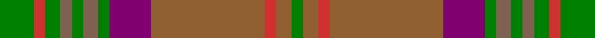

In pattern [GRGRGRGBRRRG](/stripes/grgrgrgbrrrg/).

This was sourced from weddslist.  It is a [12 stripe tartan](/stripes/stripes12/).

Original link http://www.weddslist.com/cgi-bin/tartans/pg.pl?source=sts

## Thread count
G/18 R6 G8 LTa6 G6 LTa8 G6 P22 LT60 R6 LT8 G/6

## Palette
Each colour and the base-6 reference it is a variant of.

| Colour | Shade | Base |
|---|---|---|
| G | <code style="background-color:#008000;">#008000</code> `oklch(52.0% 0.177 142.5)` <small>#008000</small> | G <code style="background-color:#006100;">#006100</code> |
| LT | <code style="background-color:#906030;">#906030</code> `oklch(53.1% 0.089 63.7)` <small>#906030</small> | R <code style="background-color:#CC0000;">#CC0000</code> |
| LTa | <code style="background-color:#806050;">#806050</code> `oklch(51.7% 0.049 47.8)` <small>#806050</small> | R <code style="background-color:#CC0000;">#CC0000</code> |
| P | <code style="background-color:#800070;">#800070</code> `oklch(41.1% 0.183 335.2)` <small>#800070</small> | B <code style="background-color:#2A418A;">#2A418A</code> |
| R | <code style="background-color:#D03030;">#D03030</code> `oklch(56.4% 0.196 26.2)` <small>#D03030</small> | R <code style="background-color:#CC0000;">#CC0000</code> |

## Nearest tartans

The nearest existing variants by ΔTartan distance.

1. [Stewart Camel (Lochcarron)](/setts/s14/y3dy3dg2dy6y7dg2y3dg2lo3dg5y3b3y20dy2~x2/) — ΔT 1.14
1. [Tasmanian](/setts/s11/r5lp2y24lr2y2lr2y6lr8r6lr8ly4~x2/) — ΔT 1.15
1. [Methven](/setts/s11/r2dg3dy18r2dy2r21y6dg2y2dg24lo2~x2/) — ΔT 1.17
1. [Lander (2013)](/setts/s15/lo18do3lo3do3lo3do16y16r2ly2r2y16do16lo17do3lo3~x2/) — ΔT 1.21
1. [Brousseau (Personal)](/setts/s9/y25r2lb2db2lb2r13dy28db2r3~x2/) — ΔT 1.28
1. [Dorcas (Fashion)](/setts/s12/r4g20dt2g2dt2g3dt6o26lb3o2lb2o4~x2/) — ΔT 1.29
1. [Scottish Crofting Foundation](/setts/s9/do6lg3do18dy2do2dy10y28r2y4~x2/) — ΔT 1.32
1. [John Muir Way](/setts/s8/dy35dg19r3y8r3dg8r3t3~x2/) — ΔT 1.37
1. [Moncton, City of](/setts/s9/g4r1db2r1g10y5r3y10ly1~x4/) — ΔT 1.39
1. [Methven](/setts/s11/o2dg3dy18o2dy2o21g2dg2g2dg24lo2~x2/) — ΔT 1.45

## Neighbour map

Every grey dot is one of 14299 variants placed by the first two principal components of the ΔTartan feature space (44% of its variance). Red is this tartan; blue dots are its nearest — click one to open its page.

<svg viewBox="0 0 640 380" role="img" style="max-width:100%;height:auto;border:1px solid #e0e0e0;border-radius:4px;display:block" xmlns="http://www.w3.org/2000/svg"><image href="/nn/cloud.v1.png" width="640" height="380"/><a href="/setts/s14/y3dy3dg2dy6y7dg2y3dg2lo3dg5y3b3y20dy2~x2/"><circle cx="250.7" cy="168.3" r="4" fill="#3465a4"><title>Stewart Camel (Lochcarron)</title></circle></a><a href="/setts/s11/r5lp2y24lr2y2lr2y6lr8r6lr8ly4~x2/"><circle cx="293.0" cy="176.1" r="4" fill="#3465a4"><title>Tasmanian</title></circle></a><a href="/setts/s11/r2dg3dy18r2dy2r21y6dg2y2dg24lo2~x2/"><circle cx="251.5" cy="179.7" r="4" fill="#3465a4"><title>Methven</title></circle></a><a href="/setts/s15/lo18do3lo3do3lo3do16y16r2ly2r2y16do16lo17do3lo3~x2/"><circle cx="222.2" cy="189.8" r="4" fill="#3465a4"><title>Lander (2013)</title></circle></a><a href="/setts/s9/y25r2lb2db2lb2r13dy28db2r3~x2/"><circle cx="269.6" cy="172.5" r="4" fill="#3465a4"><title>Brousseau (Personal)</title></circle></a><a href="/setts/s12/r4g20dt2g2dt2g3dt6o26lb3o2lb2o4~x2/"><circle cx="269.3" cy="153.0" r="4" fill="#3465a4"><title>Dorcas (Fashion)</title></circle></a><a href="/setts/s9/do6lg3do18dy2do2dy10y28r2y4~x2/"><circle cx="309.8" cy="194.3" r="4" fill="#3465a4"><title>Scottish Crofting Foundation</title></circle></a><a href="/setts/s8/dy35dg19r3y8r3dg8r3t3~x2/"><circle cx="302.0" cy="206.0" r="4" fill="#3465a4"><title>John Muir Way</title></circle></a><a href="/setts/s9/g4r1db2r1g10y5r3y10ly1~x4/"><circle cx="257.0" cy="208.6" r="4" fill="#3465a4"><title>Moncton, City of</title></circle></a><a href="/setts/s11/o2dg3dy18o2dy2o21g2dg2g2dg24lo2~x2/"><circle cx="242.4" cy="159.1" r="4" fill="#3465a4"><title>Methven</title></circle></a><circle cx="271.4" cy="174.8" r="5" fill="#c00000"/></svg>

ID: /setts/s12/g9r3g4o3g3o4g3dp11o30r3o4g3~x2/
