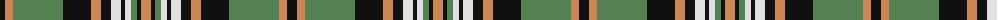

In pattern [KYGKYKWKWGKY](/patterns/kygkykwkwgky/).

This was sourced from tartans-authority.  It is a [12 stripes tartan](/stripes/stripes12/).

Original link http://www.tartansauthority.com/tartan-ferret/display/8282/

## Thread count
K/10 O8 G50 K28 O10 K10 LN10 K4 LN6 G6 K4 O/10

## Palette
Each colour and its ΔE from the base-6 reference it is a variant of.

| Colour | Shade | Base | ΔE (OKLab) |
|---|---|---|---|
| G | <code style="background-color:#548054;">#548054</code> `#548054` | G <code style="background-color:#006400;">#006400</code> | 0.14 |
| K | <code style="background-color:#101010;">#101010</code> `#101010` | K <code style="background-color:#000000;">#000000</code> | 0.17 |
| LN | <code style="background-color:#E0E0E0;">#E0E0E0</code> `#E0E0E0` | W <code style="background-color:#F4F4F0;">#F4F4F0</code> | 0.06 |
| O | <code style="background-color:#CC8854;">#CC8854</code> `#CC8854` | Y <code style="background-color:#E8C000;">#E8C000</code> | 0.17 |

ID: /setts/s12/k10y8g50k28y10k10w10k4w6g6k4y10-g548054-k101010-we0e0e0-ycc8854/
