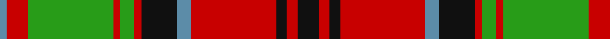

In pattern [BRGRGRKBRKRK](/patterns/brgrgrkbrkrk/).

This was sourced from register-of-tartans.  It is a [12 stripes tartan](/stripes/stripes12/).

Original link https://www.tartanregister.gov.uk/tartanDetails.aspx?ref=227

## Attestations

This cloth appears in 2 source records; the oldest owns this page.

- 01/01/2003 — Bates (register-of-tartans, [record](https://www.tartanregister.gov.uk/tartanDetails.aspx?ref=227))
- 2003 — Bates (Name) (tartans-authority, [record](http://www.tartansauthority.com/tartan-ferret/display/6057/))

## Thread count
B/4 R12 G48 R4 G8 R4 K20 B8 R48 K6 R6 K/12

## Palette
Each colour and its ΔE from the base-6 reference it is a variant of.

| Colour | Shade | Base | ΔE (OKLab) |
|---|---|---|---|
| B | <code style="background-color:#5C8CA8;">#5C8CA8</code> `#5C8CA8` | B <code style="background-color:#2C4084;">#2C4084</code> | 0.23 |
| G | <code style="background-color:#289C18;">#289C18</code> `#289C18` | G <code style="background-color:#006400;">#006400</code> | 0.18 |
| Ga | <code style="background-color:#006818;">#006818</code> `#006818` | G <code style="background-color:#006400;">#006400</code> | 0.02 |
| K | <code style="background-color:#101010;">#101010</code> `#101010` | K <code style="background-color:#000000;">#000000</code> | 0.17 |
| R | <code style="background-color:#C80000;">#C80000</code> `#C80000` | R <code style="background-color:#C80000;">#C80000</code> | 0.00 |

ID: /setts/s12/k12r6k6r48b8k20r4g8r4g48r12b4-b5c8ca8-g289c18-k101010-rc80000/
