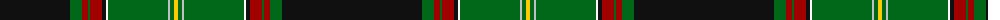

In pattern [KKGRGRKWGWGY](/patterns/kkgrgrkwgwgy/).

This was sourced from tartans-authority.  It is a [12 stripes tartan](/stripes/stripes12/).

Original link http://www.tartansauthority.com/tartan-ferret/display/8448/

## Thread count
K/136 K2 G12 DR6 G2 DR12 K4 W2 G60 N2 G4 Y/4

## Palette
Each colour and its ΔE from the base-6 reference it is a variant of.

| Colour | Shade | Base | ΔE (OKLab) |
|---|---|---|---|
| DR | <code style="background-color:#A00000;">#A00000</code> `#A00000` | R <code style="background-color:#C80000;">#C80000</code> | 0.09 |
| G | <code style="background-color:#006818;">#006818</code> `#006818` | G <code style="background-color:#006400;">#006400</code> | 0.02 |
| K | <code style="background-color:#101010;">#101010</code> `#101010` | K <code style="background-color:#000000;">#000000</code> | 0.17 |
| N | <code style="background-color:#C0C0C0;">#C0C0C0</code> `#C0C0C0` | W <code style="background-color:#F4F4F0;">#F4F4F0</code> | 0.16 |
| W | <code style="background-color:#FCFCFC;">#FCFCFC</code> `#FCFCFC` | W <code style="background-color:#F4F4F0;">#F4F4F0</code> | 0.03 |
| Y | <code style="background-color:#FCCC00;">#FCCC00</code> `#FCCC00` | Y <code style="background-color:#E8C000;">#E8C000</code> | 0.04 |

ID: /setts/s12/k136k2g12r6g2r12k4w2g60wa2g4y4-g006818-k101010-ra00000-wfcfcfc-wac0c0c0-yfccc00/
