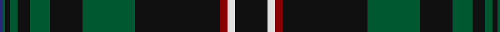

In pattern [BGKGKGKGKRWK](/patterns/bgkgkgkgkrwk/).

This was sourced from tartans-authority.  It is a [12 stripes tartan](/stripes/stripes12/).

Original link http://www.tartansauthority.com/tartan-ferret/display/8129/

## Thread count
DB/1 G1 K2 G3 K5 G8 K13 G21 K34 DR3 LN3 K/13

## Palette
Each colour and its ΔE from the base-6 reference it is a variant of.

| Colour | Shade | Base | ΔE (OKLab) |
|---|---|---|---|
| DB | <code style="background-color:#282874;">#282874</code> `#282874` | B <code style="background-color:#2A418A;">#2A418A</code> | 0.07 |
| DR | <code style="background-color:#880000;">#880000</code> `#880000` | R <code style="background-color:#CC0000;">#CC0000</code> | 0.15 |
| G | <code style="background-color:#005830;">#005830</code> `#005830` | G <code style="background-color:#006100;">#006100</code> | 0.06 |
| K | <code style="background-color:#101010;">#101010</code> `#101010` | K <code style="background-color:#000000;">#000000</code> | 0.17 |
| LN | <code style="background-color:#E0E0E0;">#E0E0E0</code> `#E0E0E0` | W <code style="background-color:#F7F7F7;">#F7F7F7</code> | 0.07 |

## Nearest tartans

The nearest existing variants by ΔTartan distance.

1. [Schwarzen Keiler, Die](/setts/s12/g6k6r1w1k6g32k6r1w1k6g6y2~g003820-k101010-rc80000-wfcfcfc-ye8c000~x4/) — ΔT 0.92
1. [Pride of Scotland Contemporary](/setts/s11/k9b2r2b2k18b2k2w1b19k33ba2~b5c5c5c-ba6c0070-k101010-r888888-wc49cd8~x2/) — ΔT 0.98
1. [Schwarzen Keiler, Die](/setts/s12/g6k6r1w1k6g32k6r1w1k6g6y2~g0a2a1b-k101010-rff0000-wffffff-yffe600~x4/) — ΔT 1.08
1. [Pride of Scotland Platinum](/setts/s11/k10b2r2b2k14b2k2w1b12k24ra2~b5c5c5c-k101010-r888888-rab468ac-wc49cd8~x2/) — ΔT 1.14
1. [Milne of Corstorphine #1 (Personal)](/setts/s12/k20g1k2g1k20y1g16r2g16y1k30g1~g005020-k101010-rdc0000-ye8c000~x2/) — ΔT 1.15
1. [Entier](/setts/s12/k2g4k6y2k31ya2k1ya2k16g20ya1y2~g00643c-k101010-yb0b0b0-ya9c9c00~x2/) — ΔT 1.26
1. [Lochnagar Dark Fashion Tartan Tartan Number: 7327. Earliest known date: 01/01/1999 Inspired by the original works of Fenton Wyness, Dark Lochnagar tartan was designed to encapsulate Lochnagar in all its glory, including the Royal connections. Black & Grey are the primary colours of the tartan and were chosen to reflect 'The steep frowning glories of Dark Lochnagar', a line from Byron's verse. Purple was used for the Royal connections i.e. Queen Victoria's love of the district and Prince Charles book 'The Old Man of Lochnagar'. For the red we used a dye which we have called 'Red Granite' which Lochnagar has an abundance.'/Threadcount and colours aren't 100% original. Generated manually./ See products available Copyright © Blair Urquhart, Comrie, 2015](/setts/s10/k8b1k40b1k16b16ba6b3r3b6~b5c5c5c-ba3f4441-k101010-r880000~x2/) — ΔT 1.38
1. [Ataç, H.M. & I.C. (Personal)](/setts/s8/b9g5w1g15k2g1k44r1~b000080-g006400-k101010-rff0000-wffffff~x2/) — ΔT 1.40
1. [Glen and Son, William (Corporate)](/setts/s11/r6k3b4k10b5ra3k2b31w1b2w2~b3c3c3c-k101010-r880000-ra888888-we0e0e0~x2/) — ΔT 1.42
1. [MacNeill, Royce (Personal)](/setts/s8/k40g21w3r1y2k12b12k10~b304048-g2c5c44-k101010-rc80000-we0e0e0-ye8c000~x2/) — ΔT 1.43

## Neighbour map

Every grey dot is one of 15726 variants placed by the first two principal components of the ΔTartan feature space (44% of its variance). Red is this tartan; blue dots are its nearest — click one to open its page.

<svg viewBox="0 0 640 380" role="img" style="max-width:100%;height:auto;border:1px solid #e0e0e0;border-radius:4px;display:block" xmlns="http://www.w3.org/2000/svg"><image href="/nn/cloud.v1.png" width="640" height="380"/><a href="/setts/s12/g6k6r1w1k6g32k6r1w1k6g6y2~g003820-k101010-rc80000-wfcfcfc-ye8c000~x4/"><circle cx="396.9" cy="121.0" r="4" fill="#3465a4"><title>Schwarzen Keiler, Die</title></circle></a><a href="/setts/s11/k9b2r2b2k18b2k2w1b19k33ba2~b5c5c5c-ba6c0070-k101010-r888888-wc49cd8~x2/"><circle cx="453.8" cy="131.1" r="4" fill="#3465a4"><title>Pride of Scotland Contemporary</title></circle></a><a href="/setts/s12/g6k6r1w1k6g32k6r1w1k6g6y2~g0a2a1b-k101010-rff0000-wffffff-yffe600~x4/"><circle cx="393.4" cy="119.6" r="4" fill="#3465a4"><title>Schwarzen Keiler, Die</title></circle></a><a href="/setts/s11/k10b2r2b2k14b2k2w1b12k24ra2~b5c5c5c-k101010-r888888-rab468ac-wc49cd8~x2/"><circle cx="429.3" cy="146.5" r="4" fill="#3465a4"><title>Pride of Scotland Platinum</title></circle></a><a href="/setts/s12/k20g1k2g1k20y1g16r2g16y1k30g1~g005020-k101010-rdc0000-ye8c000~x2/"><circle cx="460.3" cy="163.9" r="4" fill="#3465a4"><title>Milne of Corstorphine #1 (Personal)</title></circle></a><a href="/setts/s12/k2g4k6y2k31ya2k1ya2k16g20ya1y2~g00643c-k101010-yb0b0b0-ya9c9c00~x2/"><circle cx="404.2" cy="131.7" r="4" fill="#3465a4"><title>Entier</title></circle></a><a href="/setts/s10/k8b1k40b1k16b16ba6b3r3b6~b5c5c5c-ba3f4441-k101010-r880000~x2/"><circle cx="467.8" cy="154.7" r="4" fill="#3465a4"><title>Lochnagar Dark Fashion Tartan Tartan Number: 7327. Earliest known date: 01/01/1999 Inspired by the original works of Fenton Wyness, Dark Lochnagar tartan was designed to encapsulate Lochnagar in all its glory, including the Royal connections. Black &amp; Grey are the primary colours of the tartan and were chosen to reflect 'The steep frowning glories of Dark Lochnagar', a line from Byron's verse. Purple was used for the Royal connections i.e. Queen Victoria's love of the district and Prince Charles book 'The Old Man of Lochnagar'. For the red we used a dye which we have called 'Red Granite' which Lochnagar has an abundance.'/Threadcount and colours aren't 100% original. Generated manually./ See products available Copyright © Blair Urquhart, Comrie, 2015</title></circle></a><a href="/setts/s8/b9g5w1g15k2g1k44r1~b000080-g006400-k101010-rff0000-wffffff~x2/"><circle cx="399.6" cy="117.3" r="4" fill="#3465a4"><title>Ataç, H.M. &amp; I.C. (Personal)</title></circle></a><a href="/setts/s11/r6k3b4k10b5ra3k2b31w1b2w2~b3c3c3c-k101010-r880000-ra888888-we0e0e0~x2/"><circle cx="400.8" cy="120.0" r="4" fill="#3465a4"><title>Glen and Son, William (Corporate)</title></circle></a><a href="/setts/s8/k40g21w3r1y2k12b12k10~b304048-g2c5c44-k101010-rc80000-we0e0e0-ye8c000~x2/"><circle cx="364.0" cy="130.2" r="4" fill="#3465a4"><title>MacNeill, Royce (Personal)</title></circle></a><circle cx="408.7" cy="134.1" r="5" fill="#c00000"/></svg>

ID: /setts/s12/k13w3r3k34g21k13g8k5g3k2g1b1~b282874-g005830-k101010-r880000-we0e0e0/
