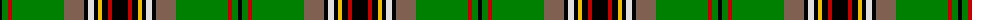

In pattern [KGRGRKWKYKRK](/patterns/kgrgrkwkykrk/).

This was sourced from weddslist.  It is a [12 stripes tartan](/stripes/stripes12/).

Original link http://www.weddslist.com/cgi-bin/tartans/pg.pl?source=sts

## Thread count
K/4 G6 R4 G52 LT20 K4 LN6 K4 Y4 K6 R4 K/16

## Palette
Each colour and its ΔE from the base-6 reference it is a variant of.

| Colour | Shade | Base | ΔE (OKLab) |
|---|---|---|---|
| G | <code style="background-color:#008000;">#008000</code> `#008000` | G <code style="background-color:#006100;">#006100</code> | 0.10 |
| K | <code style="background-color:#000000;">#000000</code> `#000000` | K <code style="background-color:#000000;">#000000</code> | 0.00 |
| LN | <code style="background-color:#E0E0E0;">#E0E0E0</code> `#E0E0E0` | W <code style="background-color:#F7F7F7;">#F7F7F7</code> | 0.07 |
| LT | <code style="background-color:#806050;">#806050</code> `#806050` | R <code style="background-color:#CC0000;">#CC0000</code> | 0.17 |
| R | <code style="background-color:#C00000;">#C00000</code> `#C00000` | R <code style="background-color:#CC0000;">#CC0000</code> | 0.03 |
| Y | <code style="background-color:#F0C000;">#F0C000</code> `#F0C000` | Y <code style="background-color:#F2BF00;">#F2BF00</code> | 0.00 |

## Nearest tartans

The nearest existing variants by ΔTartan distance.

1. [King George VI](/setts/s11/r6g48k8y4k6b4k12r8k4r6w4-b304080-g008000-k000000-rc00000-we0e0e0-yf0c000/) — ΔT 0.48
1. [MacKellar](/setts/s11/g64w4g4y6g4w4g4k32b4ba32w6-b5480b0-ba304080-g008000-k000000-we0e0e0-yf0c000/) — ΔT 0.91
1. [Louth County Crest (Fashion)](/setts/s9/y16ya5k8ya8k68g46w8k8r8-g006818-k101010-re87878-we0e0e0-ye8c000-yabc8c00/) — ΔT 0.99
1. [King George VI Royal Family Tartan Tartan Number: 1484. Earliest known date: pre 2003 Reputed to be a tartan specifically woven for King Edward VII. In the possession of Miss K Roberts of Torquay. See products available Copyright © Blair Urquhart, Comrie, 2015](/setts/s11/r6g48k8y4k6b4k12r8k4r6w4-b2c2c80-g006818-k101010-rc80000-we0e0e0-ye8c000/) — ΔT 1.00
1. [Celtic F.C.](/setts/s14/g12ga6g48k4g8k32r10g4w8g4ga42g4k4y6-g003000-ga008000-k000000-r906030-we0e0e0-yf0c000/) — ΔT 1.03
1. [Murray-Hetherington (Personal) Name Tartan Tartan Number: 10700. Earliest known date: 18 September 2012 After years of wearing the Murray of Atholl tartan, the registrant has chosen to register a tartan in his own name. He belongs to a family that has intermarried with the Murrays for many years and bears the additional surname of Murray. The underlying design of this personal tartan is based on details derived from the Blair Atholl tartan with due and proper differences to distinguish it. The colours used were specifically chosen to represent the colours found in the Murray of Atholl sett. The addition of three white stripes alludes to the three silver stars of the Murrays. The black and white also reflect the principal heraldic colours in the registrant's coat of arms granted to him by Garter King of Arms (England) and Norroy and Ulster King of Arms. The tartan, for the registrant, his immediate family, and their descendants to wear, maintains the strong link with the Murray Clan. See products available Copyright © Blair Urquhart, Comrie, 2015](/setts/s12/g4k4g56k8r12b12k24w4k4w4k4w4-b000080-g008b00-k101010-rff0000-wffffff/) — ΔT 1.03
1. [Murray-Hetherington (Personal)](/setts/s10/g4k4g56k8r12b12k24w4k4w4-b000080-g008b00-k101010-rff0000-wffffff/) — ΔT 1.08
1. [Kelsey, William (Personal)](/setts/s12/g24r4g4r10g32b6y4k4y6b12k40ya6-b2c4084-g289c18-k000000-rdc0000-ya0a0a0-yac89800/) — ΔT 1.08
1. [Courtet-Meyer (Personal)](/setts/s14/k30w2k2w2k2w2k2g30r2g30y4r10y4w6-g006818-k101010-rc8002c-wfcfcfc-ybc8c00/) — ΔT 1.10
1. [Tara Murphy Irish Family Tartan Tartan Number: 1103. Earliest known date: 1880 This pattern was recorded by Bill Johnston, Shippak, USA in 1978 along with other patterns found at Pendleton Mill. This and other Irish patterns appear to have originated in the former Waterford Mill in Ireland before they arrived at Pendleton in the late 19C. This and the O'Keefe (1176) are colour variations of the MacLean of Duart See products available Copyright © Blair Urquhart, Comrie, 2015](/setts/s12/k16r4k6y4k4w6k4g20ga52r4ga6k4-g604000-ga006818-k101010-rc80000-we0e0e0-ye8c000/) — ΔT 1.13

## Neighbour map

Every grey dot is one of 15726 variants placed by the first two principal components of the ΔTartan feature space (44% of its variance). Red is this tartan; blue dots are its nearest — click one to open its page.

<svg viewBox="0 0 640 380" role="img" style="max-width:100%;height:auto;border:1px solid #e0e0e0;border-radius:4px;display:block" xmlns="http://www.w3.org/2000/svg"><image href="/nn/cloud.v1.png" width="640" height="380"/><a href="/setts/s11/r6g48k8y4k6b4k12r8k4r6w4-b304080-g008000-k000000-rc00000-we0e0e0-yf0c000/"><circle cx="166.4" cy="106.9" r="4" fill="#3465a4"><title>King George VI</title></circle></a><a href="/setts/s11/g64w4g4y6g4w4g4k32b4ba32w6-b5480b0-ba304080-g008000-k000000-we0e0e0-yf0c000/"><circle cx="181.0" cy="98.5" r="4" fill="#3465a4"><title>MacKellar</title></circle></a><a href="/setts/s9/y16ya5k8ya8k68g46w8k8r8-g006818-k101010-re87878-we0e0e0-ye8c000-yabc8c00/"><circle cx="193.8" cy="123.8" r="4" fill="#3465a4"><title>Louth County Crest (Fashion)</title></circle></a><a href="/setts/s11/r6g48k8y4k6b4k12r8k4r6w4-b2c2c80-g006818-k101010-rc80000-we0e0e0-ye8c000/"><circle cx="190.3" cy="115.0" r="4" fill="#3465a4"><title>King George VI Royal Family Tartan Tartan Number: 1484. Earliest known date: pre 2003 Reputed to be a tartan specifically woven for King Edward VII. In the possession of Miss K Roberts of Torquay. See products available Copyright © Blair Urquhart, Comrie, 2015</title></circle></a><a href="/setts/s14/g12ga6g48k4g8k32r10g4w8g4ga42g4k4y6-g003000-ga008000-k000000-r906030-we0e0e0-yf0c000/"><circle cx="149.3" cy="119.4" r="4" fill="#3465a4"><title>Celtic F.C.</title></circle></a><a href="/setts/s12/g4k4g56k8r12b12k24w4k4w4k4w4-b000080-g008b00-k101010-rff0000-wffffff/"><circle cx="183.6" cy="112.0" r="4" fill="#3465a4"><title>Murray-Hetherington (Personal) Name Tartan Tartan Number: 10700. Earliest known date: 18 September 2012 After years of wearing the Murray of Atholl tartan, the registrant has chosen to register a tartan in his own name. He belongs to a family that has intermarried with the Murrays for many years and bears the additional surname of Murray. The underlying design of this personal tartan is based on details derived from the Blair Atholl tartan with due and proper differences to distinguish it. The colours used were specifically chosen to represent the colours found in the Murray of Atholl sett. The addition of three white stripes alludes to the three silver stars of the Murrays. The black and white also reflect the principal heraldic colours in the registrant's coat of arms granted to him by Garter King of Arms (England) and Norroy and Ulster King of Arms. The tartan, for the registrant, his immediate family, and their descendants to wear, maintains the strong link with the Murray Clan. See products available Copyright © Blair Urquhart, Comrie, 2015</title></circle></a><a href="/setts/s10/g4k4g56k8r12b12k24w4k4w4-b000080-g008b00-k101010-rff0000-wffffff/"><circle cx="200.2" cy="126.5" r="4" fill="#3465a4"><title>Murray-Hetherington (Personal)</title></circle></a><a href="/setts/s12/g24r4g4r10g32b6y4k4y6b12k40ya6-b2c4084-g289c18-k000000-rdc0000-ya0a0a0-yac89800/"><circle cx="108.4" cy="127.2" r="4" fill="#3465a4"><title>Kelsey, William (Personal)</title></circle></a><a href="/setts/s14/k30w2k2w2k2w2k2g30r2g30y4r10y4w6-g006818-k101010-rc8002c-wfcfcfc-ybc8c00/"><circle cx="211.7" cy="108.8" r="4" fill="#3465a4"><title>Courtet-Meyer (Personal)</title></circle></a><a href="/setts/s12/k16r4k6y4k4w6k4g20ga52r4ga6k4-g604000-ga006818-k101010-rc80000-we0e0e0-ye8c000/"><circle cx="202.5" cy="115.6" r="4" fill="#3465a4"><title>Tara Murphy Irish Family Tartan Tartan Number: 1103. Earliest known date: 1880 This pattern was recorded by Bill Johnston, Shippak, USA in 1978 along with other patterns found at Pendleton Mill. This and other Irish patterns appear to have originated in the former Waterford Mill in Ireland before they arrived at Pendleton in the late 19C. This and the O'Keefe (1176) are colour variations of the MacLean of Duart See products available Copyright © Blair Urquhart, Comrie, 2015</title></circle></a><circle cx="169.1" cy="102.0" r="5" fill="#c00000"/></svg>

ID: /setts/s12/k16r4k6y4k4w6k4ra20g52r4g6k4-g008000-k000000-rc00000-ra806050-we0e0e0-yf0c000/
