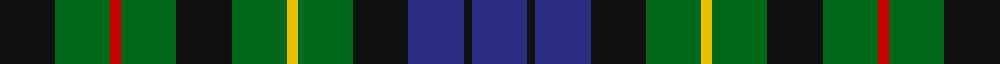

In pattern [BKBKGYGKGRGK](/stripes/bkbkgygkgrgk/).

This was sourced from register-of-tartans.  It is a [12 stripe tartan](/stripes/stripes12/).

Original link https://www.tartanregister.gov.uk/tartanDetails.aspx?ref=3542

## Attestations

This cloth appears in 2 source records; the oldest owns this page.

- 01/01/1946 — Rollo (register-of-tartans, [record](https://www.tartanregister.gov.uk/tartanDetails.aspx?ref=3542))
- pre 1946 — Rollo (Clan) (tartans-authority, [record](http://www.tartansauthority.com/tartan-ferret/display/1971/))

## Register references

External register numbers recorded for this tartan.

- Scottish Register of Tartans: [3542](https://www.tartanregister.gov.uk/tartanDetails.aspx?ref=3542)
- Scottish Tartans Authority (ITI): 1971
- Scottish Tartans World Register: 1971

## Thread count
K/42 G42 R8 G42 K42 G42 Y8 G42 K42 DB42 K6 DB/42

## Palette
Each colour and the base-6 reference it is a variant of.

| Colour | Shade | Base |
|---|---|---|
| DB | <code style="background-color:#2C2C80;">#2C2C80</code> `oklch(35.0% 0.138 276.6)` <small>#2C2C80</small> | B <code style="background-color:#2A418A;">#2A418A</code> |
| G | <code style="background-color:#006818;">#006818</code> `oklch(45.0% 0.142 145.0)` <small>#006818</small> | G <code style="background-color:#006100;">#006100</code> |
| K | <code style="background-color:#101010;">#101010</code> `oklch(17.3% 0.000 89.9)` <small>#101010</small> | K <code style="background-color:#000000;">#000000</code> |
| R | <code style="background-color:#C80000;">#C80000</code> `oklch(52.3% 0.215 29.2)` <small>#C80000</small> | R <code style="background-color:#CC0000;">#CC0000</code> |
| Y | <code style="background-color:#E8C000;">#E8C000</code> `oklch(81.9% 0.168 93.7)` <small>#E8C000</small> | Y <code style="background-color:#F2BF00;">#F2BF00</code> |

## Nearest tartans

The nearest existing variants by ΔTartan distance, with this tartan at the top so the swatches line up against it.

ΔTartan

Tartan

Sett

—

<a href="/ttd/edit/#slug=k21g21r4g21k21g21ly4g21k21db21k3db21~x2">Rollo</a> <a class="nn-out" href="/setts/s12/k21g21r4g21k21g21ly4g21k21db21k3db21~x2/" title="open its dictionary page">↗</a>

0.11

<a href="/ttd/edit/#slug=k15g15ly3g15k15g15r3g15k15db15k2db15~x2">Rollo Family Tartan Tartan Number: 1971. Earliest known date: 1946 Designed for Lord Rollo in 1946. It is interesting to note the similarity with the tartan of the Campbells of Breadalbane. Both the Rollos and the Campbells of Breadalbane had their homes in Perthshire. Rollos claim descent from a common ancestor of William the Conqueror. They settled in Scotland in the reign of David I (1124-53). See products available Copyright © Blair Urquhart, Comrie, 2015</a> <a class="nn-out" href="/setts/s12/k15g15ly3g15k15g15r3g15k15db15k2db15~x2/" title="open its dictionary page">↗</a>

0.37

<a href="/ttd/edit/#slug=lo3g15k15db15k2db15k15g15dp3g15k15g15lo3~x2">MacBride</a> <a class="nn-out" href="/setts/s13/lo3g15k15db15k2db15k15g15dp3g15k15g15lo3~x2/" title="open its dictionary page">↗</a>

0.49

<a href="/ttd/edit/#slug=ly3g15k15db15k2db15k15g15m3g15k15g15ly3~x2">MacBride Family Tartan Tartan Number: 2153. Earliest known date: 1992 The family of MacBride, (from SaintBride or Brigid) are known to have been a sept of the MacDonalds. Head of the family, Mr Stuart C. MacBride, commissioned Mr Harry Lindley to create a MacBride tartan from the Ensigns Armorial recently granted by Lord Lyon. Mr MacBride is a member of the Weaver Incorporation of Aberdeen. Traditionally members of the family, as a courtesy, ask permission of the chief or head of the family before wearing his tartan. See products available Copyright © Blair Urquhart, Comrie, 2015</a> <a class="nn-out" href="/setts/s13/ly3g15k15db15k2db15k15g15m3g15k15g15ly3~x2/" title="open its dictionary page">↗</a>

0.64

<a href="/ttd/edit/#slug=k2b1g6b2g2k4g5lo1g5k4db4k2db2~x4">Gordon Dress (US Fashion)</a> <a class="nn-out" href="/setts/s13/k2b1g6b2g2k4g5lo1g5k4db4k2db2~x4/" title="open its dictionary page">↗</a>

0.69

<a href="/ttd/edit/#slug=k5g4w1g4k1g4r1g4k5db5k1db5~x4">Lloyd of Dolobran Family Tartan Tartan Number: 1970. Earliest known date: 1930-50 This sample comes from the MacGregor-Hastie collection which forms the basis of the cloth archive of the Scottish Tartans Society. Some of the samples, including this one, were unmarked. One can assume that the sample dates between 1930 and 1950. See products available Copyright © Blair Urquhart, Comrie, 2015</a> <a class="nn-out" href="/setts/s12/k5g4w1g4k1g4r1g4k5db5k1db5~x4/" title="open its dictionary page">↗</a>

0.86

<a href="/ttd/edit/#slug=dp6k6g6w1g6k6g6w1g6k6dp6y1~x4">Wilson's No.233</a> <a class="nn-out" href="/setts/s12/dp6k6g6w1g6k6g6w1g6k6dp6y1~x4/" title="open its dictionary page">↗</a>

0.96

<a href="/ttd/edit/#slug=dp12k13g12lb2g12k13g12lb2g12k13dp12k2~x2">Wilson's No.064 #2</a> <a class="nn-out" href="/setts/s12/dp12k13g12lb2g12k13g12lb2g12k13dp12k2~x2/" title="open its dictionary page">↗</a>

1.08

<a href="/ttd/edit/#slug=db9dg3db9k4dg10r4dg10k6dg2k7dg2k7dg2k6dg10ly4dg10k8~x2">Stuart/Stewart Hunting Plaid</a> <a class="nn-out" href="/setts/s18/db9dg3db9k4dg10r4dg10k6dg2k7dg2k7dg2k6dg10ly4dg10k8~x2/" title="open its dictionary page">↗</a>

1.16

<a href="/ttd/edit/#slug=k19g3db19lo5db19g3k19g19r7g19~x2">Casely Family Tartan Tartan Number: 2146. Earliest known date: 1992 The chiefly sett of a family tartan designed by Harry Lindley for the Scottish Tartans Society, to whom Mr Gordon Casely petitioned for the design in 1990. Formal accreditation was granted in 1993. See products available Copyright © Blair Urquhart, Comrie, 2015</a> <a class="nn-out" href="/setts/s10/k19g3db19lo5db19g3k19g19r7g19~x2/" title="open its dictionary page">↗</a>

1.22

<a href="/ttd/edit/#slug=dp12k13dg12ly2dg12k13dg12ly2dg12k13dp12k2~x2">Wilson's No.064</a> <a class="nn-out" href="/setts/s12/dp12k13dg12ly2dg12k13dg12ly2dg12k13dp12k2~x2/" title="open its dictionary page">↗</a>

## Neighbour map

Every grey dot is one of 14299 variants placed by the first two principal components of the ΔTartan feature space (44% of its variance). Red is this tartan; blue dots are its nearest — click one to open its page.

<svg viewBox="0 0 640 380" role="img" style="max-width:100%;height:auto;border:1px solid #e0e0e0;border-radius:4px;display:block" xmlns="http://www.w3.org/2000/svg"><image href="/nn/cloud.v1.png" width="640" height="380"/><a href="/setts/s12/k15g15ly3g15k15g15r3g15k15db15k2db15~x2/"><circle cx="155.7" cy="235.8" r="4" fill="#3465a4"><title>Rollo Family Tartan Tartan Number: 1971. Earliest known date: 1946 Designed for Lord Rollo in 1946. It is interesting to note the similarity with the tartan of the Campbells of Breadalbane. Both the Rollos and the Campbells of Breadalbane had their homes in Perthshire. Rollos claim descent from a common ancestor of William the Conqueror. They settled in Scotland in the reign of David I (1124-53). See products available Copyright © Blair Urquhart, Comrie, 2015</title></circle></a><a href="/setts/s13/lo3g15k15db15k2db15k15g15dp3g15k15g15lo3~x2/"><circle cx="154.2" cy="224.9" r="4" fill="#3465a4"><title>MacBride</title></circle></a><a href="/setts/s13/ly3g15k15db15k2db15k15g15m3g15k15g15ly3~x2/"><circle cx="144.8" cy="220.0" r="4" fill="#3465a4"><title>MacBride Family Tartan Tartan Number: 2153. Earliest known date: 1992 The family of MacBride, (from SaintBride or Brigid) are known to have been a sept of the MacDonalds. Head of the family, Mr Stuart C. MacBride, commissioned Mr Harry Lindley to create a MacBride tartan from the Ensigns Armorial recently granted by Lord Lyon. Mr MacBride is a member of the Weaver Incorporation of Aberdeen. Traditionally members of the family, as a courtesy, ask permission of the chief or head of the family before wearing his tartan. See products available Copyright © Blair Urquhart, Comrie, 2015</title></circle></a><a href="/setts/s13/k2b1g6b2g2k4g5lo1g5k4db4k2db2~x4/"><circle cx="152.7" cy="228.7" r="4" fill="#3465a4"><title>Gordon Dress (US Fashion)</title></circle></a><a href="/setts/s12/k5g4w1g4k1g4r1g4k5db5k1db5~x4/"><circle cx="132.1" cy="238.8" r="4" fill="#3465a4"><title>Lloyd of Dolobran Family Tartan Tartan Number: 1970. Earliest known date: 1930-50 This sample comes from the MacGregor-Hastie collection which forms the basis of the cloth archive of the Scottish Tartans Society. Some of the samples, including this one, were unmarked. One can assume that the sample dates between 1930 and 1950. See products available Copyright © Blair Urquhart, Comrie, 2015</title></circle></a><a href="/setts/s12/dp6k6g6w1g6k6g6w1g6k6dp6y1~x4/"><circle cx="133.4" cy="229.5" r="4" fill="#3465a4"><title>Wilson's No.233</title></circle></a><a href="/setts/s12/dp12k13g12lb2g12k13g12lb2g12k13dp12k2~x2/"><circle cx="168.7" cy="252.4" r="4" fill="#3465a4"><title>Wilson's No.064 #2</title></circle></a><a href="/setts/s18/db9dg3db9k4dg10r4dg10k6dg2k7dg2k7dg2k6dg10ly4dg10k8~x2/"><circle cx="151.0" cy="235.9" r="4" fill="#3465a4"><title>Stuart/Stewart Hunting Plaid</title></circle></a><a href="/setts/s10/k19g3db19lo5db19g3k19g19r7g19~x2/"><circle cx="116.6" cy="231.2" r="4" fill="#3465a4"><title>Casely Family Tartan Tartan Number: 2146. Earliest known date: 1992 The chiefly sett of a family tartan designed by Harry Lindley for the Scottish Tartans Society, to whom Mr Gordon Casely petitioned for the design in 1990. Formal accreditation was granted in 1993. See products available Copyright © Blair Urquhart, Comrie, 2015</title></circle></a><a href="/setts/s12/dp12k13dg12ly2dg12k13dg12ly2dg12k13dp12k2~x2/"><circle cx="169.1" cy="247.6" r="4" fill="#3465a4"><title>Wilson's No.064</title></circle></a><circle cx="154.6" cy="238.4" r="5" fill="#c00000"/></svg>

ID: /setts/s12/k21g21r4g21k21g21ly4g21k21db21k3db21~x2/
