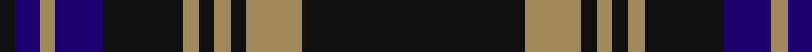

In pattern [KBYBKYKYKYKK](/patterns/kbybkykykykk/).

This was sourced from tartans-authority.  It is a [12 stripes tartan](/stripes/stripes12/).

Original link http://www.tartansauthority.com/tartan-ferret/display/2630/

## Thread count
K/4 DB6 LT4 DB12 Kb20 LT4 K4 LT4 K4 LT14 K6 K/44

## Palette
Each colour and its ΔE from the base-6 reference it is a variant of.

| Colour | Shade | Base | ΔE (OKLab) |
|---|---|---|---|
| DB | <code style="background-color:#1C0070;">#1C0070</code> `#1C0070` | B <code style="background-color:#2A418A;">#2A418A</code> | 0.14 |
| K | <code style="background-color:#101010;">#101010</code> `#101010` | K <code style="background-color:#000000;">#000000</code> | 0.17 |
| Ka | <code style="background-color:#101010;">#101010</code> `#101010` | K <code style="background-color:#000000;">#000000</code> | 0.17 |
| Kb | <code style="background-color:#101010;">#101010</code> `#101010` | K <code style="background-color:#000000;">#000000</code> | 0.17 |
| LT | <code style="background-color:#A08858;">#A08858</code> `#A08858` | Y <code style="background-color:#F2BF00;">#F2BF00</code> | 0.21 |

## Nearest tartans

The nearest existing variants by ΔTartan distance.

1. [Chess](/setts/s13/k1w1k8g1k1ka8k1g8k1ka1k8w1k1x6~g004000-k101010-ka000040-wffffff/) — ΔT 0.94
1. [Guthrie Family Tartan Tartan Number: 1085. Earliest known date: pre 2003 From the Barony of Guthrie in Angus, the name is also said to derive from Guthrum, a Scandinavian prince. Sir David Guthrie was King's Treasurer in the fifteenth century and built Guthrie Castle near Friockheim, Angus, in 1468. See products available Copyright © Blair Urquhart, Comrie, 2015](/setts/s9/k1g8k9r1k1r1k9b8r1x6~b2c2c80-g006818-k101010-rc80000/) — ΔT 1.13
1. [Law of Atholl (Personal)](/setts/s11/b10r3b3r6b26g12r6g2r3g6y2x2~b1c0070-g006818-r880000-yd09800/) — ΔT 1.16
1. [Durie](/setts/s9/k12r1k1r1k1r4g12y1g2x4~g003000-k000030-r800000-yf0c000/) — ΔT 1.19
1. [Daks (Chino Check)](/setts/s12/k22k3ka7k2ka2k2ka2b10g6ka2g3k2x2~b1c0070-g5c6428-k000000-ka101010/) — ΔT 1.20
1. [Auld Lang Syne Brown Tartan Tartan Number: 2401. Earliest known date: Threadcount and colours aren't 100% original. Generated manually. See products available Copyright © Blair Urquhart, Comrie, 2015](/setts/s12/w4k2g8k2r2k2r2k23g10k2g7k2x2~g352406-k130d00-r977957-wffffda/) — ΔT 1.25
1. [Dama Resort](/setts/s11/b3k2ba6k2ba2k18g13w2g2k6b2x2~b7a378b-ba2f4f4f-g777733-k101010-w88ace0/) — ΔT 1.26
1. [Dama Resort (Fashion)](/setts/s11/b3k2ba6k2ba2k18g13w2g2k6b2x2~b780078-ba5c5c5c-g006818-k101010-w98c8e8/) — ΔT 1.26
1. [Paxton (Personal)](/setts/s11/k24b5k9g3k2g3k2g14b7k2b10x2~b780078-g006818-k101010/) — ΔT 1.27
1. [Riddoch Personal Tartan Tartan Number: 5856. Earliest known date: circa 1992 Designed by Tony Murray for an Albert (Bert) Riddoch of Bearsden, Glasgow as a private and personal tartan initially but it was then changed to usage by anyone of the name. Bert Riddoch (2002) is a private investgator involved in covert drugs investigations and 'highly thought of by the police'. Tartan based on Campbell of Breadalbane. See products available Copyright © Blair Urquhart, Comrie, 2015](/setts/s14/b18k2b2k2b2k15r2g28r2k15b2k2b2k2x2~b2c2c80-g006818-k101010-rc80000/) — ΔT 1.29

## Neighbour map

Every grey dot is one of 15726 variants placed by the first two principal components of the ΔTartan feature space (44% of its variance). Red is this tartan; blue dots are its nearest — click one to open its page.

<svg viewBox="0 0 640 380" role="img" style="max-width:100%;height:auto;border:1px solid #e0e0e0;border-radius:4px;display:block" xmlns="http://www.w3.org/2000/svg"><image href="/nn/cloud.v1.png" width="640" height="380"/><a href="/setts/s13/k1w1k8g1k1ka8k1g8k1ka1k8w1k1x6~g004000-k101010-ka000040-wffffff/"><circle cx="271.3" cy="193.5" r="4" fill="#3465a4"><title>Chess</title></circle></a><a href="/setts/s9/k1g8k9r1k1r1k9b8r1x6~b2c2c80-g006818-k101010-rc80000/"><circle cx="276.4" cy="213.1" r="4" fill="#3465a4"><title>Guthrie Family Tartan Tartan Number: 1085. Earliest known date: pre 2003 From the Barony of Guthrie in Angus, the name is also said to derive from Guthrum, a Scandinavian prince. Sir David Guthrie was King's Treasurer in the fifteenth century and built Guthrie Castle near Friockheim, Angus, in 1468. See products available Copyright © Blair Urquhart, Comrie, 2015</title></circle></a><a href="/setts/s11/b10r3b3r6b26g12r6g2r3g6y2x2~b1c0070-g006818-r880000-yd09800/"><circle cx="276.6" cy="177.4" r="4" fill="#3465a4"><title>Law of Atholl (Personal)</title></circle></a><a href="/setts/s9/k12r1k1r1k1r4g12y1g2x4~g003000-k000030-r800000-yf0c000/"><circle cx="272.7" cy="187.1" r="4" fill="#3465a4"><title>Durie</title></circle></a><a href="/setts/s12/k22k3ka7k2ka2k2ka2b10g6ka2g3k2x2~b1c0070-g5c6428-k000000-ka101010/"><circle cx="274.6" cy="182.7" r="4" fill="#3465a4"><title>Daks (Chino Check)</title></circle></a><a href="/setts/s12/w4k2g8k2r2k2r2k23g10k2g7k2x2~g352406-k130d00-r977957-wffffda/"><circle cx="294.7" cy="171.5" r="4" fill="#3465a4"><title>Auld Lang Syne Brown Tartan Tartan Number: 2401. Earliest known date: Threadcount and colours aren't 100% original. Generated manually. See products available Copyright © Blair Urquhart, Comrie, 2015</title></circle></a><a href="/setts/s11/b3k2ba6k2ba2k18g13w2g2k6b2x2~b7a378b-ba2f4f4f-g777733-k101010-w88ace0/"><circle cx="227.5" cy="168.6" r="4" fill="#3465a4"><title>Dama Resort</title></circle></a><a href="/setts/s11/b3k2ba6k2ba2k18g13w2g2k6b2x2~b780078-ba5c5c5c-g006818-k101010-w98c8e8/"><circle cx="230.2" cy="172.8" r="4" fill="#3465a4"><title>Dama Resort (Fashion)</title></circle></a><a href="/setts/s11/k24b5k9g3k2g3k2g14b7k2b10x2~b780078-g006818-k101010/"><circle cx="293.9" cy="204.8" r="4" fill="#3465a4"><title>Paxton (Personal)</title></circle></a><a href="/setts/s14/b18k2b2k2b2k15r2g28r2k15b2k2b2k2x2~b2c2c80-g006818-k101010-rc80000/"><circle cx="254.7" cy="155.4" r="4" fill="#3465a4"><title>Riddoch Personal Tartan Tartan Number: 5856. Earliest known date: circa 1992 Designed by Tony Murray for an Albert (Bert) Riddoch of Bearsden, Glasgow as a private and personal tartan initially but it was then changed to usage by anyone of the name. Bert Riddoch (2002) is a private investgator involved in covert drugs investigations and 'highly thought of by the police'. Tartan based on Campbell of Breadalbane. See products available Copyright © Blair Urquhart, Comrie, 2015</title></circle></a><circle cx="267.5" cy="173.6" r="5" fill="#c00000"/></svg>

ID: /setts/s12/k22k3y7k2y2k2y2k10b6y2b3k2x2~b1c0070-k101010-ya08858/
