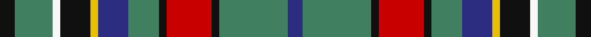

This page is one **sett** — a single exact thread-count. It belongs to the [tartan](/tartans/k2g5w1k4y1db4g4k1r6k1g9db2/)
(the same proportion at any scale), whose colour order is pattern [BGKRKGBYKWGK](/stripes/bgkrkgbykwgk/).

Sourced from register-of-tartans.  It is a [12 stripe tartan](/stripes/stripes12/).

Original link https://www.tartanregister.gov.uk/tartanDetails.aspx?ref=3022

2 attestations — the source records this cloth was collapsed from (oldest owns this page)

<ul>
<li>01/01/1980 — Moskova (register-of-tartans, <a href="https://www.tartanregister.gov.uk/tartanDetails.aspx?ref=3022">record</a>)</li>
<li>circ 1980 — Moskova (Corporate) (tartans-authority, <a href="http://www.tartansauthority.com/tartan-ferret/display/6360/">record</a>)</li>
</ul>

## Register references

External register numbers recorded for this tartan.

- Scottish Register of Tartans: [3022](https://www.tartanregister.gov.uk/tartanDetails.aspx?ref=3022)
- Scottish Tartans Authority (ITI): 6360

## Thread count
K/8 G20 W4 K16 Y4 DB16 G16 K4 R24 K4 G36 DB/8

## Palette
Each colour and the base-6 reference it is a variant of.

| Colour | Shade | Base |
|---|---|---|
| DB | <code style="background-color:#2C2C80;">#2C2C80</code> `oklch(35.0% 0.138 276.6)` <small>#2C2C80</small> | B <code style="background-color:#2A418A;">#2A418A</code> |
| G | <code style="background-color:#408060;">#408060</code> `oklch(54.8% 0.084 160.1)` <small>#408060</small> | G <code style="background-color:#006100;">#006100</code> |
| K | <code style="background-color:#101010;">#101010</code> `oklch(17.3% 0.000 89.9)` <small>#101010</small> | K <code style="background-color:#000000;">#000000</code> |
| R | <code style="background-color:#C80000;">#C80000</code> `oklch(52.3% 0.215 29.2)` <small>#C80000</small> | R <code style="background-color:#CC0000;">#CC0000</code> |
| W | <code style="background-color:#F8F8F8;">#F8F8F8</code> `oklch(97.9% 0.000 89.9)` <small>#F8F8F8</small> | W <code style="background-color:#F7F7F7;">#F7F7F7</code> |
| Y | <code style="background-color:#E8C000;">#E8C000</code> `oklch(81.9% 0.168 93.7)` <small>#E8C000</small> | Y <code style="background-color:#F2BF00;">#F2BF00</code> |

## Nearest tartans

The nearest existing variants by ΔTartan distance, with this tartan at the top so the swatches line up against it.

ΔTartan

Tartan

Sett

—

<a href="/ttd/edit/#slug=k2g5w1k4ly1db4g4k1r6k1g9db2~x4">Moskova</a> <a class="nn-out" href="/setts/s12/k2g5w1k4ly1db4g4k1r6k1g9db2~x4/" title="open its dictionary page">↗</a>

1.01

<a href="/ttd/edit/#slug=k3g2k12db4g19r3g19db4k12g2ly3~x2">Loch Lomond Millenium Comemmorative Tartan Tartan Number: 2520. Earliest known date: 2002 Designed by Claire Donaldson of the House of Edgar. The application states that it is restricted to H of E by copyright. However, the fabric is produced by Lochcarron. See products available Copyright © Blair Urquhart, Comrie, 2015</a> <a class="nn-out" href="/setts/s11/k3g2k12db4g19r3g19db4k12g2ly3~x2/" title="open its dictionary page">↗</a>

1.04

<a href="/ttd/edit/#slug=g18r4g4r6g28dp28r4lt3ly4lt13r6">Unidentified (Woven sample)</a> <a class="nn-out" href="/setts/s11/g18r4g4r6g28dp28r4lt3ly4lt13r6/" title="open its dictionary page">↗</a>

1.05

<a href="/ttd/edit/#slug=dy24k4w7dy7lo4o28dy7k29dy35r7dy7w4dy4k17">Mauchline</a> <a class="nn-out" href="/setts/s14/dy24k4w7dy7lo4o28dy7k29dy35r7dy7w4dy4k17/" title="open its dictionary page">↗</a>

1.06

<a href="/ttd/edit/#slug=dt48lo25dy15r7lb5dt7k10lb10~x2">State Seal of Utah (Fashion)</a> <a class="nn-out" href="/setts/s8/dt48lo25dy15r7lb5dt7k10lb10~x2/" title="open its dictionary page">↗</a>

1.08

<a href="/ttd/edit/#slug=dg3ly2r10dg10g20dg12r3g10w2~x2">Patel (2013)</a> <a class="nn-out" href="/setts/s9/dg3ly2r10dg10g20dg12r3g10w2~x2/" title="open its dictionary page">↗</a>

1.08

<a href="/ttd/edit/#slug=lo2g6r12k3w3k3g16k2g2k2g2k12lp2~x2">Kapasi (Personal)</a> <a class="nn-out" href="/setts/s13/lo2g6r12k3w3k3g16k2g2k2g2k12lp2~x2/" title="open its dictionary page">↗</a>

1.08

<a href="/ttd/edit/#slug=k18w3k18g18t18k2w4k2t18g18k18w3k18r3~x2">Hislop/Hyslop Hunting</a> <a class="nn-out" href="/setts/s14/k18w3k18g18t18k2w4k2t18g18k18w3k18r3~x2/" title="open its dictionary page">↗</a>

1.08

<a href="/ttd/edit/#slug=db6r2db6ly3g6k1g2lb2g2k1g6k1g2lb2~x2">Presbyterian Synod of Living Waters (USA)</a> <a class="nn-out" href="/setts/s14/db6r2db6ly3g6k1g2lb2g2k1g6k1g2lb2~x2/" title="open its dictionary page">↗</a>

1.10

<a href="/ttd/edit/#slug=r2k8ly2k7ly1k1w3k2g9db8r2~x2">Hislop Hunting (Name)</a> <a class="nn-out" href="/setts/s11/r2k8ly2k7ly1k1w3k2g9db8r2~x2/" title="open its dictionary page">↗</a>

1.11

<a href="/ttd/edit/#slug=db6r2db6ly3g6k1g2lb2g2k1g6~x2">Presbyterian Synod (US) (Corporate)</a> <a class="nn-out" href="/setts/s11/db6r2db6ly3g6k1g2lb2g2k1g6~x2/" title="open its dictionary page">↗</a>

## Neighbour map

Every grey dot is one of 14299 variants placed by the first two principal components of the ΔTartan feature space (44% of its variance). Red is this tartan; blue dots are its nearest — click one to open its page.

<svg viewBox="0 0 640 380" role="img" style="max-width:100%;height:auto;border:1px solid #e0e0e0;border-radius:4px;display:block" xmlns="http://www.w3.org/2000/svg"><image href="/nn/cloud.v1.png" width="640" height="380"/><a href="/setts/s11/k3g2k12db4g19r3g19db4k12g2ly3~x2/"><circle cx="180.7" cy="158.8" r="4" fill="#3465a4"><title>Loch Lomond Millenium Comemmorative Tartan Tartan Number: 2520. Earliest known date: 2002 Designed by Claire Donaldson of the House of Edgar. The application states that it is restricted to H of E by copyright. However, the fabric is produced by Lochcarron. See products available Copyright © Blair Urquhart, Comrie, 2015</title></circle></a><a href="/setts/s11/g18r4g4r6g28dp28r4lt3ly4lt13r6/"><circle cx="159.3" cy="146.2" r="4" fill="#3465a4"><title>Unidentified (Woven sample)</title></circle></a><a href="/setts/s14/dy24k4w7dy7lo4o28dy7k29dy35r7dy7w4dy4k17/"><circle cx="174.3" cy="148.3" r="4" fill="#3465a4"><title>Mauchline</title></circle></a><a href="/setts/s8/dt48lo25dy15r7lb5dt7k10lb10~x2/"><circle cx="157.9" cy="163.0" r="4" fill="#3465a4"><title>State Seal of Utah (Fashion)</title></circle></a><a href="/setts/s9/dg3ly2r10dg10g20dg12r3g10w2~x2/"><circle cx="167.4" cy="179.1" r="4" fill="#3465a4"><title>Patel (2013)</title></circle></a><a href="/setts/s13/lo2g6r12k3w3k3g16k2g2k2g2k12lp2~x2/"><circle cx="131.0" cy="135.9" r="4" fill="#3465a4"><title>Kapasi (Personal)</title></circle></a><a href="/setts/s14/k18w3k18g18t18k2w4k2t18g18k18w3k18r3~x2/"><circle cx="147.2" cy="162.5" r="4" fill="#3465a4"><title>Hislop/Hyslop Hunting</title></circle></a><a href="/setts/s14/db6r2db6ly3g6k1g2lb2g2k1g6k1g2lb2~x2/"><circle cx="109.6" cy="176.7" r="4" fill="#3465a4"><title>Presbyterian Synod of Living Waters (USA)</title></circle></a><a href="/setts/s11/r2k8ly2k7ly1k1w3k2g9db8r2~x2/"><circle cx="105.3" cy="155.0" r="4" fill="#3465a4"><title>Hislop Hunting (Name)</title></circle></a><a href="/setts/s11/db6r2db6ly3g6k1g2lb2g2k1g6~x2/"><circle cx="123.4" cy="194.6" r="4" fill="#3465a4"><title>Presbyterian Synod (US) (Corporate)</title></circle></a><circle cx="148.0" cy="159.4" r="5" fill="#c00000"/></svg>

ID: /setts/s12/k2g5w1k4ly1db4g4k1r6k1g9db2~x4/
