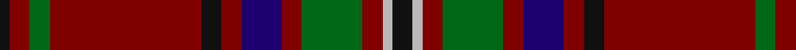

**Bands:** [KRGRKRBRGRYK](/stripes/krgrkrbrgryk/) · **Stripes:** [K R G R K R DB R G R LR K](/stripes/stripes12/) K R G R K R DB R G R LR K

This was sourced from house-of-tartan.  It is a [12 band tartan](/bands/bands12/).

Original link http://www.house-of-tartan.scotland.net/house/TartanViewjs.asp?colr=Def&tnam=3330

## Thread count
K/4 DR8 G8 DR60 K8 DR8 DB16 DR8 G24 DR8 N4 K/8

## Palette
Each colour and its ΔE from the base-6 reference it is a variant of.

| Colour | Shade | Base | ΔE (OKLab) |
|---|---|---|---|
| DB | <code style="background-color:#1C0070;">#1C0070</code> `#1C0070` | B <code style="background-color:#2A418A;">#2A418A</code> | 0.14 |
| DR | <code style="background-color:#800000;">#800000</code> `#800000` | R <code style="background-color:#CC0000;">#CC0000</code> | 0.17 |
| G | <code style="background-color:#006818;">#006818</code> `#006818` | G <code style="background-color:#006100;">#006100</code> | 0.02 |
| K | <code style="background-color:#101010;">#101010</code> `#101010` | K <code style="background-color:#000000;">#000000</code> | 0.17 |
| N | <code style="background-color:#B8B8B8;">#B8B8B8</code> `#B8B8B8` | Y <code style="background-color:#F2BF00;">#F2BF00</code> | 0.17 |

## Nearest tartans

The nearest existing variants by ΔTartan distance.

1. [MacClure](/setts/s12/k2lb1r2dg6r2db4r2k2r15dg2r2k1~x4/) — ΔT 0.54
1. [Ainslie #2](/setts/s15/r6k2r2k4r2k2r6g18r2lo1r2k2r10w1r2~x4/) — ΔT 0.95
1. [MacDonald of Glencoe](/setts/s13/dg3r1r2dg2r16lb1db4r3dg13r1db1r1r3~x2/) — ΔT 0.96
1. [Brotherhood of Dirk, The](/setts/s11/r9k3r9k2n4k4dp4k3dp2k32lg6~x2/) — ΔT 1.04
1. [Leach (1995)](/setts/s9/r24lb1k3lb1g14r8k3dp3lb2~x4/) — ΔT 1.12
1. [Michael from Appin (Personal)](/setts/s12/db4r24dg2r3dg19ly2r2db8r2dg2w2r2~x2/) — ΔT 1.14
1. [Stewart of Bute Hunting](/setts/s10/dr22g11k2g4k2g6k16dr40dr2lb6~x2/) — ΔT 1.15
1. [Chisholm VS](/setts/s10/r6lr1r24db6dg2k1dg2k1dg12r1~x2/) — ΔT 1.16
1. [Waddell (Name)](/setts/s11/r3db2r24db8dg2db2dg2db2dg10r3w2~x2/) — ΔT 1.18
1. [Balnagowan (Harrods)](/setts/s14/ly3dy3r1ly2r1dy20k5dy4k5dy3r2dy3o7dy2~x2/) — ΔT 1.18

## Neighbour map

Every grey dot is one of 14313 variants placed by the first two principal components of the ΔTartan feature space (44% of its variance). Red is this tartan; blue dots are its nearest — click one to open its page.

<svg viewBox="0 0 640 380" role="img" style="max-width:100%;height:auto;border:1px solid #e0e0e0;border-radius:4px;display:block" xmlns="http://www.w3.org/2000/svg"><image href="/nn/cloud.v1.png" width="640" height="380"/><a href="/setts/s12/k2lb1r2dg6r2db4r2k2r15dg2r2k1~x4/"><circle cx="340.3" cy="150.7" r="4" fill="#3465a4"><title>MacClure</title></circle></a><a href="/setts/s15/r6k2r2k4r2k2r6g18r2lo1r2k2r10w1r2~x4/"><circle cx="303.4" cy="126.7" r="4" fill="#3465a4"><title>Ainslie #2</title></circle></a><a href="/setts/s13/dg3r1r2dg2r16lb1db4r3dg13r1db1r1r3~x2/"><circle cx="321.0" cy="138.3" r="4" fill="#3465a4"><title>MacDonald of Glencoe</title></circle></a><a href="/setts/s11/r9k3r9k2n4k4dp4k3dp2k32lg6~x2/"><circle cx="319.9" cy="139.4" r="4" fill="#3465a4"><title>Brotherhood of Dirk, The</title></circle></a><a href="/setts/s9/r24lb1k3lb1g14r8k3dp3lb2~x4/"><circle cx="330.9" cy="129.6" r="4" fill="#3465a4"><title>Leach (1995)</title></circle></a><a href="/setts/s12/db4r24dg2r3dg19ly2r2db8r2dg2w2r2~x2/"><circle cx="270.9" cy="141.6" r="4" fill="#3465a4"><title>Michael from Appin (Personal)</title></circle></a><a href="/setts/s10/dr22g11k2g4k2g6k16dr40dr2lb6~x2/"><circle cx="363.2" cy="160.4" r="4" fill="#3465a4"><title>Stewart of Bute Hunting</title></circle></a><a href="/setts/s10/r6lr1r24db6dg2k1dg2k1dg12r1~x2/"><circle cx="350.3" cy="115.8" r="4" fill="#3465a4"><title>Chisholm VS</title></circle></a><a href="/setts/s11/r3db2r24db8dg2db2dg2db2dg10r3w2~x2/"><circle cx="317.3" cy="165.4" r="4" fill="#3465a4"><title>Waddell (Name)</title></circle></a><a href="/setts/s14/ly3dy3r1ly2r1dy20k5dy4k5dy3r2dy3o7dy2~x2/"><circle cx="326.7" cy="124.8" r="4" fill="#3465a4"><title>Balnagowan (Harrods)</title></circle></a><circle cx="328.1" cy="145.2" r="5" fill="#c00000"/></svg>

ID: /setts/s12/k2lr1r2g6r2db4r2k2r15g2r2k1~x4/
