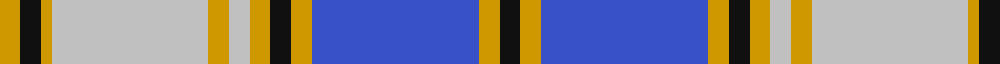

In pattern [KYBYKYWYWYKY](/patterns/kybykywywyky/).

This was sourced from register-of-tartans.  It is a [12 stripes tartan](/stripes/stripes12/).

Original link https://www.tartanregister.gov.uk/tartanDetails.aspx?ref=1821

## Attestations

This cloth appears in 3 source records; the oldest owns this page.

- 01/08/1996 — Independence (register-of-tartans, [record](https://www.tartanregister.gov.uk/tartanDetails.aspx?ref=1821))
- 1996 — Independence Tartan (Corporate) (tartans-authority, [record](http://www.tartansauthority.com/tartan-ferret/display/2285/))
- undated — Independence Universal Tartan Tartan Number: 2285. Earliest known date: 1996 Designed by Donald Fraser 1996. Commissioned by New Scots for Independence and launched at a Scottish National Party (SNP) conference. See products available Copyright © Blair Urquhart, Comrie, 2015 (house-of-tartan, [record](http://www.house-of-tartan.scotland.net/house/TartanViewjs.asp?colr=Def&tnam=2285))

## Thread count
DY/4 K4 DY2 N30 DY4 N4 DY4 K4 DY4 B32 DY4 K/4

## Palette
Each colour and its ΔE from the base-6 reference it is a variant of.

| Colour | Shade | Base | ΔE (OKLab) |
|---|---|---|---|
| B | <code style="background-color:#3850C8;">#3850C8</code> `#3850C8` | B <code style="background-color:#2A418A;">#2A418A</code> | 0.11 |
| DY | <code style="background-color:#D09800;">#D09800</code> `#D09800` | Y <code style="background-color:#F2BF00;">#F2BF00</code> | 0.12 |
| K | <code style="background-color:#101010;">#101010</code> `#101010` | K <code style="background-color:#000000;">#000000</code> | 0.17 |
| N | <code style="background-color:#C0C0C0;">#C0C0C0</code> `#C0C0C0` | W <code style="background-color:#F7F7F7;">#F7F7F7</code> | 0.17 |

## Nearest tartans

The nearest existing variants by ΔTartan distance.

1. [IAPD (Corporate)](/setts/s13/k8w7k2w3k2w3k2w3k2w7g18r27w3x2~g0098a0-k101010-rb468ac-we0e0e0/) — ΔT 0.64
1. [Oliphant Dress](/setts/s13/w25b2w2b2w2b10k2b4k2b10g23w2g4x2~b405c88-g548060-k101010-we0e0e0/) — ΔT 0.94
1. [Independence](/setts/s12/k2y2b15y2k2y2w2y2w14y1k2y2x2~b304080-k000000-we0e0e0-yf0c000/) — ΔT 1.03
1. [IAPD](/setts/s13/k8w7k2w3k2w3k2w3k2w7g18b27w3x2~b9932cc-g008080-k101010-wffffff/) — ΔT 1.16
1. [Walker Dress Family Tartan Tartan Number: 2070. Earliest known date: 1991 R.W.Hawks submitted this tartan via Phil Smith in January 1992. Hawks advised Oct. 1993 that he is agreeable for any Walkers to use this tartan. See products available Copyright © Blair Urquhart, Comrie, 2015](/setts/s12/y4b2r7b15r3b3r3b7w28r7w6r2~b003c64-ra00048-we0e0e0-ye8c000/) — ΔT 1.16
1. [Florida](/setts/s18/w8b1ba20b2ba1b2ba4b2ba1b2ba4w2r4w1r2w20b1r4x2~b141e46-ba2c4084-rdc0000-we0e0e0/) — ΔT 1.20
1. [Beaufort](/setts/s18/b3w8r2w2r2w2r8k2r2k2r2k8w2b24r2k2r1k3x2~b2474e8-k101010-ra07c58-wf8f4d0/) — ΔT 1.22
1. [International Council for Commercial Arbitration](/setts/s13/r2w1r12b2ra1b18ra1ba18ra1ba2w12r1w1x2~b141e46-ba0596fa-re86000-radc0000-wffffff/) — ΔT 1.24
1. [Chartered Institute of Bankers in Scotland](/setts/s11/y5w36r5w5r56k5r8k5r5k34y5~k101010-r888888-w98c8e8-ye8c000/) — ΔT 1.26
1. [Tweedsmuir Dress (Dance)](/setts/s10/g1ga15b1ga1b1ga2b6w15ba1w1x4~b780078-ba2888c4-g289c18-ga406054-wf8f8f8/) — ΔT 1.31

## Neighbour map

Every grey dot is one of 15726 variants placed by the first two principal components of the ΔTartan feature space (44% of its variance). Red is this tartan; blue dots are its nearest — click one to open its page.

<svg viewBox="0 0 640 380" role="img" style="max-width:100%;height:auto;border:1px solid #e0e0e0;border-radius:4px;display:block" xmlns="http://www.w3.org/2000/svg"><image href="/nn/cloud.v1.png" width="640" height="380"/><a href="/setts/s13/k8w7k2w3k2w3k2w3k2w7g18r27w3x2~g0098a0-k101010-rb468ac-we0e0e0/"><circle cx="142.7" cy="122.4" r="4" fill="#3465a4"><title>IAPD (Corporate)</title></circle></a><a href="/setts/s13/w25b2w2b2w2b10k2b4k2b10g23w2g4x2~b405c88-g548060-k101010-we0e0e0/"><circle cx="181.9" cy="134.3" r="4" fill="#3465a4"><title>Oliphant Dress</title></circle></a><a href="/setts/s12/k2y2b15y2k2y2w2y2w14y1k2y2x2~b304080-k000000-we0e0e0-yf0c000/"><circle cx="149.7" cy="112.2" r="4" fill="#3465a4"><title>Independence</title></circle></a><a href="/setts/s13/k8w7k2w3k2w3k2w3k2w7g18b27w3x2~b9932cc-g008080-k101010-wffffff/"><circle cx="131.3" cy="117.6" r="4" fill="#3465a4"><title>IAPD</title></circle></a><a href="/setts/s12/y4b2r7b15r3b3r3b7w28r7w6r2~b003c64-ra00048-we0e0e0-ye8c000/"><circle cx="183.5" cy="130.3" r="4" fill="#3465a4"><title>Walker Dress Family Tartan Tartan Number: 2070. Earliest known date: 1991 R.W.Hawks submitted this tartan via Phil Smith in January 1992. Hawks advised Oct. 1993 that he is agreeable for any Walkers to use this tartan. See products available Copyright © Blair Urquhart, Comrie, 2015</title></circle></a><a href="/setts/s18/w8b1ba20b2ba1b2ba4b2ba1b2ba4w2r4w1r2w20b1r4x2~b141e46-ba2c4084-rdc0000-we0e0e0/"><circle cx="200.6" cy="85.0" r="4" fill="#3465a4"><title>Florida</title></circle></a><a href="/setts/s18/b3w8r2w2r2w2r8k2r2k2r2k8w2b24r2k2r1k3x2~b2474e8-k101010-ra07c58-wf8f4d0/"><circle cx="173.7" cy="83.8" r="4" fill="#3465a4"><title>Beaufort</title></circle></a><a href="/setts/s13/r2w1r12b2ra1b18ra1ba18ra1ba2w12r1w1x2~b141e46-ba0596fa-re86000-radc0000-wffffff/"><circle cx="114.2" cy="86.6" r="4" fill="#3465a4"><title>International Council for Commercial Arbitration</title></circle></a><a href="/setts/s11/y5w36r5w5r56k5r8k5r5k34y5~k101010-r888888-w98c8e8-ye8c000/"><circle cx="207.0" cy="144.1" r="4" fill="#3465a4"><title>Chartered Institute of Bankers in Scotland</title></circle></a><a href="/setts/s10/g1ga15b1ga1b1ga2b6w15ba1w1x4~b780078-ba2888c4-g289c18-ga406054-wf8f8f8/"><circle cx="197.6" cy="105.5" r="4" fill="#3465a4"><title>Tweedsmuir Dress (Dance)</title></circle></a><circle cx="179.9" cy="117.0" r="5" fill="#c00000"/></svg>

ID: /setts/s12/k2y2b16y2k2y2w2y2w15y1k2y2x2~b3850c8-k101010-wc0c0c0-yd09800/
