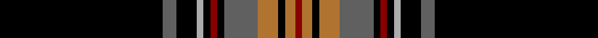

In pattern [KBKYKRKBRKRR](/stripes/kbkykrkbrkrr/).

This was sourced from register-of-tartans.  It is a [12 stripe tartan](/stripes/stripes12/).

Original link https://www.tartanregister.gov.uk/tartanDetails.aspx?ref=1396

## Also known as

This cloth is also recorded under:

- Glen Ross (WCWM

## Register references

External register numbers recorded for this tartan.

- Scottish Register of Tartans: [1396](https://www.tartanregister.gov.uk/tartanDetails.aspx?ref=1396)
- Scottish Tartans Authority (ITI): 5022

## Thread count
K/96 N8 K12 Na4 K4 DR4 K4 N20 LT12 K4 LT6 DR/4

## Palette
Each colour and the base-6 reference it is a variant of.

| Colour | Shade | Base |
|---|---|---|
| DR | <code style="background-color:#880000;">#880000</code> `oklch(39.4% 0.162 29.2)` <small>#880000</small> | R <code style="background-color:#CC0000;">#CC0000</code> |
| K | <code style="background-color:#000000;">#000000</code> `oklch(0.0% 0.000 0.0)` <small>#000000</small> | K <code style="background-color:#000000;">#000000</code> |
| LT | <code style="background-color:#B07430;">#B07430</code> `oklch(61.0% 0.112 66.0)` <small>#B07430</small> | R <code style="background-color:#CC0000;">#CC0000</code> |
| N | <code style="background-color:#606060;">#606060</code> `oklch(48.9% 0.000 89.9)` <small>#606060</small> | B <code style="background-color:#2A418A;">#2A418A</code> |
| Na | <code style="background-color:#ACACAC;">#ACACAC</code> `oklch(74.4% 0.000 89.9)` <small>#ACACAC</small> | Y <code style="background-color:#F2BF00;">#F2BF00</code> |

## Nearest tartans

The nearest existing variants by ΔTartan distance.

1. [Langtree](/setts/s12/k86y6k4w3k3r3k3y22o14k3o6w4/) — ΔT 0.82
1. [Stewart, Black ground](/setts/s12/k36db4k6ly1k1w1k1g8r4k1r2w1~x2/) — ΔT 1.10
1. [Braveheart - ( Warrior)](/setts/s12/k43b3k7dp3k2dp3k2g11r6k2r3w3~x2/) — ΔT 1.11
1. [Calgary HOG](/setts/s9/lb4lr6k4r2r10k44lr1k1lb2~x2/) — ΔT 1.38
1. [Grey Spencer Plaid](/setts/s11/k40y8o2y2w2y2k9w5y2w5k2~x2/) — ΔT 1.42
1. [Valdres, Kvam and Vang](/setts/s11/k4w1r4k2g2r3k2k20r2k2r2/) — ΔT 1.42
1. [Down Irish County Tartan Tartan Number: 2266. Earliest known date: 1995 One of a series of Irish District tartans designed by Polly Wittering of the House of Edgar, with colours reminiscent of the Country with soft warm colours dominating. See products available Copyright © Blair Urquhart, Comrie, 2015](/setts/s9/k65dy9r11k5t2lo2lo5k2lo13~x2/) — ΔT 1.43
1. [Clan An Caigeann (Corporate)](/setts/s12/k44ly3k4ly3k4db4w2db4r2w2dg4ly2~x2/) — ΔT 1.47
1. [Stewart Black](/setts/s13/k58db5w5k10ly3k3w3k3g14r11k3r4w3~x2/) — ΔT 1.49
1. [Hawks (2014)](/setts/s10/w2do3g5k50g4do3w2db3k2ly2~x2/) — ΔT 1.49

## Neighbour map

Every grey dot is one of 14299 variants placed by the first two principal components of the ΔTartan feature space (44% of its variance). Red is this tartan; blue dots are its nearest — click one to open its page.

<svg viewBox="0 0 640 380" role="img" style="max-width:100%;height:auto;border:1px solid #e0e0e0;border-radius:4px;display:block" xmlns="http://www.w3.org/2000/svg"><image href="/nn/cloud.v1.png" width="640" height="380"/><a href="/setts/s12/k86y6k4w3k3r3k3y22o14k3o6w4/"><circle cx="366.6" cy="77.0" r="4" fill="#3465a4"><title>Langtree</title></circle></a><a href="/setts/s12/k36db4k6ly1k1w1k1g8r4k1r2w1~x2/"><circle cx="396.2" cy="62.2" r="4" fill="#3465a4"><title>Stewart, Black ground</title></circle></a><a href="/setts/s12/k43b3k7dp3k2dp3k2g11r6k2r3w3~x2/"><circle cx="334.1" cy="85.4" r="4" fill="#3465a4"><title>Braveheart - ( Warrior)</title></circle></a><a href="/setts/s9/lb4lr6k4r2r10k44lr1k1lb2~x2/"><circle cx="398.5" cy="76.0" r="4" fill="#3465a4"><title>Calgary HOG</title></circle></a><a href="/setts/s11/k40y8o2y2w2y2k9w5y2w5k2~x2/"><circle cx="365.8" cy="115.5" r="4" fill="#3465a4"><title>Grey Spencer Plaid</title></circle></a><a href="/setts/s11/k4w1r4k2g2r3k2k20r2k2r2/"><circle cx="411.8" cy="133.2" r="4" fill="#3465a4"><title>Valdres, Kvam and Vang</title></circle></a><a href="/setts/s9/k65dy9r11k5t2lo2lo5k2lo13~x2/"><circle cx="349.2" cy="78.7" r="4" fill="#3465a4"><title>Down Irish County Tartan Tartan Number: 2266. Earliest known date: 1995 One of a series of Irish District tartans designed by Polly Wittering of the House of Edgar, with colours reminiscent of the Country with soft warm colours dominating. See products available Copyright © Blair Urquhart, Comrie, 2015</title></circle></a><a href="/setts/s12/k44ly3k4ly3k4db4w2db4r2w2dg4ly2~x2/"><circle cx="369.4" cy="74.0" r="4" fill="#3465a4"><title>Clan An Caigeann (Corporate)</title></circle></a><a href="/setts/s13/k58db5w5k10ly3k3w3k3g14r11k3r4w3~x2/"><circle cx="302.8" cy="78.1" r="4" fill="#3465a4"><title>Stewart Black</title></circle></a><a href="/setts/s10/w2do3g5k50g4do3w2db3k2ly2~x2/"><circle cx="406.2" cy="81.7" r="4" fill="#3465a4"><title>Hawks (2014)</title></circle></a><circle cx="401.2" cy="94.5" r="5" fill="#c00000"/></svg>

ID: /setts/s12/k48n4k6lr2k2r2k2n10o6k2o3r2~x2/
