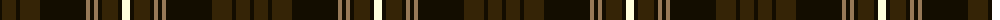

In pattern [KBKBKRKRKBKW](/patterns/kbkbkrkrkbkw/).

This was sourced from house-of-tartan.  It is a [12 stripes tartan](/stripes/stripes12/).

Original link http://www.house-of-tartan.scotland.net/house/TartanViewjs.asp?colr=Def&tnam=2401

## Thread count
Ka/4 K14 Ka4 K20 Ka46 LT4 Ka4 LT4 Ka4 K16 Ka4 LY/8

## Palette
Each colour and its ΔE from the base-6 reference it is a variant of.

| Colour | Shade | Base | ΔE (OKLab) |
|---|---|---|---|
| K | <code style="background-color:#352406;">#352406</code> `#352406` | B <code style="background-color:#2C4084;">#2C4084</code> | 0.21 |
| Ka | <code style="background-color:#130D00;">#130D00</code> `#130D00` | K <code style="background-color:#000000;">#000000</code> | 0.17 |
| LT | <code style="background-color:#977957;">#977957</code> `#977957` | R <code style="background-color:#C80000;">#C80000</code> | 0.19 |
| LY | <code style="background-color:#FFFFDA;">#FFFFDA</code> `#FFFFDA` | W <code style="background-color:#F4F4F0;">#F4F4F0</code> | 0.05 |

ID: /setts/s12/k4b14k4b20k46r4k4r4k4b16k4w8-b352406-k130d00-r977957-wffffda/
