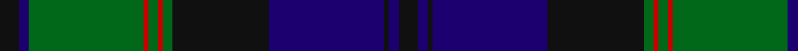

In pattern [KBGRGRGKBKBK](/patterns/kbgrgrgkbkbk/).

This was sourced from register-of-tartans.  It is a [12 stripes tartan](/stripes/stripes12/).

Original link https://www.tartanregister.gov.uk/tartanDetails.aspx?ref=1888

## Attestations

This cloth appears in 2 source records; the oldest owns this page.

- 01/01/1996 — Jedforest (register-of-tartans, [record](https://www.tartanregister.gov.uk/tartanDetails.aspx?ref=1888))
- pre 1996 — Jedforest (District) (tartans-authority, [record](http://www.tartansauthority.com/tartan-ferret/display/5301/))

## Thread count
K/8 DB4 G48 R2 G4 R2 G4 K40 DB48 K2 DB4 K/8

## Palette
Each colour and its ΔE from the base-6 reference it is a variant of.

| Colour | Shade | Base | ΔE (OKLab) |
|---|---|---|---|
| DB | <code style="background-color:#1C0070;">#1C0070</code> `#1C0070` | B <code style="background-color:#2A418A;">#2A418A</code> | 0.14 |
| G | <code style="background-color:#006818;">#006818</code> `#006818` | G <code style="background-color:#006100;">#006100</code> | 0.02 |
| K | <code style="background-color:#101010;">#101010</code> `#101010` | K <code style="background-color:#000000;">#000000</code> | 0.17 |
| R | <code style="background-color:#C80000;">#C80000</code> `#C80000` | R <code style="background-color:#CC0000;">#CC0000</code> | 0.01 |

## Nearest tartans

The nearest existing variants by ΔTartan distance.

1. [Hope-Vere/Weir #2](/setts/s14/g19k1g4k1g3k10b20y1k7y1b20k10y3g1~b2c4084-g005020-k101010-ye8c000~x2/) — ΔT 1.02
1. [Pitceathley Chamberlain (Personal)](/setts/s10/b2k3g5k9b21k2b5k2g20w1~b2c2c80-g006818-k101010-we0e0e0~x2/) — ΔT 1.03
1. [MacThomas](/setts/s9/b1b1r2b21k11g21r2g1g1~b000060-g004c00-k000000-rc80000~x2/) — ΔT 1.04
1. [Common Kilt Tartan Tartan Number: 554. Earliest known date: c. 1790 A version of the Blatck Watch tartan produced by Wilson's of Bannockburn before the widespread use of clan names for tartan. The military Black Watch tartan was also woven with a red stripe. See products available Copyright © Blair Urquhart, Comrie, 2015](/setts/s8/r3k2b25k28g25k2r1b2~b2c2c80-g006818-k101010-rc80000~x2/) — ΔT 1.05
1. [Riddoch Personal Tartan Tartan Number: 5856. Earliest known date: circa 1992 Designed by Tony Murray for an Albert (Bert) Riddoch of Bearsden, Glasgow as a private and personal tartan initially but it was then changed to usage by anyone of the name. Bert Riddoch (2002) is a private investgator involved in covert drugs investigations and 'highly thought of by the police'. Tartan based on Campbell of Breadalbane. See products available Copyright © Blair Urquhart, Comrie, 2015](/setts/s14/b18k2b2k2b2k15r2g28r2k15b2k2b2k2~b2c2c80-g006818-k101010-rc80000~x2/) — ΔT 1.06
1. [Scottish Tourist Board (1981) (Corp)](/setts/s11/b30k2b2k2b2k32g15r2g4r4g30~b2c2c80-g006818-k101010-rc80000~x2/) — ΔT 1.08
1. [Stewart/Stuart](/setts/s17/g34k2b2k2g34r3k34r2k34r3b33k2g2k2g2k2b33~b202060-g006818-k101010-rc80000/) — ΔT 1.09
1. [Black from Cumnock (Personal)](/setts/s13/b8k1b1k1b1k8y1g14y1k8b8k1b1~b2c4084-g005020-k101010-ye8c000~x2/) — ΔT 1.09
1. [Gordon Old Clan/Family Tartan Tartan Number: 215. Earliest known date: 1842 Also The Setts No: 65. W & A K Johnston. Sample in Paton's collection. According to the story, The Duke of Gordon passed on the unwanted samples of the selection from Wilson's, to members of the family. The three stripe version was adopted by the Gordons of Esslemont. This discounts the Sobieski Stuarts claim to a 16th century origin for this sett. See products available Copyright © Blair Urquhart, Comrie, 2015](/setts/s17/b28k1b1k1b3k12g24y1g1y2g1y1g24k12b18k1b4~b2c2c80-g006818-k101010-ye8c000~x2/) — ΔT 1.12
1. [Hebridean Old.. District Tartan Tartan Number: 249. Earliest known date: pre 2003 Alternative count on 1990 See products available Copyright © Blair Urquhart, Comrie, 2015](/setts/s9/b2k2b18ba1k13ba1g16b3k2~b2c2c80-ba2888c4-g006818-k101010~x2/) — ΔT 1.14

## Neighbour map

Every grey dot is one of 15726 variants placed by the first two principal components of the ΔTartan feature space (44% of its variance). Red is this tartan; blue dots are its nearest — click one to open its page.

<svg viewBox="0 0 640 380" role="img" style="max-width:100%;height:auto;border:1px solid #e0e0e0;border-radius:4px;display:block" xmlns="http://www.w3.org/2000/svg"><image href="/nn/cloud.v1.png" width="640" height="380"/><a href="/setts/s14/g19k1g4k1g3k10b20y1k7y1b20k10y3g1~b2c4084-g005020-k101010-ye8c000~x2/"><circle cx="251.5" cy="155.3" r="4" fill="#3465a4"><title>Hope-Vere/Weir #2</title></circle></a><a href="/setts/s10/b2k3g5k9b21k2b5k2g20w1~b2c2c80-g006818-k101010-we0e0e0~x2/"><circle cx="270.9" cy="167.8" r="4" fill="#3465a4"><title>Pitceathley Chamberlain (Personal)</title></circle></a><a href="/setts/s9/b1b1r2b21k11g21r2g1g1~b000060-g004c00-k000000-rc80000~x2/"><circle cx="255.3" cy="156.3" r="4" fill="#3465a4"><title>MacThomas</title></circle></a><a href="/setts/s8/r3k2b25k28g25k2r1b2~b2c2c80-g006818-k101010-rc80000~x2/"><circle cx="270.4" cy="162.8" r="4" fill="#3465a4"><title>Common Kilt Tartan Tartan Number: 554. Earliest known date: c. 1790 A version of the Blatck Watch tartan produced by Wilson's of Bannockburn before the widespread use of clan names for tartan. The military Black Watch tartan was also woven with a red stripe. See products available Copyright © Blair Urquhart, Comrie, 2015</title></circle></a><a href="/setts/s14/b18k2b2k2b2k15r2g28r2k15b2k2b2k2~b2c2c80-g006818-k101010-rc80000~x2/"><circle cx="254.7" cy="155.4" r="4" fill="#3465a4"><title>Riddoch Personal Tartan Tartan Number: 5856. Earliest known date: circa 1992 Designed by Tony Murray for an Albert (Bert) Riddoch of Bearsden, Glasgow as a private and personal tartan initially but it was then changed to usage by anyone of the name. Bert Riddoch (2002) is a private investgator involved in covert drugs investigations and 'highly thought of by the police'. Tartan based on Campbell of Breadalbane. See products available Copyright © Blair Urquhart, Comrie, 2015</title></circle></a><a href="/setts/s11/b30k2b2k2b2k32g15r2g4r4g30~b2c2c80-g006818-k101010-rc80000~x2/"><circle cx="250.9" cy="165.7" r="4" fill="#3465a4"><title>Scottish Tourist Board (1981) (Corp)</title></circle></a><a href="/setts/s17/g34k2b2k2g34r3k34r2k34r3b33k2g2k2g2k2b33~b202060-g006818-k101010-rc80000/"><circle cx="244.7" cy="148.1" r="4" fill="#3465a4"><title>Stewart/Stuart</title></circle></a><a href="/setts/s13/b8k1b1k1b1k8y1g14y1k8b8k1b1~b2c4084-g005020-k101010-ye8c000~x2/"><circle cx="235.5" cy="171.9" r="4" fill="#3465a4"><title>Black from Cumnock (Personal)</title></circle></a><a href="/setts/s17/b28k1b1k1b3k12g24y1g1y2g1y1g24k12b18k1b4~b2c2c80-g006818-k101010-ye8c000~x2/"><circle cx="274.7" cy="120.7" r="4" fill="#3465a4"><title>Gordon Old Clan/Family Tartan Tartan Number: 215. Earliest known date: 1842 Also The Setts No: 65. W &amp; A K Johnston. Sample in Paton's collection. According to the story, The Duke of Gordon passed on the unwanted samples of the selection from Wilson's, to members of the family. The three stripe version was adopted by the Gordons of Esslemont. This discounts the Sobieski Stuarts claim to a 16th century origin for this sett. See products available Copyright © Blair Urquhart, Comrie, 2015</title></circle></a><a href="/setts/s9/b2k2b18ba1k13ba1g16b3k2~b2c2c80-ba2888c4-g006818-k101010~x2/"><circle cx="268.8" cy="179.1" r="4" fill="#3465a4"><title>Hebridean Old.. District Tartan Tartan Number: 249. Earliest known date: pre 2003 Alternative count on 1990 See products available Copyright © Blair Urquhart, Comrie, 2015</title></circle></a><circle cx="258.3" cy="141.4" r="5" fill="#c00000"/></svg>

ID: /setts/s12/k4b2g24r1g2r1g2k20b24k1b2k4~b1c0070-g006818-k101010-rc80000~x2/
