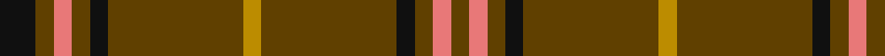

In pattern [GRGKGYGKGRGK](/stripes/grgkgygkgrgk/).

This was sourced from register-of-tartans.  It is a [12 stripe tartan](/stripes/stripes12/).

Original link https://www.tartanregister.gov.uk/tartanDetails.aspx?ref=4598

## Also known as

This cloth is also recorded under:

- Welsh National #2

## Register references

External register numbers recorded for this tartan.

- Scottish Register of Tartans: [4598](https://www.tartanregister.gov.uk/tartanDetails.aspx?ref=4598)
- Scottish Tartans Authority (ITI): 2167
- Scottish Tartans World Register: 2167

## Thread count
K/16 T8 LR8 T8 K8 T60 DY8 T60 K8 T8 LR8 T/8

## Palette
Each colour and the base-6 reference it is a variant of.

| Colour | Shade | Base |
|---|---|---|
| DY | <code style="background-color:#BC8C00;">#BC8C00</code> `oklch(66.8% 0.137 84.1)` <small>#BC8C00</small> | Y <code style="background-color:#F2BF00;">#F2BF00</code> |
| K | <code style="background-color:#101010;">#101010</code> `oklch(17.3% 0.000 89.9)` <small>#101010</small> | K <code style="background-color:#000000;">#000000</code> |
| LR | <code style="background-color:#E87878;">#E87878</code> `oklch(70.0% 0.139 21.2)` <small>#E87878</small> | R <code style="background-color:#CC0000;">#CC0000</code> |
| LT | <code style="background-color:#A08858;">#A08858</code> `oklch(63.7% 0.071 84.0)` <small>#A08858</small> | Y <code style="background-color:#F2BF00;">#F2BF00</code> |
| R | <code style="background-color:#C80000;">#C80000</code> `oklch(52.3% 0.215 29.2)` <small>#C80000</small> | R <code style="background-color:#CC0000;">#CC0000</code> |
| T | <code style="background-color:#604000;">#604000</code> `oklch(39.8% 0.083 76.8)` <small>#604000</small> | G <code style="background-color:#006100;">#006100</code> |
| Y | <code style="background-color:#E8C000;">#E8C000</code> `oklch(81.9% 0.168 93.7)` <small>#E8C000</small> | Y <code style="background-color:#F2BF00;">#F2BF00</code> |

## Nearest tartans

The nearest existing variants by ΔTartan distance, with this tartan at the top so the swatches line up against it.

ΔTartan

Tartan

Sett

—

<a href="/ttd/edit/#slug=k4dy2r2dy2k2dy15lo2~x4">Welsh National #2</a> <a class="nn-out" href="/setts/s12/k4dy2r2dy2k2dy15lo2~x4/" title="open its dictionary page">↗</a>

1.53

<a href="/ttd/edit/#slug=k4dy2r2dy2k2dy15lo2~x4">Welsh National (Fashion)</a> <a class="nn-out" href="/setts/s7/k4dy2r2dy2k2dy15lo2~x4/" title="open its dictionary page">↗</a>

1.64

<a href="/ttd/edit/#slug=r12g2r1g1r1g1r6g12r1k1r12k1r1k1r3~x4">MacDonell of Keppoch #3</a> <a class="nn-out" href="/setts/s15/r12g2r1g1r1g1r6g12r1k1r12k1r1k1r3~x4/" title="open its dictionary page">↗</a>

1.70

<a href="/setts/s10/r8g2r2k1r1g2~x10/">Waverley Care Aids Trust</a>

1.85

<a href="/ttd/edit/#slug=r3dy16dy10r3dy3lb2dy3r3~x2">Scott Htg (Error 2)</a> <a class="nn-out" href="/setts/s8/r3dy16dy10r3dy3lb2dy3r3~x2/" title="open its dictionary page">↗</a>

1.88

<a href="/setts/s14/g34m4g4m4g4m12g20w5~x2/">Leeds, University of (Dance) #1</a>

1.90

<a href="/ttd/edit/#slug=r3g12r1g2r2g2r1g12r3k1~x4">Connell (Dalgliesh) (Personal)</a> <a class="nn-out" href="/setts/s10/r3g12r1g2r2g2r1g12r3k1~x4/" title="open its dictionary page">↗</a>

1.94

<a href="/ttd/edit/#slug=r2dg2lr2dg8r2dg2r2dg6r1dg1r1dg1r1lr1~x2">Unidentified #51</a> <a class="nn-out" href="/setts/s14/r2dg2lr2dg8r2dg2r2dg6r1dg1r1dg1r1lr1~x2/" title="open its dictionary page">↗</a>

1.98

<a href="/ttd/edit/#slug=y21r3y21db5y3r30y3db5y21r3y21db2~x2">Scottish Piping Society of London</a> <a class="nn-out" href="/setts/s12/y21r3y21db5y3r30y3db5y21r3y21db2~x2/" title="open its dictionary page">↗</a>

2.03

<a href="/ttd/edit/#slug=o24dr2o3o6o3dr2dg15o20dr4~x2">Land's End (Unnamed Camel)</a> <a class="nn-out" href="/setts/s9/o24dr2o3o6o3dr2dg15o20dr4~x2/" title="open its dictionary page">↗</a>

2.05

<a href="/setts/s10/dy9t3dy6t3dy20ly2~x2/">Oman, Sultanate of / Oliver dress</a>

## Neighbour map

Every grey dot is one of 14299 variants placed by the first two principal components of the ΔTartan feature space (44% of its variance). Red is this tartan; blue dots are its nearest — click one to open its page.

<svg viewBox="0 0 640 380" role="img" style="max-width:100%;height:auto;border:1px solid #e0e0e0;border-radius:4px;display:block" xmlns="http://www.w3.org/2000/svg"><image href="/nn/cloud.v1.png" width="640" height="380"/><a href="/setts/s7/k4dy2r2dy2k2dy15lo2~x4/"><circle cx="397.9" cy="214.2" r="4" fill="#3465a4"><title>Welsh National (Fashion)</title></circle></a><a href="/setts/s15/r12g2r1g1r1g1r6g12r1k1r12k1r1k1r3~x4/"><circle cx="466.1" cy="183.9" r="4" fill="#3465a4"><title>MacDonell of Keppoch #3</title></circle></a><a href="/setts/s10/r8g2r2k1r1g2~x10/"><circle cx="416.5" cy="229.5" r="4" fill="#3465a4"><title>Waverley Care Aids Trust</title></circle></a><a href="/setts/s8/r3dy16dy10r3dy3lb2dy3r3~x2/"><circle cx="511.7" cy="252.2" r="4" fill="#3465a4"><title>Scott Htg (Error 2)</title></circle></a><a href="/setts/s14/g34m4g4m4g4m12g20w5~x2/"><circle cx="397.3" cy="204.6" r="4" fill="#3465a4"><title>Leeds, University of (Dance) #1</title></circle></a><a href="/setts/s10/r3g12r1g2r2g2r1g12r3k1~x4/"><circle cx="475.1" cy="206.4" r="4" fill="#3465a4"><title>Connell (Dalgliesh) (Personal)</title></circle></a><a href="/setts/s14/r2dg2lr2dg8r2dg2r2dg6r1dg1r1dg1r1lr1~x2/"><circle cx="369.3" cy="215.2" r="4" fill="#3465a4"><title>Unidentified #51</title></circle></a><a href="/setts/s12/y21r3y21db5y3r30y3db5y21r3y21db2~x2/"><circle cx="443.9" cy="207.8" r="4" fill="#3465a4"><title>Scottish Piping Society of London</title></circle></a><a href="/setts/s9/o24dr2o3o6o3dr2dg15o20dr4~x2/"><circle cx="410.3" cy="212.4" r="4" fill="#3465a4"><title>Land's End (Unnamed Camel)</title></circle></a><a href="/setts/s10/dy9t3dy6t3dy20ly2~x2/"><circle cx="561.4" cy="240.3" r="4" fill="#3465a4"><title>Oman, Sultanate of / Oliver dress</title></circle></a><circle cx="456.0" cy="197.7" r="5" fill="#c00000"/></svg>

ID: /setts/s12/k4dy2r2dy2k2dy15lo2~x4/
