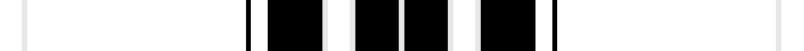

This page is one **sett** — a single exact thread-count. It belongs to the [tartan](/tartans/k4w1k36k4ki1k3ki10w1k4w1ki8w1/)
(the same proportion at any scale), whose colour order is pattern [KWKKKKKWKWKW](/stripes/kwkkkkkwkwkw/).

Sourced from house-of-tartan.  It is a [12 stripe tartan](/stripes/stripes12/).

Original link http://www.house-of-tartan.scotland.net/house/TartanViewjs.asp?colr=Def&tnam=10999

## Thread count
R/8 LN2 SCR72 RB8 K2 RB6 K20 LN2 RB8 LN2 K16 LN/2

## Palette

Palette: <strong>Ingles Buchan</strong> <small style="color:#888">(1 of 2 colours)</small>
<table><thead><tr><th>Colour</th><th>Threads</th><th>Shade</th><th>Base</th><th>OKLCh</th></tr></thead><tbody><tr><td>/</td><td style="text-align:right;font-variant-numeric:tabular-nums">8</td><td><code style="background-color:;"></code> <small style="color:#888"></small></td><td> <code style="background-color:;"></code></td><td><small style="color:#888"></small></td></tr><tr><td>LN</td><td style="text-align:right;font-variant-numeric:tabular-nums">2</td><td><code style="background-color:#E8E8E8;">#E8E8E8</code> <small style="color:#888">#E8E8E8</small></td><td>W <code style="background-color:#F7F7F7;">#F7F7F7</code></td><td><small style="color:#888">oklch(93.1% 0.000 89.9)</small></td></tr><tr><td></td><td style="text-align:right;font-variant-numeric:tabular-nums">72</td><td><code style="background-color:;"></code> <small style="color:#888"></small></td><td> <code style="background-color:;"></code></td><td><small style="color:#888"></small></td></tr><tr><td></td><td style="text-align:right;font-variant-numeric:tabular-nums">8</td><td><code style="background-color:;"></code> <small style="color:#888"></small></td><td> <code style="background-color:;"></code></td><td><small style="color:#888"></small></td></tr><tr><td>K</td><td style="text-align:right;font-variant-numeric:tabular-nums">2</td><td><code style="background-color:#000000;">#000000</code> <small style="color:#888">#000000</small></td><td>K <code style="background-color:#000000;">#000000</code></td><td><small style="color:#888">oklch(0.0% 0.000 0.0)</small></td></tr><tr><td></td><td style="text-align:right;font-variant-numeric:tabular-nums">6</td><td><code style="background-color:;"></code> <small style="color:#888"></small></td><td> <code style="background-color:;"></code></td><td><small style="color:#888"></small></td></tr><tr><td>K</td><td style="text-align:right;font-variant-numeric:tabular-nums">20</td><td><code style="background-color:#000000;">#000000</code> <small style="color:#888">#000000</small></td><td>K <code style="background-color:#000000;">#000000</code></td><td><small style="color:#888">oklch(0.0% 0.000 0.0)</small></td></tr><tr><td>LN</td><td style="text-align:right;font-variant-numeric:tabular-nums">2</td><td><code style="background-color:#E8E8E8;">#E8E8E8</code> <small style="color:#888">#E8E8E8</small></td><td>W <code style="background-color:#F7F7F7;">#F7F7F7</code></td><td><small style="color:#888">oklch(93.1% 0.000 89.9)</small></td></tr><tr><td></td><td style="text-align:right;font-variant-numeric:tabular-nums">8</td><td><code style="background-color:;"></code> <small style="color:#888"></small></td><td> <code style="background-color:;"></code></td><td><small style="color:#888"></small></td></tr><tr><td>LN</td><td style="text-align:right;font-variant-numeric:tabular-nums">2</td><td><code style="background-color:#E8E8E8;">#E8E8E8</code> <small style="color:#888">#E8E8E8</small></td><td>W <code style="background-color:#F7F7F7;">#F7F7F7</code></td><td><small style="color:#888">oklch(93.1% 0.000 89.9)</small></td></tr><tr><td>K</td><td style="text-align:right;font-variant-numeric:tabular-nums">16</td><td><code style="background-color:#000000;">#000000</code> <small style="color:#888">#000000</small></td><td>K <code style="background-color:#000000;">#000000</code></td><td><small style="color:#888">oklch(0.0% 0.000 0.0)</small></td></tr><tr><td>LN/</td><td style="text-align:right;font-variant-numeric:tabular-nums">2</td><td><code style="background-color:#E8E8E8;">#E8E8E8</code> <small style="color:#888">#E8E8E8</small></td><td>W <code style="background-color:#F7F7F7;">#F7F7F7</code></td><td><small style="color:#888">oklch(93.1% 0.000 89.9)</small></td></tr></tbody></table>

## Nearest tartans

The nearest existing variants by ΔTartan distance, with this tartan at the top so the swatches line up against it.

ΔTartan

Tartan

Sett

—

<a href="/ttd/edit/#slug=k4w1k36k4ki1k3ki10w1k4w1ki8w1~x2">YMCA Corporate Tartan Tartan Number: 10999. Earliest known date: October 2013 This 21st century tartan is a variation of the ancient &quot;Breacan nan Cleirach&quot; - the tartan of the Clergy - which was worn in the Scottish Highlands by men of the church as early as the 1750s. The YMCA tartan incorporates the colours of the world organisation and at its core is the 1844 founding date of the YMCA represented with 18 threads of black and white and 44 threads of blue. Combined with that 1844 beginning, the blue of the oceans links over 45 million members around the globe and celebrates the values, strengths and aspirations of the world's largest clan - the YMCA. See products available Copyright © Blair Urquhart, Comrie, 2015</a> <a class="nn-out" href="/setts/s12/k4w1k36k4ki1k3ki10w1k4w1ki8w1~x2/" title="open its dictionary page">↗</a>

3.38

<a href="/setts/s11/ki38k4ki2dp6dpi11dp3dpi2dg2ki11k1w2~x2/">Highland Thistle</a>

3.40

<a href="/ttd/edit/#slug=dt4dp2dt22k2dt1db2dt1k2db24w2~x2">Spirit of Wales (Fashion)</a> <a class="nn-out" href="/setts/s10/dt4dp2dt22k2dt1db2dt1k2db24w2~x2/" title="open its dictionary page">↗</a>

3.51

<a href="/ttd/edit/#slug=k80ri1dt25w1dt3r2dt3w1dt25lt1~x2">Pompili, Antonio and Alessandro (Personal)</a> <a class="nn-out" href="/setts/s10/k80ri1dt25w1dt3r2dt3w1dt25lt1~x2/" title="open its dictionary page">↗</a>

3.53

<a href="/setts/s8/k9dg5w1dg15ki2dg1ki44r1~x2/">Ata?, H.M. &amp; I.C. (Personal)</a>

3.65

<a href="/ttd/edit/#slug=db6k2dp9lb1dp9k2dt4k6dt24w1db6~x2">Newlands, Charlie (Personal)</a> <a class="nn-out" href="/setts/s11/db6k2dp9lb1dp9k2dt4k6dt24w1db6~x2/" title="open its dictionary page">↗</a>

3.70

<a href="/ttd/edit/#slug=k43dg8k8dt21dg10w2~x2">Longmuir (2014)</a> <a class="nn-out" href="/setts/s6/k43dg8k8dt21dg10w2~x2/" title="open its dictionary page">↗</a>

3.71

<a href="/ttd/edit/#slug=do19lo3w1k18dg30r2~x2">Cornish Countryside</a> <a class="nn-out" href="/setts/s6/do19lo3w1k18dg30r2~x2/" title="open its dictionary page">↗</a>

3.71

<a href="/ttd/edit/#slug=k4y1dp5y1k20db37y4db4~x2">Finnie (Personal)</a> <a class="nn-out" href="/setts/s8/k4y1dp5y1k20db37y4db4~x2/" title="open its dictionary page">↗</a>

3.78

<a href="/ttd/edit/#slug=dt5lb2dt12k21dg12k4dg4k4r4k4dg4k4dg12k21dt12lb2dt4~x2">Psychological Operations Regiment</a> <a class="nn-out" href="/setts/s17/dt5lb2dt12k21dg12k4dg4k4r4k4dg4k4dg12k21dt12lb2dt4~x2/" title="open its dictionary page">↗</a>

3.80

<a href="/ttd/edit/#slug=db6k2dp14k5dp14k3dt4k6dt24w2dp6~x2">Dunn #2</a> <a class="nn-out" href="/setts/s11/db6k2dp14k5dp14k3dt4k6dt24w2dp6~x2/" title="open its dictionary page">↗</a>

## Neighbour map

Every grey dot is one of 14359 variants placed by the first two principal components of the ΔTartan feature space (44% of its variance). Red is this tartan; blue dots are its nearest — click one to open its page.

<svg viewBox="0 0 640 380" role="img" style="max-width:100%;height:auto;border:1px solid #e0e0e0;border-radius:4px;display:block" xmlns="http://www.w3.org/2000/svg"><image href="/nn/cloud.v1.png" width="640" height="380"/><a href="/setts/s11/ki38k4ki2dp6dpi11dp3dpi2dg2ki11k1w2~x2/"><circle cx="460.9" cy="145.2" r="4" fill="#3465a4"><title>Highland Thistle</title></circle></a><a href="/setts/s10/dt4dp2dt22k2dt1db2dt1k2db24w2~x2/"><circle cx="398.3" cy="182.8" r="4" fill="#3465a4"><title>Spirit of Wales (Fashion)</title></circle></a><a href="/setts/s10/k80ri1dt25w1dt3r2dt3w1dt25lt1~x2/"><circle cx="468.9" cy="117.6" r="4" fill="#3465a4"><title>Pompili, Antonio and Alessandro (Personal)</title></circle></a><a href="/setts/s8/k9dg5w1dg15ki2dg1ki44r1~x2/"><circle cx="488.7" cy="169.7" r="4" fill="#3465a4"><title>Ata?, H.M. &amp; I.C. (Personal)</title></circle></a><a href="/setts/s11/db6k2dp9lb1dp9k2dt4k6dt24w1db6~x2/"><circle cx="309.1" cy="184.4" r="4" fill="#3465a4"><title>Newlands, Charlie (Personal)</title></circle></a><a href="/setts/s6/k43dg8k8dt21dg10w2~x2/"><circle cx="422.8" cy="252.3" r="4" fill="#3465a4"><title>Longmuir (2014)</title></circle></a><a href="/setts/s6/do19lo3w1k18dg30r2~x2/"><circle cx="306.7" cy="192.4" r="4" fill="#3465a4"><title>Cornish Countryside</title></circle></a><a href="/setts/s8/k4y1dp5y1k20db37y4db4~x2/"><circle cx="466.7" cy="197.6" r="4" fill="#3465a4"><title>Finnie (Personal)</title></circle></a><a href="/setts/s17/dt5lb2dt12k21dg12k4dg4k4r4k4dg4k4dg12k21dt12lb2dt4~x2/"><circle cx="302.5" cy="234.9" r="4" fill="#3465a4"><title>Psychological Operations Regiment</title></circle></a><a href="/setts/s11/db6k2dp14k5dp14k3dt4k6dt24w2dp6~x2/"><circle cx="290.9" cy="232.1" r="4" fill="#3465a4"><title>Dunn #2</title></circle></a><circle cx="377.8" cy="150.5" r="5" fill="#c00000"/></svg>

ID: /setts/s12/k4w1k36k4ki1k3ki10w1k4w1ki8w1~x2/
