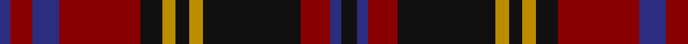

In pattern [BRBRKYKYKRBK](/patterns/brbrkykykrbk/).

This was sourced from tartans-authority.  It is a [12 stripes tartan](/stripes/stripes12/).

Original link http://www.tartansauthority.com/tartan-ferret/display/6100/

## Thread count
DB/4 DR8 DB10 DR30 K8 DY5 K5 DY5 K36 DR11 DB4 K/6

## Palette
Each colour and its ΔE from the base-6 reference it is a variant of.

| Colour | Shade | Base | ΔE (OKLab) |
|---|---|---|---|
| DB | <code style="background-color:#2C2C80;">#2C2C80</code> `#2C2C80` | B <code style="background-color:#2A418A;">#2A418A</code> | 0.06 |
| DR | <code style="background-color:#880000;">#880000</code> `#880000` | R <code style="background-color:#CC0000;">#CC0000</code> | 0.15 |
| DY | <code style="background-color:#BC8C00;">#BC8C00</code> `#BC8C00` | Y <code style="background-color:#F2BF00;">#F2BF00</code> | 0.16 |
| K | <code style="background-color:#101010;">#101010</code> `#101010` | K <code style="background-color:#000000;">#000000</code> | 0.17 |

## Nearest tartans

The nearest existing variants by ΔTartan distance.

1. [MacLachlan](/setts/s13/r16k2r2k2r2k16b16g3b16k16r16k2r2~b202060-g006818-k101010-rc80000~x2/) — ΔT 0.96
1. [Etihad Airways](/setts/s13/r6k28r4k4r12b32k4b3k4b3k4b14y4~b3c1026-k101010-r98481c-yfccc00/) — ΔT 0.98
1. [Montrose (Macnaughton variation)](/setts/s9/b1k1r12g12k6b5r12k1b1~b1c0070-g006818-k101010-r880000~x4/) — ΔT 1.07
1. [Grady Highlands Family Tartan Tartan Number: 1141. Earliest known date: 1987 For the Grady family of North Carolina. See products available Copyright © Blair Urquhart, Comrie, 2015](/setts/s9/k36r3b3r3k8b23r18g3r3~b2c2c80-g006818-k101010-rc80000~x2/) — ΔT 1.07
1. [Grady (Personal)](/setts/s9/k36r3b3r3k8b24r18g3r3~b2c2c80-g006818-k101010-rc80000~x2/) — ΔT 1.08
1. [MacLachlan Clan Tartan Tartan Number: 732. Earliest known date: 1850 T. Smibert produced a book entitled, 'The Clans of the Highlands of Scotland' in 1850 which is widely regarded as an accurate source for the tartans illustrated within it. Smibert had access to the patterns of Wilson's of Bannockburn who had been weavers 'since the '45', and to the works of Logan and the Sobieski brothers. Of the three distinct versions of MacLachlan tartan, Smiberts rendering is the one woven today, and it would appear to have a longer history than might be gathered from the date of its first publication. See products available Copyright © Blair Urquhart, Comrie, 2015](/setts/s13/r16k2r2k2r2k16b16g3b16k16r16k2r2~b2c2c80-g006818-k101010-rc80000~x2/) — ΔT 1.11
1. [Matheson N](/setts/s13/r2g2r12b10ba3g10r2g2r2g10r12g2r2~b000052-ba4367ae-g11450d-raa0000~x2/) — ΔT 1.14
1. [Matheson N](/setts/s13/r2g2r12b10ba3g10r2g2r2g10r12g2r2~b000052-ba4367ae-g11450d-raa0000/) — ΔT 1.14
1. [Clare Irish County Tartan Tartan Number: 2248. Earliest known date: 1995 One of a series of Irish District tartans designed by Polly Wittering of the House of Edgar, with colours reminiscent of the Country with soft warm colours dominating. See products available Copyright © Blair Urquhart, Comrie, 2015](/setts/s11/r3b14g14b2r14b2r14b2g14b2y3~b101448-g3c6838-r8c0020-yd09000~x2/) — ΔT 1.17
1. [Balmoral Hotel (Corporate)](/setts/s13/r15b2r2b2r2ba12k12ba3k12ba12r12b2r2~b2c2c80-ba003c64-k101010-rc04c08~x2/) — ΔT 1.18

## Neighbour map

Every grey dot is one of 15726 variants placed by the first two principal components of the ΔTartan feature space (44% of its variance). Red is this tartan; blue dots are its nearest — click one to open its page.

<svg viewBox="0 0 640 380" role="img" style="max-width:100%;height:auto;border:1px solid #e0e0e0;border-radius:4px;display:block" xmlns="http://www.w3.org/2000/svg"><image href="/nn/cloud.v1.png" width="640" height="380"/><a href="/setts/s13/r16k2r2k2r2k16b16g3b16k16r16k2r2~b202060-g006818-k101010-rc80000~x2/"><circle cx="185.4" cy="187.3" r="4" fill="#3465a4"><title>MacLachlan</title></circle></a><a href="/setts/s13/r6k28r4k4r12b32k4b3k4b3k4b14y4~b3c1026-k101010-r98481c-yfccc00/"><circle cx="276.9" cy="181.4" r="4" fill="#3465a4"><title>Etihad Airways</title></circle></a><a href="/setts/s9/b1k1r12g12k6b5r12k1b1~b1c0070-g006818-k101010-r880000~x4/"><circle cx="271.3" cy="195.3" r="4" fill="#3465a4"><title>Montrose (Macnaughton variation)</title></circle></a><a href="/setts/s9/k36r3b3r3k8b23r18g3r3~b2c2c80-g006818-k101010-rc80000~x2/"><circle cx="259.2" cy="176.5" r="4" fill="#3465a4"><title>Grady Highlands Family Tartan Tartan Number: 1141. Earliest known date: 1987 For the Grady family of North Carolina. See products available Copyright © Blair Urquhart, Comrie, 2015</title></circle></a><a href="/setts/s9/k36r3b3r3k8b24r18g3r3~b2c2c80-g006818-k101010-rc80000~x2/"><circle cx="257.6" cy="176.5" r="4" fill="#3465a4"><title>Grady (Personal)</title></circle></a><a href="/setts/s13/r16k2r2k2r2k16b16g3b16k16r16k2r2~b2c2c80-g006818-k101010-rc80000~x2/"><circle cx="181.7" cy="185.0" r="4" fill="#3465a4"><title>MacLachlan Clan Tartan Tartan Number: 732. Earliest known date: 1850 T. Smibert produced a book entitled, 'The Clans of the Highlands of Scotland' in 1850 which is widely regarded as an accurate source for the tartans illustrated within it. Smibert had access to the patterns of Wilson's of Bannockburn who had been weavers 'since the '45', and to the works of Logan and the Sobieski brothers. Of the three distinct versions of MacLachlan tartan, Smiberts rendering is the one woven today, and it would appear to have a longer history than might be gathered from the date of its first publication. See products available Copyright © Blair Urquhart, Comrie, 2015</title></circle></a><a href="/setts/s13/r2g2r12b10ba3g10r2g2r2g10r12g2r2~b000052-ba4367ae-g11450d-raa0000~x2/"><circle cx="233.8" cy="206.3" r="4" fill="#3465a4"><title>Matheson N</title></circle></a><a href="/setts/s13/r2g2r12b10ba3g10r2g2r2g10r12g2r2~b000052-ba4367ae-g11450d-raa0000/"><circle cx="233.8" cy="206.3" r="4" fill="#3465a4"><title>Matheson N</title></circle></a><a href="/setts/s11/r3b14g14b2r14b2r14b2g14b2y3~b101448-g3c6838-r8c0020-yd09000~x2/"><circle cx="205.1" cy="212.0" r="4" fill="#3465a4"><title>Clare Irish County Tartan Tartan Number: 2248. Earliest known date: 1995 One of a series of Irish District tartans designed by Polly Wittering of the House of Edgar, with colours reminiscent of the Country with soft warm colours dominating. See products available Copyright © Blair Urquhart, Comrie, 2015</title></circle></a><a href="/setts/s13/r15b2r2b2r2ba12k12ba3k12ba12r12b2r2~b2c2c80-ba003c64-k101010-rc04c08~x2/"><circle cx="175.3" cy="195.1" r="4" fill="#3465a4"><title>Balmoral Hotel (Corporate)</title></circle></a><circle cx="243.9" cy="185.5" r="5" fill="#c00000"/></svg>

ID: /setts/s12/k6b4r11k36y5k5y5k8r30b10r8b4~b2c2c80-k101010-r880000-ybc8c00/
