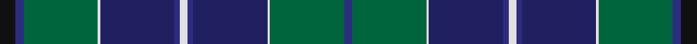

In pattern [BGWBBWBBWGBK](/stripes/bgwbbwbbwgbk/).

This was sourced from register-of-tartans.  It is a [12 stripe tartan](/stripes/stripes12/).

Original link https://www.tartanregister.gov.uk/tartanDetails.aspx?ref=4585

## Register references

External register numbers recorded for this tartan.

- Scottish Register of Tartans: [4585](https://www.tartanregister.gov.uk/tartanDetails.aspx?ref=4585)
- Scottish Tartans Authority (ITI): 2617
- Scottish Tartans World Register: 2617

## Thread count
K/12 DBa6 G56 LN2 DB56 DBa4 LN6 DBa4 DB56 LN2 G56 DBa/6

## Palette
Each colour and the base-6 reference it is a variant of.

| Colour | Shade | Base |
|---|---|---|
| DB | <code style="background-color:#202060;">#202060</code> `oklch(28.9% 0.111 276.9)` <small>#202060</small> | B <code style="background-color:#2A418A;">#2A418A</code> |
| DBa | <code style="background-color:#2C2C80;">#2C2C80</code> `oklch(35.0% 0.138 276.6)` <small>#2C2C80</small> | B <code style="background-color:#2A418A;">#2A418A</code> |
| G | <code style="background-color:#00643C;">#00643C</code> `oklch(44.3% 0.104 157.7)` <small>#00643C</small> | G <code style="background-color:#006100;">#006100</code> |
| K | <code style="background-color:#101010;">#101010</code> `oklch(17.3% 0.000 89.9)` <small>#101010</small> | K <code style="background-color:#000000;">#000000</code> |
| LN | <code style="background-color:#E0E0E0;">#E0E0E0</code> `oklch(90.7% 0.000 89.9)` <small>#E0E0E0</small> | W <code style="background-color:#F7F7F7;">#F7F7F7</code> |

## Nearest tartans

The nearest existing variants by ΔTartan distance.

1. [Coopers & Lybrand](/setts/s11/t4g4r1db24t4k2g24r1db10t4db2~x2/) — ΔT 0.66
1. [Spirit of Morningside (Fashion)](/setts/s10/dp4db5dp3db50k15g3k5g32w2g3/) — ΔT 0.84
1. [Hope-Vere/Weir (Modern)](/setts/s16/g19k1dg3k1g3k9db20k1ly1k7ly1k1db21k12g2dg1~x2/) — ΔT 0.99
1. [Royal Highland Yacht Club (Corporate](/setts/s11/db26db3db1m2db1db3db3db12g14db2w2~x2/) — ΔT 1.07
1. [Spirit of Morningside](/setts/s19/dp4db5dp3db50k15g3k5g32w2g3w2g32k5g5k15db50dp3k5dp3/) — ΔT 1.19
1. [Lowry](/setts/s7/dp6ly2dp1g25db16k2db4~x2/) — ΔT 1.19
1. [Coopers & Lybrand Corporate Commem. Tartan Tartan Number: 2303. Earliest known date: 1996 Designed by Deirdre Nicholls of Celtic Silks. May 1996. Swatch in STA's Johnston Collection. Dark green, red and blue called for but lighter shades used here to display sett. See products available Copyright © Blair Urquhart, Comrie, 2015](/setts/s20/g4r1db24t4k2g24r1db10t4db2t4db10r1g24k2t4db24r1g4t4~x2/) — ΔT 1.20
1. [State Seal of Connecticut (Fashion)](/setts/s10/dp4g6dt4g28lb4g6dt6db46dt1lb4~x2/) — ΔT 1.21
1. [Urquhart - 1842 (Clan)](/setts/s12/db4w2db24k3db3k3db8k24g48k3g3r2~x2/) — ΔT 1.21
1. [King (Personal)](/setts/s11/r3y2k1y2n26k12n4y15k1n1ly3~x2/) — ΔT 1.22

## Neighbour map

Every grey dot is one of 14299 variants placed by the first two principal components of the ΔTartan feature space (44% of its variance). Red is this tartan; blue dots are its nearest — click one to open its page.

<svg viewBox="0 0 640 380" role="img" style="max-width:100%;height:auto;border:1px solid #e0e0e0;border-radius:4px;display:block" xmlns="http://www.w3.org/2000/svg"><image href="/nn/cloud.v1.png" width="640" height="380"/><a href="/setts/s11/t4g4r1db24t4k2g24r1db10t4db2~x2/"><circle cx="291.4" cy="143.0" r="4" fill="#3465a4"><title>Coopers &amp; Lybrand</title></circle></a><a href="/setts/s10/dp4db5dp3db50k15g3k5g32w2g3/"><circle cx="293.4" cy="135.4" r="4" fill="#3465a4"><title>Spirit of Morningside (Fashion)</title></circle></a><a href="/setts/s16/g19k1dg3k1g3k9db20k1ly1k7ly1k1db21k12g2dg1~x2/"><circle cx="255.5" cy="136.6" r="4" fill="#3465a4"><title>Hope-Vere/Weir (Modern)</title></circle></a><a href="/setts/s11/db26db3db1m2db1db3db3db12g14db2w2~x2/"><circle cx="315.7" cy="142.0" r="4" fill="#3465a4"><title>Royal Highland Yacht Club (Corporate</title></circle></a><a href="/setts/s19/dp4db5dp3db50k15g3k5g32w2g3w2g32k5g5k15db50dp3k5dp3/"><circle cx="268.9" cy="110.2" r="4" fill="#3465a4"><title>Spirit of Morningside</title></circle></a><a href="/setts/s7/dp6ly2dp1g25db16k2db4~x2/"><circle cx="304.0" cy="169.6" r="4" fill="#3465a4"><title>Lowry</title></circle></a><a href="/setts/s20/g4r1db24t4k2g24r1db10t4db2t4db10r1g24k2t4db24r1g4t4~x2/"><circle cx="282.8" cy="120.4" r="4" fill="#3465a4"><title>Coopers &amp; Lybrand Corporate Commem. Tartan Tartan Number: 2303. Earliest known date: 1996 Designed by Deirdre Nicholls of Celtic Silks. May 1996. Swatch in STA's Johnston Collection. Dark green, red and blue called for but lighter shades used here to display sett. See products available Copyright © Blair Urquhart, Comrie, 2015</title></circle></a><a href="/setts/s10/dp4g6dt4g28lb4g6dt6db46dt1lb4~x2/"><circle cx="293.6" cy="108.0" r="4" fill="#3465a4"><title>State Seal of Connecticut (Fashion)</title></circle></a><a href="/setts/s12/db4w2db24k3db3k3db8k24g48k3g3r2~x2/"><circle cx="268.3" cy="128.4" r="4" fill="#3465a4"><title>Urquhart - 1842 (Clan)</title></circle></a><a href="/setts/s11/r3y2k1y2n26k12n4y15k1n1ly3~x2/"><circle cx="293.8" cy="134.8" r="4" fill="#3465a4"><title>King (Personal)</title></circle></a><circle cx="292.3" cy="141.3" r="5" fill="#c00000"/></svg>

ID: /setts/s12/k6db3g28w1db28db2w3~x2/
