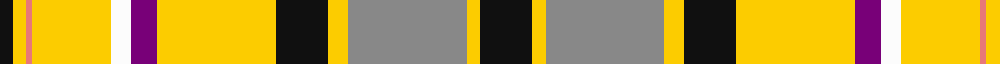

This page is one **sett** — a single exact thread-count. It belongs to the [tartan](/tartans/k8ly2o18ly3k8ly18dp4w3ly12r1ly2k2/)
(the same proportion at any scale), whose colour order is pattern [KYRYKYBWYRYK](/stripes/kyrykybwyryk/).

Sourced from tartans-authority.  It is a [12 stripe tartan](/stripes/stripes12/).

Original link http://www.tartansauthority.com/tartan-ferret/display/6064/

## Thread count
K/16 Y4 N36 Y6 K16 Y36 P8 W6 Y24 LR2 Y4 K/4

## Palette

Palette: <strong>Tartan Register</strong>
<table><thead><tr><th>Colour</th><th>Threads</th><th>Shade</th><th>Base</th><th>OKLCh</th></tr></thead><tbody><tr><td>K/</td><td style="text-align:right;font-variant-numeric:tabular-nums">16</td><td><code style="background-color:#101010;">#101010</code> <small style="color:#888">#101010</small></td><td>K <code style="background-color:#000000;">#000000</code></td><td><small style="color:#888">oklch(17.3% 0.000 89.9)</small></td></tr><tr><td>Y</td><td style="text-align:right;font-variant-numeric:tabular-nums">4</td><td><code style="background-color:#FCCC00;">#FCCC00</code> <small style="color:#888">#FCCC00</small></td><td>Y <code style="background-color:#F2BF00;">#F2BF00</code></td><td><small style="color:#888">oklch(86.2% 0.176 91.5)</small></td></tr><tr><td>N</td><td style="text-align:right;font-variant-numeric:tabular-nums">36</td><td><code style="background-color:#888888;">#888888</code> <small style="color:#888">#888888</small></td><td>R <code style="background-color:#CC0000;">#CC0000</code></td><td><small style="color:#888">oklch(62.7% 0.000 89.9)</small></td></tr><tr><td>Y</td><td style="text-align:right;font-variant-numeric:tabular-nums">6</td><td><code style="background-color:#FCCC00;">#FCCC00</code> <small style="color:#888">#FCCC00</small></td><td>Y <code style="background-color:#F2BF00;">#F2BF00</code></td><td><small style="color:#888">oklch(86.2% 0.176 91.5)</small></td></tr><tr><td>K</td><td style="text-align:right;font-variant-numeric:tabular-nums">16</td><td><code style="background-color:#101010;">#101010</code> <small style="color:#888">#101010</small></td><td>K <code style="background-color:#000000;">#000000</code></td><td><small style="color:#888">oklch(17.3% 0.000 89.9)</small></td></tr><tr><td>Y</td><td style="text-align:right;font-variant-numeric:tabular-nums">36</td><td><code style="background-color:#FCCC00;">#FCCC00</code> <small style="color:#888">#FCCC00</small></td><td>Y <code style="background-color:#F2BF00;">#F2BF00</code></td><td><small style="color:#888">oklch(86.2% 0.176 91.5)</small></td></tr><tr><td>P</td><td style="text-align:right;font-variant-numeric:tabular-nums">8</td><td><code style="background-color:#780078;">#780078</code> <small style="color:#888">#780078</small></td><td>B <code style="background-color:#2A418A;">#2A418A</code></td><td><small style="color:#888">oklch(40.2% 0.185 328.4)</small></td></tr><tr><td>W</td><td style="text-align:right;font-variant-numeric:tabular-nums">6</td><td><code style="background-color:#FCFCFC;">#FCFCFC</code> <small style="color:#888">#FCFCFC</small></td><td>W <code style="background-color:#F7F7F7;">#F7F7F7</code></td><td><small style="color:#888">oklch(99.1% 0.000 89.9)</small></td></tr><tr><td>Y</td><td style="text-align:right;font-variant-numeric:tabular-nums">24</td><td><code style="background-color:#FCCC00;">#FCCC00</code> <small style="color:#888">#FCCC00</small></td><td>Y <code style="background-color:#F2BF00;">#F2BF00</code></td><td><small style="color:#888">oklch(86.2% 0.176 91.5)</small></td></tr><tr><td>LR</td><td style="text-align:right;font-variant-numeric:tabular-nums">2</td><td><code style="background-color:#E87878;">#E87878</code> <small style="color:#888">#E87878</small></td><td>R <code style="background-color:#CC0000;">#CC0000</code></td><td><small style="color:#888">oklch(70.0% 0.139 21.2)</small></td></tr><tr><td>Y</td><td style="text-align:right;font-variant-numeric:tabular-nums">4</td><td><code style="background-color:#FCCC00;">#FCCC00</code> <small style="color:#888">#FCCC00</small></td><td>Y <code style="background-color:#F2BF00;">#F2BF00</code></td><td><small style="color:#888">oklch(86.2% 0.176 91.5)</small></td></tr><tr><td>K/</td><td style="text-align:right;font-variant-numeric:tabular-nums">4</td><td><code style="background-color:#101010;">#101010</code> <small style="color:#888">#101010</small></td><td>K <code style="background-color:#000000;">#000000</code></td><td><small style="color:#888">oklch(17.3% 0.000 89.9)</small></td></tr></tbody></table>

## Nearest tartans

The nearest existing variants by ΔTartan distance, with this tartan at the top so the swatches line up against it.

ΔTartan

Tartan

Sett

—

<a href="/ttd/edit/#slug=k8ly2o18ly3k8ly18dp4w3ly12r1ly2k2~x2">McMillen Memorial, Hugh E. (Personal</a> <a class="nn-out" href="/setts/s12/k8ly2o18ly3k8ly18dp4w3ly12r1ly2k2~x2/" title="open its dictionary page">↗</a>

1.15

<a href="/ttd/edit/#slug=k8w1r2g16r8g8r11ly2g2lo1g2w2r10ly2r2k1w4~x2">Pernel (Personal)</a> <a class="nn-out" href="/setts/s17/k8w1r2g16r8g8r11ly2g2lo1g2w2r10ly2r2k1w4~x2/" title="open its dictionary page">↗</a>

1.24

<a href="/ttd/edit/#slug=dp6t2w24r15g12t4w4t4w4t4g34ly4">Fredericton (District)</a> <a class="nn-out" href="/setts/s12/dp6t2w24r15g12t4w4t4w4t4g34ly4/" title="open its dictionary page">↗</a>

1.24

<a href="/ttd/edit/#slug=dy27w2dy3ly4dy3w2dy5k13t2w26dg3~x2">MacKellar Dress</a> <a class="nn-out" href="/setts/s11/dy27w2dy3ly4dy3w2dy5k13t2w26dg3~x2/" title="open its dictionary page">↗</a>

1.29

<a href="/ttd/edit/#slug=ly16k2ly6k2r2k2db15g1db1w2~x2">Otago Corporate District Tartan Tartan Number: 2317. Earliest known date: 1996 Otago's colours are blue and gold. White on blue is the St Andrews Cross, gold is for the gold discovered in Otago. The black divides the gold to show that the miners came from the four quarters of the world. Red is for the blood ties in the Old Country and black for mourning loved ones never to be seen again. See products available Copyright © Blair Urquhart, Comrie, 2015</a> <a class="nn-out" href="/setts/s10/ly16k2ly6k2r2k2db15g1db1w2~x2/" title="open its dictionary page">↗</a>

1.29

<a href="/ttd/edit/#slug=dy27w2dy3ly4dy3w2dy5k13t2w26g3~x2">MacKellar Dress Clan Tartan Tartan Number: 926. Earliest known date: 1976 As worn by Kenneth? - D.C.S. See products available Copyright © Blair Urquhart, Comrie, 2015</a> <a class="nn-out" href="/setts/s11/dy27w2dy3ly4dy3w2dy5k13t2w26g3~x2/" title="open its dictionary page">↗</a>

1.39

<a href="/ttd/edit/#slug=ly4g2ly2g2ly2g24k2r16w9db3~x2">North West Territories</a> <a class="nn-out" href="/setts/s10/ly4g2ly2g2ly2g24k2r16w9db3~x2/" title="open its dictionary page">↗</a>

1.41

<a href="/ttd/edit/#slug=r4g1w19db4w4db1k5ly3k2db1w4g15r6g3r5g1w3~x2">Victoria</a> <a class="nn-out" href="/setts/s17/r4g1w19db4w4db1k5ly3k2db1w4g15r6g3r5g1w3~x2/" title="open its dictionary page">↗</a>

1.42

<a href="/ttd/edit/#slug=w9r5w29k10ly2k3w3k3dg12r6k3r3w2~x2">Hay or Stewart</a> <a class="nn-out" href="/setts/s13/w9r5w29k10ly2k3w3k3dg12r6k3r3w2~x2/" title="open its dictionary page">↗</a>

1.43

<a href="/ttd/edit/#slug=w9r5w29k10ly2k3w3k3g12r6k3r3w2~x2">Hay, or Stewart</a> <a class="nn-out" href="/setts/s13/w9r5w29k10ly2k3w3k3g12r6k3r3w2~x2/" title="open its dictionary page">↗</a>

1.46

<a href="/ttd/edit/#slug=g10w4r4m4g2m4r4w4g10w4t4w2t4w23k2r2~x2">MacBean dress</a> <a class="nn-out" href="/setts/s16/g10w4r4m4g2m4r4w4g10w4t4w2t4w23k2r2~x2/" title="open its dictionary page">↗</a>

## Neighbour map

Every grey dot is one of 14299 variants placed by the first two principal components of the ΔTartan feature space (44% of its variance). Red is this tartan; blue dots are its nearest — click one to open its page.

<svg viewBox="0 0 640 380" role="img" style="max-width:100%;height:auto;border:1px solid #e0e0e0;border-radius:4px;display:block" xmlns="http://www.w3.org/2000/svg"><image href="/nn/cloud.v1.png" width="640" height="380"/><a href="/setts/s17/k8w1r2g16r8g8r11ly2g2lo1g2w2r10ly2r2k1w4~x2/"><circle cx="149.4" cy="86.9" r="4" fill="#3465a4"><title>Pernel (Personal)</title></circle></a><a href="/setts/s12/dp6t2w24r15g12t4w4t4w4t4g34ly4/"><circle cx="137.2" cy="93.7" r="4" fill="#3465a4"><title>Fredericton (District)</title></circle></a><a href="/setts/s11/dy27w2dy3ly4dy3w2dy5k13t2w26dg3~x2/"><circle cx="161.3" cy="93.0" r="4" fill="#3465a4"><title>MacKellar Dress</title></circle></a><a href="/setts/s10/ly16k2ly6k2r2k2db15g1db1w2~x2/"><circle cx="186.4" cy="93.6" r="4" fill="#3465a4"><title>Otago Corporate District Tartan Tartan Number: 2317. Earliest known date: 1996 Otago's colours are blue and gold. White on blue is the St Andrews Cross, gold is for the gold discovered in Otago. The black divides the gold to show that the miners came from the four quarters of the world. Red is for the blood ties in the Old Country and black for mourning loved ones never to be seen again. See products available Copyright © Blair Urquhart, Comrie, 2015</title></circle></a><a href="/setts/s11/dy27w2dy3ly4dy3w2dy5k13t2w26g3~x2/"><circle cx="168.6" cy="97.7" r="4" fill="#3465a4"><title>MacKellar Dress Clan Tartan Tartan Number: 926. Earliest known date: 1976 As worn by Kenneth? - D.C.S. See products available Copyright © Blair Urquhart, Comrie, 2015</title></circle></a><a href="/setts/s10/ly4g2ly2g2ly2g24k2r16w9db3~x2/"><circle cx="161.9" cy="111.5" r="4" fill="#3465a4"><title>North West Territories</title></circle></a><a href="/setts/s17/r4g1w19db4w4db1k5ly3k2db1w4g15r6g3r5g1w3~x2/"><circle cx="116.1" cy="67.9" r="4" fill="#3465a4"><title>Victoria</title></circle></a><a href="/setts/s13/w9r5w29k10ly2k3w3k3dg12r6k3r3w2~x2/"><circle cx="189.2" cy="100.4" r="4" fill="#3465a4"><title>Hay or Stewart</title></circle></a><a href="/setts/s13/w9r5w29k10ly2k3w3k3g12r6k3r3w2~x2/"><circle cx="182.5" cy="99.6" r="4" fill="#3465a4"><title>Hay, or Stewart</title></circle></a><a href="/setts/s16/g10w4r4m4g2m4r4w4g10w4t4w2t4w23k2r2~x2/"><circle cx="131.7" cy="97.1" r="4" fill="#3465a4"><title>MacBean dress</title></circle></a><circle cx="165.4" cy="92.4" r="5" fill="#c00000"/></svg>

ID: /setts/s12/k8ly2o18ly3k8ly18dp4w3ly12r1ly2k2~x2/
