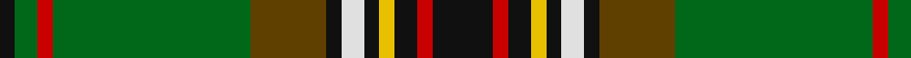

In pattern [KGRGGKWKYKRK](/patterns/kgrggkwkykrk/).

This was sourced from house-of-tartan.  It is a [12 stripes tartan](/stripes/stripes12/).

Original link http://www.house-of-tartan.scotland.net/house/TartanViewjs.asp?colr=Def&tnam=1103

## Thread count
K/4 G6 R4 G52 T20 K4 LN6 K4 Y4 K6 R4 K/16

## Palette
Each colour and its ΔE from the base-6 reference it is a variant of.

| Colour | Shade | Base | ΔE (OKLab) |
|---|---|---|---|
| G | <code style="background-color:#006818;">#006818</code> `#006818` | G <code style="background-color:#006100;">#006100</code> | 0.02 |
| K | <code style="background-color:#101010;">#101010</code> `#101010` | K <code style="background-color:#000000;">#000000</code> | 0.17 |
| LN | <code style="background-color:#E0E0E0;">#E0E0E0</code> `#E0E0E0` | W <code style="background-color:#F7F7F7;">#F7F7F7</code> | 0.07 |
| R | <code style="background-color:#C80000;">#C80000</code> `#C80000` | R <code style="background-color:#CC0000;">#CC0000</code> | 0.01 |
| T | <code style="background-color:#604000;">#604000</code> `#604000` | G <code style="background-color:#006100;">#006100</code> | 0.14 |
| Y | <code style="background-color:#E8C000;">#E8C000</code> `#E8C000` | Y <code style="background-color:#F2BF00;">#F2BF00</code> | 0.02 |

## Nearest tartans

The nearest existing variants by ΔTartan distance.

1. [King George VI Royal Family Tartan Tartan Number: 1484. Earliest known date: pre 2003 Reputed to be a tartan specifically woven for King Edward VII. In the possession of Miss K Roberts of Torquay. See products available Copyright © Blair Urquhart, Comrie, 2015](/setts/s11/r3g24k4y2k3b2k6r4k2r3w2x2~b2c2c80-g006818-k101010-rc80000-we0e0e0-ye8c000/) — ΔT 0.69
1. [Murphy (District)](/setts/s12/k4r1k3y1k1w1k1g8ga12r1ga2k1x4~g84642c-ga347430-k101010-rc80000-wfcfcfc-yd8b000/) — ΔT 0.69
1. [Rourke-Frew Hunting](/setts/s11/b6k3r2k3g31k6ga2k6y13k2ga2x2~b202060-g003c14-ga5c6428-k1c1714-rc8002c-ye0a126/) — ΔT 0.80
1. [Kerby (Personal)](/setts/s12/b4w2b10k10g3k3g3k2g24y2g2r4x2~b440044-g006818-k101010-r880000-we0e0e0-ye8c000/) — ΔT 0.82
1. [Harmony, 2](/setts/s12/b9ba3b4y3b3y4b3r11g30bb3g4b3x2~b401000-ba5480b0-bb8080d0-g008000-r806050-yf0c000/) — ΔT 0.85
1. [Stewart (King George VI)](/setts/s14/r2g11g2b2k3y1k1ya1k1g4r2k1r2ya1x4~b2474e8-g006818-k101010-r880000-ybc8c00-yab8b8b8/) — ΔT 0.88
1. [King George VI](/setts/s11/r3g24k4y2k3b2k6r4k2r3w2x2~b2c4084-g005020-k101010-rdc0000-we0e0e0-ye8c000/) — ΔT 0.92
1. [Stewart Camel Fashion Tartan Tartan Number: 4038. Earliest known date: 01/01/1999 No Details See products available Copyright © Blair Urquhart, Comrie, 2015](/setts/s14/g3k3ga2k6gb7ga2g3ga2y3ga5g3b3g20k2x2~b3850c8-g8c7038-ga003820-gb5c6428-k000000-ybc8c00/) — ΔT 1.10
1. [Tara, Murphy](/setts/s12/k8r2k3y2k2w3k2ra10g26r2g3k2x2~g008000-k000000-rc00000-ra806050-we0e0e0-yf0c000/) — ΔT 1.15
1. [Murray-Hetherington (Personal)](/setts/s10/g1k1g14k2r3b3k6w1k1w1x4~b2c2c80-g006818-k101010-rc80000-we0e0e0/) — ΔT 1.17

## Neighbour map

Every grey dot is one of 15726 variants placed by the first two principal components of the ΔTartan feature space (44% of its variance). Red is this tartan; blue dots are its nearest — click one to open its page.

<svg viewBox="0 0 640 380" role="img" style="max-width:100%;height:auto;border:1px solid #e0e0e0;border-radius:4px;display:block" xmlns="http://www.w3.org/2000/svg"><image href="/nn/cloud.v1.png" width="640" height="380"/><a href="/setts/s11/r3g24k4y2k3b2k6r4k2r3w2x2~b2c2c80-g006818-k101010-rc80000-we0e0e0-ye8c000/"><circle cx="192.4" cy="114.9" r="4" fill="#3465a4"><title>King George VI Royal Family Tartan Tartan Number: 1484. Earliest known date: pre 2003 Reputed to be a tartan specifically woven for King Edward VII. In the possession of Miss K Roberts of Torquay. See products available Copyright © Blair Urquhart, Comrie, 2015</title></circle></a><a href="/setts/s12/k4r1k3y1k1w1k1g8ga12r1ga2k1x4~g84642c-ga347430-k101010-rc80000-wfcfcfc-yd8b000/"><circle cx="172.9" cy="121.0" r="4" fill="#3465a4"><title>Murphy (District)</title></circle></a><a href="/setts/s11/b6k3r2k3g31k6ga2k6y13k2ga2x2~b202060-g003c14-ga5c6428-k1c1714-rc8002c-ye0a126/"><circle cx="194.6" cy="115.6" r="4" fill="#3465a4"><title>Rourke-Frew Hunting</title></circle></a><a href="/setts/s12/b4w2b10k10g3k3g3k2g24y2g2r4x2~b440044-g006818-k101010-r880000-we0e0e0-ye8c000/"><circle cx="204.1" cy="129.7" r="4" fill="#3465a4"><title>Kerby (Personal)</title></circle></a><a href="/setts/s12/b9ba3b4y3b3y4b3r11g30bb3g4b3x2~b401000-ba5480b0-bb8080d0-g008000-r806050-yf0c000/"><circle cx="177.0" cy="126.6" r="4" fill="#3465a4"><title>Harmony, 2</title></circle></a><a href="/setts/s14/r2g11g2b2k3y1k1ya1k1g4r2k1r2ya1x4~b2474e8-g006818-k101010-r880000-ybc8c00-yab8b8b8/"><circle cx="214.2" cy="128.4" r="4" fill="#3465a4"><title>Stewart (King George VI)</title></circle></a><a href="/setts/s11/r3g24k4y2k3b2k6r4k2r3w2x2~b2c4084-g005020-k101010-rdc0000-we0e0e0-ye8c000/"><circle cx="196.2" cy="115.9" r="4" fill="#3465a4"><title>King George VI</title></circle></a><a href="/setts/s14/g3k3ga2k6gb7ga2g3ga2y3ga5g3b3g20k2x2~b3850c8-g8c7038-ga003820-gb5c6428-k000000-ybc8c00/"><circle cx="166.2" cy="125.8" r="4" fill="#3465a4"><title>Stewart Camel Fashion Tartan Tartan Number: 4038. Earliest known date: 01/01/1999 No Details See products available Copyright © Blair Urquhart, Comrie, 2015</title></circle></a><a href="/setts/s12/k8r2k3y2k2w3k2ra10g26r2g3k2x2~g008000-k000000-rc00000-ra806050-we0e0e0-yf0c000/"><circle cx="171.0" cy="102.4" r="4" fill="#3465a4"><title>Tara, Murphy</title></circle></a><a href="/setts/s10/g1k1g14k2r3b3k6w1k1w1x4~b2c2c80-g006818-k101010-rc80000-we0e0e0/"><circle cx="226.6" cy="138.1" r="4" fill="#3465a4"><title>Murray-Hetherington (Personal)</title></circle></a><circle cx="204.9" cy="115.0" r="5" fill="#c00000"/></svg>

ID: /setts/s12/k8r2k3y2k2w3k2g10ga26r2ga3k2x2~g604000-ga006818-k101010-rc80000-we0e0e0-ye8c000/
