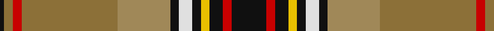

In pattern [KGRGYKWKYKRK](/patterns/kgrgykwkykrk/).

This was sourced from tartans-authority.  It is a [12 stripes tartan](/stripes/stripes12/).

Original link http://www.tartansauthority.com/tartan-ferret/display/1176/

## Thread count
K/2 LTa4 R4 LTa44 LT24 K4 LN6 K4 Y4 K6 R4 K/16

## Palette
Each colour and its ΔE from the base-6 reference it is a variant of.

| Colour | Shade | Base | ΔE (OKLab) |
|---|---|---|---|
| K | <code style="background-color:#101010;">#101010</code> `#101010` | K <code style="background-color:#000000;">#000000</code> | 0.17 |
| LN | <code style="background-color:#E0E0E0;">#E0E0E0</code> `#E0E0E0` | W <code style="background-color:#F7F7F7;">#F7F7F7</code> | 0.07 |
| LT | <code style="background-color:#A08858;">#A08858</code> `#A08858` | Y <code style="background-color:#F2BF00;">#F2BF00</code> | 0.21 |
| LTa | <code style="background-color:#8C7038;">#8C7038</code> `#8C7038` | G <code style="background-color:#006100;">#006100</code> | 0.18 |
| R | <code style="background-color:#C80000;">#C80000</code> `#C80000` | R <code style="background-color:#CC0000;">#CC0000</code> | 0.01 |
| Y | <code style="background-color:#E8C000;">#E8C000</code> `#E8C000` | Y <code style="background-color:#F2BF00;">#F2BF00</code> | 0.02 |

## Nearest tartans

The nearest existing variants by ΔTartan distance.

1. [Bicknell, The Hamish (Personal)](/setts/s11/w3k1r25k2g2ga25g2y2g10k1r2~g603311-ga008000-k101010-raf1e2d-wffffff-yffe600~x2/) — ΔT 0.69
1. [Moray of Abercairny](/setts/s11/w1b3ba2r18ra2g16ra2r2ra2b3w1~b5c8ca8-ba1c1c50-g006818-r880000-rad05054-wf8f8f8~x2/) — ΔT 0.83
1. [Baxter (Clan)](/setts/s11/w2r16k1b2k1y4k1b2k1g16b1~b788cb4-g007800-k000000-r8c0000-wc8c8c8-yc88c00~x4/) — ΔT 0.86
1. [Maclean of Duart (Wilsons) (Clan)](/setts/s11/b16k12y4k4w6k4g32r50b6r8k3~b5c8ca8-g285800-k101010-rc80000-we0e0e0-ye8c000/) — ΔT 0.90
1. [Leaf Peeper](/setts/s9/k2w1g25ga11r12w1y12k1w2~g003c14-ga503c14-k101010-ra00000-wffffff-ye0a126~x2/) — ΔT 0.92
1. [Westwood (Fashion?)](/setts/s10/r15y30k1w6k1y2g16b4r6w1~b5c8ca8-g003820-k101010-rc80000-we0e0e0-ya08858~x2/) — ΔT 0.94
1. [Berwick District Tartan Tartan Number: 2011. Earliest known date: 1981 Marygate Weavers of Berwick upon Tweed organised a competition to design a tartan to commemorate the historic past of the town. Alison Wilkinson from Wooler, Northumberland, a pupil in the third form at Berwick High School, won the prize of £50. The tartan is also produced in a symetrical form. (STS archives) See products available Copyright © Blair Urquhart, Comrie, 2015](/setts/s14/r8y5g2y4g2y5ra38k5g2k4g2k5r8b4~b2888c4-g006818-k101010-rc80000-ra888888-yd87c00~x2/) — ΔT 0.94
1. [Elystan Glodrydd (Name)](/setts/s9/w2g27y1ya7b5y5r17y6b1~b5c8ca8-g003820-rc80000-wfcfcfc-ye8c000-yabc8c00~x2/) — ΔT 0.96
1. [Unnamed No 1 Tartan Tartan Number: 1340. Earliest known date: 1870 This sett is taken from the records of Messrs Bolingbroke and Jones of Norwich, who were weavers around 1870. Some of the tartans have been adopted or modified in recent times as the copyright of the designs is now in the public domain. See products available Copyright © Blair Urquhart, Comrie, 2015](/setts/s12/r8b7k8y2k1w2k1g19k1r8b3r8~b5c8ca8-g006818-k101010-rc80000-we0e0e0-ye8c000~x2/) — ΔT 0.96
1. [MacLean of Duart #4](/setts/s11/b13k6y2k3w4k3g22r31b3r4k2~b3c82af-g005020-k101010-rdc0000-we0e0e0-ye8c000~x2/) — ΔT 0.98

## Neighbour map

Every grey dot is one of 15726 variants placed by the first two principal components of the ΔTartan feature space (44% of its variance). Red is this tartan; blue dots are its nearest — click one to open its page.

<svg viewBox="0 0 640 380" role="img" style="max-width:100%;height:auto;border:1px solid #e0e0e0;border-radius:4px;display:block" xmlns="http://www.w3.org/2000/svg"><image href="/nn/cloud.v1.png" width="640" height="380"/><a href="/setts/s11/w3k1r25k2g2ga25g2y2g10k1r2~g603311-ga008000-k101010-raf1e2d-wffffff-yffe600~x2/"><circle cx="206.5" cy="79.7" r="4" fill="#3465a4"><title>Bicknell, The Hamish (Personal)</title></circle></a><a href="/setts/s11/w1b3ba2r18ra2g16ra2r2ra2b3w1~b5c8ca8-ba1c1c50-g006818-r880000-rad05054-wf8f8f8~x2/"><circle cx="207.1" cy="99.3" r="4" fill="#3465a4"><title>Moray of Abercairny</title></circle></a><a href="/setts/s11/w2r16k1b2k1y4k1b2k1g16b1~b788cb4-g007800-k000000-r8c0000-wc8c8c8-yc88c00~x4/"><circle cx="162.8" cy="92.5" r="4" fill="#3465a4"><title>Baxter (Clan)</title></circle></a><a href="/setts/s11/b16k12y4k4w6k4g32r50b6r8k3~b5c8ca8-g285800-k101010-rc80000-we0e0e0-ye8c000/"><circle cx="177.1" cy="100.7" r="4" fill="#3465a4"><title>Maclean of Duart (Wilsons) (Clan)</title></circle></a><a href="/setts/s9/k2w1g25ga11r12w1y12k1w2~g003c14-ga503c14-k101010-ra00000-wffffff-ye0a126~x2/"><circle cx="167.9" cy="100.0" r="4" fill="#3465a4"><title>Leaf Peeper</title></circle></a><a href="/setts/s10/r15y30k1w6k1y2g16b4r6w1~b5c8ca8-g003820-k101010-rc80000-we0e0e0-ya08858~x2/"><circle cx="207.5" cy="84.9" r="4" fill="#3465a4"><title>Westwood (Fashion?)</title></circle></a><a href="/setts/s14/r8y5g2y4g2y5ra38k5g2k4g2k5r8b4~b2888c4-g006818-k101010-rc80000-ra888888-yd87c00~x2/"><circle cx="198.4" cy="76.9" r="4" fill="#3465a4"><title>Berwick District Tartan Tartan Number: 2011. Earliest known date: 1981 Marygate Weavers of Berwick upon Tweed organised a competition to design a tartan to commemorate the historic past of the town. Alison Wilkinson from Wooler, Northumberland, a pupil in the third form at Berwick High School, won the prize of £50. The tartan is also produced in a symetrical form. (STS archives) See products available Copyright © Blair Urquhart, Comrie, 2015</title></circle></a><a href="/setts/s9/w2g27y1ya7b5y5r17y6b1~b5c8ca8-g003820-rc80000-wfcfcfc-ye8c000-yabc8c00~x2/"><circle cx="170.7" cy="91.4" r="4" fill="#3465a4"><title>Elystan Glodrydd (Name)</title></circle></a><a href="/setts/s12/r8b7k8y2k1w2k1g19k1r8b3r8~b5c8ca8-g006818-k101010-rc80000-we0e0e0-ye8c000~x2/"><circle cx="146.7" cy="108.2" r="4" fill="#3465a4"><title>Unnamed No 1 Tartan Tartan Number: 1340. Earliest known date: 1870 This sett is taken from the records of Messrs Bolingbroke and Jones of Norwich, who were weavers around 1870. Some of the tartans have been adopted or modified in recent times as the copyright of the designs is now in the public domain. See products available Copyright © Blair Urquhart, Comrie, 2015</title></circle></a><a href="/setts/s11/b13k6y2k3w4k3g22r31b3r4k2~b3c82af-g005020-k101010-rdc0000-we0e0e0-ye8c000~x2/"><circle cx="159.1" cy="100.6" r="4" fill="#3465a4"><title>MacLean of Duart #4</title></circle></a><circle cx="190.0" cy="85.2" r="5" fill="#c00000"/></svg>

ID: /setts/s12/k8r2k3y2k2w3k2ya12g22r2g2k1~g8c7038-k101010-rc80000-we0e0e0-ye8c000-yaa08858~x2/
