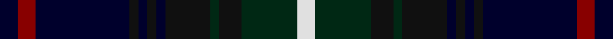

**Bands:** [KRKKKKKKGKGW](/stripes/krkkkkkkgkgw/) · **Stripes:** [K R K K K K K K DG K DG W](/stripes/stripes12/) K R K K K K K K DG K DG W

This was sourced from tartans-authority.  It is a [12 band tartan](/bands/bands12/).

Original link http://www.tartansauthority.com/tartan-ferret/display/7753/

## Thread count
DB/8 DR8 DB42 K4 DB4 K4 DB4 K20 DG4 K10 DG25 LN/8

## Palette
Each colour and its ΔE from the base-6 reference it is a variant of.

| Colour | Shade | Base | ΔE (OKLab) |
|---|---|---|---|
| DB | <code style="background-color:#00002C;">#00002C</code> `#00002C` | K <code style="background-color:#000000;">#000000</code> | 0.16 |
| DG | <code style="background-color:#002814;">#002814</code> `#002814` | G <code style="background-color:#006100;">#006100</code> | 0.20 |
| DR | <code style="background-color:#880000;">#880000</code> `#880000` | R <code style="background-color:#CC0000;">#CC0000</code> | 0.15 |
| K | <code style="background-color:#101010;">#101010</code> `#101010` | K <code style="background-color:#000000;">#000000</code> | 0.17 |
| LN | <code style="background-color:#E0E0E0;">#E0E0E0</code> `#E0E0E0` | W <code style="background-color:#F7F7F7;">#F7F7F7</code> | 0.07 |

## Nearest tartans

The nearest existing variants by ΔTartan distance.

1. [Stephenson Htg (Name)](/setts/s15/dg2k1db9k9dg9k1w1k2w1k1dg9k9db9k1r2~x4/) — ΔT 1.02
1. [Barnes Hunting (Personal)](/setts/s10/db20k3db3k3db3k16g3lo3g12r2~x2/) — ΔT 1.20
1. [Humphries (Personal)](/setts/s14/k16k4k4k4k6k14dg17k2r3k2dg17k14k18w4~x2/) — ΔT 1.21
1. [Edgar (2014)](/setts/s13/w1db16k12t2dp3t2k12db2k2db2k2db7w1~x2/) — ΔT 1.22
1. [Scotch House (Fashion)](/setts/s12/dg2lb1dg1lb1dg8k4db2k1db1k1db8o1~x4/) — ΔT 1.24
1. [Wacker](/setts/s11/db12k6db6k25dg25k2dg25k25w2db6k6/) — ΔT 1.25
1. [Cumbernauld District Tartan Tartan Number: 1566. Earliest known date: 1987 The Cumbernauld tartan is the same as the MacKenzie, except for a change in the colour scheme. Ancient green was incorporated with modern blue, black and red to represent a new thriving community, proud of its heritage. Cumbernauld is one of Scotlands new towns. See products available Copyright © Blair Urquhart, Comrie, 2015](/setts/s15/db17k3db3k3db3k17g17k2w3k2g17k17db17k2r3~x2/) — ΔT 1.26
1. [Leung (Personal)](/setts/s9/dp4db7dp2db25k19w2dg23k2lo3~x2/) — ΔT 1.27
1. [McWilliams Dress (2014)](/setts/s12/db3r2db13k9k3k2k14k2k3k9db15w3~x2/) — ΔT 1.28
1. [Bootneck 350](/setts/s8/k6r4k19dg4db25r5dg3ly2~x2/) — ΔT 1.31

## Neighbour map

Every grey dot is one of 14299 variants placed by the first two principal components of the ΔTartan feature space (44% of its variance). Red is this tartan; blue dots are its nearest — click one to open its page.

<svg viewBox="0 0 640 380" role="img" style="max-width:100%;height:auto;border:1px solid #e0e0e0;border-radius:4px;display:block" xmlns="http://www.w3.org/2000/svg"><image href="/nn/cloud.v1.png" width="640" height="380"/><a href="/setts/s15/dg2k1db9k9dg9k1w1k2w1k1dg9k9db9k1r2~x4/"><circle cx="190.6" cy="186.7" r="4" fill="#3465a4"><title>Stephenson Htg (Name)</title></circle></a><a href="/setts/s10/db20k3db3k3db3k16g3lo3g12r2~x2/"><circle cx="198.7" cy="185.3" r="4" fill="#3465a4"><title>Barnes Hunting (Personal)</title></circle></a><a href="/setts/s14/k16k4k4k4k6k14dg17k2r3k2dg17k14k18w4~x2/"><circle cx="182.0" cy="212.0" r="4" fill="#3465a4"><title>Humphries (Personal)</title></circle></a><a href="/setts/s13/w1db16k12t2dp3t2k12db2k2db2k2db7w1~x2/"><circle cx="283.5" cy="168.9" r="4" fill="#3465a4"><title>Edgar (2014)</title></circle></a><a href="/setts/s12/dg2lb1dg1lb1dg8k4db2k1db1k1db8o1~x4/"><circle cx="169.7" cy="180.6" r="4" fill="#3465a4"><title>Scotch House (Fashion)</title></circle></a><a href="/setts/s11/db12k6db6k25dg25k2dg25k25w2db6k6/"><circle cx="191.5" cy="200.0" r="4" fill="#3465a4"><title>Wacker</title></circle></a><a href="/setts/s15/db17k3db3k3db3k17g17k2w3k2g17k17db17k2r3~x2/"><circle cx="187.1" cy="188.5" r="4" fill="#3465a4"><title>Cumbernauld District Tartan Tartan Number: 1566. Earliest known date: 1987 The Cumbernauld tartan is the same as the MacKenzie, except for a change in the colour scheme. Ancient green was incorporated with modern blue, black and red to represent a new thriving community, proud of its heritage. Cumbernauld is one of Scotlands new towns. See products available Copyright © Blair Urquhart, Comrie, 2015</title></circle></a><a href="/setts/s9/dp4db7dp2db25k19w2dg23k2lo3~x2/"><circle cx="195.7" cy="176.5" r="4" fill="#3465a4"><title>Leung (Personal)</title></circle></a><a href="/setts/s12/db3r2db13k9k3k2k14k2k3k9db15w3~x2/"><circle cx="206.7" cy="215.1" r="4" fill="#3465a4"><title>McWilliams Dress (2014)</title></circle></a><a href="/setts/s8/k6r4k19dg4db25r5dg3ly2~x2/"><circle cx="220.7" cy="187.8" r="4" fill="#3465a4"><title>Bootneck 350</title></circle></a><circle cx="214.3" cy="184.1" r="5" fill="#c00000"/></svg>

ID: /setts/s12/k8r8k42k4k4k4k4k20dg4k10dg25w8/
