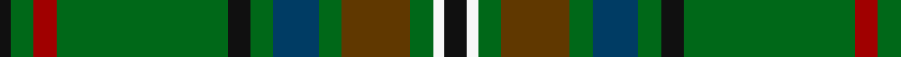

In pattern [KGRGKGBGGGWK](/patterns/kgrgkgbgggwk/).

This was sourced from tartans-authority.  It is a [12 stripes tartan](/stripes/stripes12/).

Original link http://www.tartansauthority.com/tartan-ferret/display/3331/

## Thread count
K/4 G8 DR8 G60 K8 G8 DB16 G8 T24 G8 W4 K/8

## Palette
Each colour and its ΔE from the base-6 reference it is a variant of.

| Colour | Shade | Base | ΔE (OKLab) |
|---|---|---|---|
| DB | <code style="background-color:#003C64;">#003C64</code> `#003C64` | B <code style="background-color:#2C4084;">#2C4084</code> | 0.07 |
| DR | <code style="background-color:#A00000;">#A00000</code> `#A00000` | R <code style="background-color:#C80000;">#C80000</code> | 0.09 |
| G | <code style="background-color:#006818;">#006818</code> `#006818` | G <code style="background-color:#006400;">#006400</code> | 0.02 |
| K | <code style="background-color:#101010;">#101010</code> `#101010` | K <code style="background-color:#000000;">#000000</code> | 0.17 |
| T | <code style="background-color:#603800;">#603800</code> `#603800` | G <code style="background-color:#006400;">#006400</code> | 0.16 |
| W | <code style="background-color:#F8F8F8;">#F8F8F8</code> `#F8F8F8` | W <code style="background-color:#F4F4F0;">#F4F4F0</code> | 0.01 |

ID: /setts/s12/k8w4g8ga24g8b16g8k8g60r8g8k4-b003c64-g006818-ga603800-k101010-ra00000-wf8f8f8/

