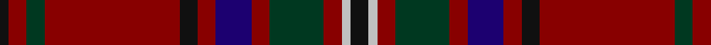

In pattern [KRGRKRBRGRWK](/patterns/krgrkrbrgrwk/).

This was sourced from register-of-tartans.  It is a [12 stripes tartan](/stripes/stripes12/).

Original link https://www.tartanregister.gov.uk/tartanDetails.aspx?ref=2314

## Attestations

This cloth appears in 2 source records; the oldest owns this page.

- 01/01/1999 — MacClure (register-of-tartans, [record](https://www.tartanregister.gov.uk/tartanDetails.aspx?ref=2314))
- pre 2002 — MacClure (Name) (tartans-authority, [record](http://www.tartansauthority.com/tartan-ferret/display/3330/))

## Thread count
K/4 DR8 DG8 DR60 K8 DR8 DB16 DR8 DG24 DR8 N4 K/8

## Palette
Each colour and its ΔE from the base-6 reference it is a variant of.

| Colour | Shade | Base | ΔE (OKLab) |
|---|---|---|---|
| DB | <code style="background-color:#1C0070;">#1C0070</code> `#1C0070` | B <code style="background-color:#2C4084;">#2C4084</code> | 0.14 |
| DG | <code style="background-color:#003820;">#003820</code> `#003820` | G <code style="background-color:#006400;">#006400</code> | 0.16 |
| DR | <code style="background-color:#880000;">#880000</code> `#880000` | R <code style="background-color:#C80000;">#C80000</code> | 0.14 |
| K | <code style="background-color:#101010;">#101010</code> `#101010` | K <code style="background-color:#000000;">#000000</code> | 0.17 |
| N | <code style="background-color:#C0C0C0;">#C0C0C0</code> `#C0C0C0` | W <code style="background-color:#F4F4F0;">#F4F4F0</code> | 0.16 |

## Nearest tartans

The nearest existing variants by ΔTartan distance.

1. [MacClure Clan/Family Tartan Tartan Number: 3330. Earliest known date: pre 2002 Designed by Phil Smith for all MacClures. (note by Phil Smith Sept 2004) and originally woven by D C Dalgliesh. MacClures and MacLures are a sept of MacLeod. See products available Copyright © Blair Urquhart, Comrie, 2015](/setts/s12/k8y4r8g24r8b16r8k8r60g8r8k4-b1c0070-g006818-k101010-r800000-yb8b8b8/) — ΔT 0.53
1. [MacDonald of Glencoe](/setts/s13/g6r2ra4g4ra32w2b8ra6g26ra2b2r2ra6-b2c2c80-g285800-re87878-ra880000-w98c8e8/) — ΔT 1.11
1. [Walker Family Tartan Tartan Number: 2068. Earliest known date: 1991 R.W.Hawks submitted this tartan via Phil Smith in January 1991. Hawks advised Oct. 1993 that he is agreeable for any Walkers to use this tartan. Marroon Red. See products available Copyright © Blair Urquhart, Comrie, 2015](/setts/s12/y4b2r7b15r4b3r4b7r28g7r6g2-b003c64-g003820-r880022-ye8c000/) — ΔT 1.12
1. [MacEdward (MacGregor Hastie)](/setts/s10/r12y2r48g12b4k2b4k2b24r2-b202060-g003820-k101010-r880000-yd09800/) — ΔT 1.14
1. [Chisholm Hunting](/setts/s10/r14w4r64b14g6b4g6b4g32r6-b2c4084-g005020-r960028-we0e0e0/) — ΔT 1.18
1. [Waddell (Name)](/setts/s11/r6b4r48b16g4b4g4b4g20r6w4-b2c2c80-g285800-r880000-we0e0e0/) — ΔT 1.26
1. [Stewart of Bute Hunting](/setts/s10/b44g22k4g8k4g12k32b80b4w12-b680028-g006818-k101010-wc0c0c0/) — ΔT 1.27
1. [Methodist Church](/setts/s12/r12g4r4g6k4r4b32k6g8r68y4r4-b1c1c50-g285800-k101010-rb00000-ybc8c00/) — ΔT 1.30
1. [Brotherhood of Dirk, The](/setts/s11/r18k6r18k4b8k8ba8k6ba4k64y12-b576982-ba3d2e60-k1c1714-r89051b-yb7d38b/) — ΔT 1.30
1. [Walker, Evening (Name)](/setts/s12/r8k4ra14k30ra6k6ra6k14ra56g14ra12g4-g004c00-k00002c-r9c7400-ra8c0000/) — ΔT 1.34

## Neighbour map

Every grey dot is one of 15726 variants placed by the first two principal components of the ΔTartan feature space (44% of its variance). Red is this tartan; blue dots are its nearest — click one to open its page.

<svg viewBox="0 0 640 380" role="img" style="max-width:100%;height:auto;border:1px solid #e0e0e0;border-radius:4px;display:block" xmlns="http://www.w3.org/2000/svg"><image href="/nn/cloud.v1.png" width="640" height="380"/><a href="/setts/s12/k8y4r8g24r8b16r8k8r60g8r8k4-b1c0070-g006818-k101010-r800000-yb8b8b8/"><circle cx="325.3" cy="142.0" r="4" fill="#3465a4"><title>MacClure Clan/Family Tartan Tartan Number: 3330. Earliest known date: pre 2002 Designed by Phil Smith for all MacClures. (note by Phil Smith Sept 2004) and originally woven by D C Dalgliesh. MacClures and MacLures are a sept of MacLeod. See products available Copyright © Blair Urquhart, Comrie, 2015</title></circle></a><a href="/setts/s13/g6r2ra4g4ra32w2b8ra6g26ra2b2r2ra6-b2c2c80-g285800-re87878-ra880000-w98c8e8/"><circle cx="317.6" cy="134.2" r="4" fill="#3465a4"><title>MacDonald of Glencoe</title></circle></a><a href="/setts/s12/y4b2r7b15r4b3r4b7r28g7r6g2-b003c64-g003820-r880022-ye8c000/"><circle cx="349.1" cy="174.2" r="4" fill="#3465a4"><title>Walker Family Tartan Tartan Number: 2068. Earliest known date: 1991 R.W.Hawks submitted this tartan via Phil Smith in January 1991. Hawks advised Oct. 1993 that he is agreeable for any Walkers to use this tartan. Marroon Red. See products available Copyright © Blair Urquhart, Comrie, 2015</title></circle></a><a href="/setts/s10/r12y2r48g12b4k2b4k2b24r2-b202060-g003820-k101010-r880000-yd09800/"><circle cx="391.3" cy="136.0" r="4" fill="#3465a4"><title>MacEdward (MacGregor Hastie)</title></circle></a><a href="/setts/s10/r14w4r64b14g6b4g6b4g32r6-b2c4084-g005020-r960028-we0e0e0/"><circle cx="366.2" cy="159.3" r="4" fill="#3465a4"><title>Chisholm Hunting</title></circle></a><a href="/setts/s11/r6b4r48b16g4b4g4b4g20r6w4-b2c2c80-g285800-r880000-we0e0e0/"><circle cx="314.5" cy="162.1" r="4" fill="#3465a4"><title>Waddell (Name)</title></circle></a><a href="/setts/s10/b44g22k4g8k4g12k32b80b4w12-b680028-g006818-k101010-wc0c0c0/"><circle cx="360.9" cy="157.6" r="4" fill="#3465a4"><title>Stewart of Bute Hunting</title></circle></a><a href="/setts/s12/r12g4r4g6k4r4b32k6g8r68y4r4-b1c1c50-g285800-k101010-rb00000-ybc8c00/"><circle cx="367.2" cy="112.1" r="4" fill="#3465a4"><title>Methodist Church</title></circle></a><a href="/setts/s11/r18k6r18k4b8k8ba8k6ba4k64y12-b576982-ba3d2e60-k1c1714-r89051b-yb7d38b/"><circle cx="316.4" cy="136.7" r="4" fill="#3465a4"><title>Brotherhood of Dirk, The</title></circle></a><a href="/setts/s12/r8k4ra14k30ra6k6ra6k14ra56g14ra12g4-g004c00-k00002c-r9c7400-ra8c0000/"><circle cx="322.7" cy="162.5" r="4" fill="#3465a4"><title>Walker, Evening (Name)</title></circle></a><circle cx="337.5" cy="146.6" r="5" fill="#c00000"/></svg>

ID: /setts/s12/k8w4r8g24r8b16r8k8r60g8r8k4-b1c0070-g003820-k101010-r880000-wc0c0c0/
